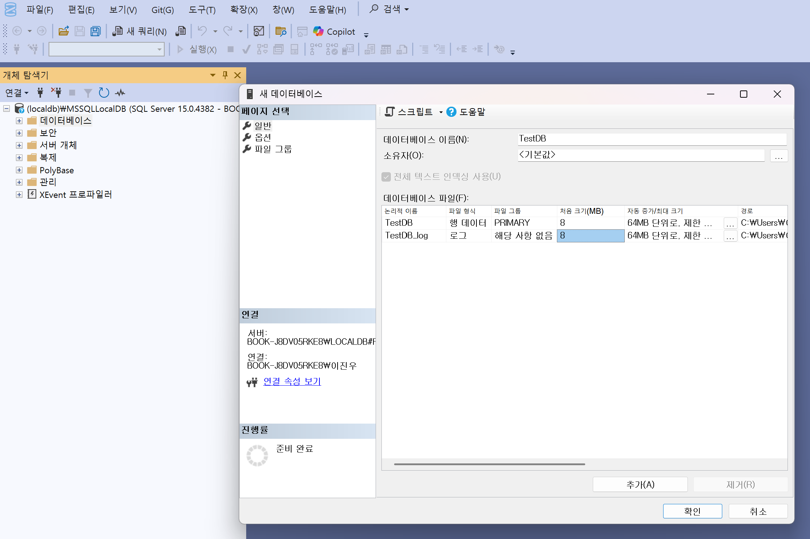

### SQL Server Client 설치 
- [SQL Server 다운로드 | Microsoft](https://www.microsoft.com/ko-kr/sql-server/sql-server-downloads?msockid=3524f9483223634a38d5ef123336626b)
	- 우선 SQL Server 2022 개발자 설치
	- [공식 sql-server-samples/samples/tutorials/c#/Windows at master · microsoft/sql-server-samples](https://github.com/microsoft/sql-server-samples/tree/master/samples/tutorials/c%23/Windows) // 안봄
- [SQL Server Management Studio 설치 | Microsoft Learn](https://learn.microsoft.com/ko-kr/ssms/install/install?redirectedfrom=MSDN)
	- 이것도 설치해야 하는 듯함
- Visual Studio용 SSDT(SQL Server Data Tools) 
	- [SSDT (SQL Server Data Tools)설치 - SQL Server Data Tools (SSDT) | Microsoft Learn](https://learn.microsoft.com/ko-kr/sql/ssdt/download-sql-server-data-tools-ssdt?view=sql-server-ver17&tabs=vs2022)
	- `선택사항`인듯


> SQL Server는 MSSQL을 의미한다 
> MSSQL은 Microsoft SQL Server의 줄임말

> SSMS가 클라이언트 도구이고, SQL Server (MSSQL)은 DBMS에 해당한다

> SSMS로 서버 접속 ▶️ 디비 생성 ▶️ 계정 생성 ▶️ 테이블 생성 ▶️ 데이터 추가 후 쿼리 실행

> [!info] MSSQLLocalDB가 결국
> - DB 서버에 해당한다. ▶️ 로컬에 SQL 서버 설치시 default로 지정되는 듯하다
> - DB 서버 하위에 데이터베이스가 나눠지게 되는거고

**쿼리 실행 단축키**
- ✅ **`F5`**: 현재 활성화된 쿼리 편집기 창에 있는 **전체 쿼리를 실행**합니다.
- ✅ **`Ctrl + E`**: `F5`와 동일하게 전체 쿼리를 실행합니다.
- **`Ctrl + F5`**: 디버그 모드로 쿼리를 실행합니다.
- **`Ctrl + Shift + E`**: 선택한 쿼리만 실행합니다. 여러 개의 쿼리 중 일부만 실행하고 싶을 때 유용합니다.

`기본적으로 대소문자 구분을 하지 않는다`
- 대부분의 SQL Server 설치는 **`SQL_Latin1_General_CP1_CI_AS`** 같은 **`CI`(Case-Insensitive)** 옵션으로 설정되어 있음
- **CI (Case-Insensitive)**: 대소문자를 구분하지 않습니다.
	- `SELECT * FROM Users;` 와 `SELECT * FROM users;` 는 동일하게 동작
- 만약 대소문자 구분하도록 설정되어 있으면 **`CS`(Case-Sensitive)** 옵션이 적용된 것
	- 이런 경우는 매우 드물고, 일일반적으로는 대소문자를 구분하지 않기 때문에 쿼리를 작성할 때 편의를 위해 소문자를 사용하는 경우가 많습니다

> 일단 쿼리가 인덱스를 잘 타는지 분석하는거는 빼자 .. 😂😂😂

---

### 테스트 디비 생성 

> 기본적인 root 계정이 있는건가?? 
> ▶️ root와 비슷한 역할을 하는 최고 권한 계정이 기본적으로 존재함. 이름은 `sa (system administrator)`이다.
> ✅ 보안상의 이유로 `sa` 계정은 기본적으로 **비활성화**되어 있거나, 매우 강력한 비밀번호를 요구합니다. 많은 기업 환경에서는 이 계정을 사용하지 않고, 윈도우 인증을 사용하는 경우가 일반적
> ✅ (내 생각) 특정 디비에 대한 권한을 가진 일반 계정으로 접속하는게 맞는듯하다.


개체 탐색기가 안보이는 경우
▶️ SSMS 상단 메뉴에서 `보기 > 개체 탐색기`를 선택
▶️ 또는 단축키 `F8` 사용

데이터베이스 폴더가 없음 
▶️ 아직 SQL Server에 연결되지 않거나 폴더가 숨겨진 상태
▶️ MSSQLLocalDB 서버에 연결하기

**1단계 DB 생성**

데이터베이스는 우리가 파일을 저장하는 **'폴더'** 와 같습니다. 데이터를 체계적으로 관리하기 위해 제일 먼저 만들어야 하는 공간이죠.

1. **SSMS**를 실행하고 접속합니다.
2. 왼쪽의 **'개체 탐색기(Object Explorer)'** 에서 **'Databases'** 폴더를 우클릭하고 **'새 데이터베이스(New Database)'** 를 선택합니다.
3. 데이터베이스 이름을 `TestDB`라고 입력하고 **확인**을 누릅니다.
    
이렇게 하면 앞으로 모든 데이터는 `TestDB`라는 폴더 안에 저장됩니다.



**2단계: 사용자(계정) 생성 및 권한 부여**

데이터베이스에 접근할 **'사용자 계정'** 을 만들고, 이 계정이 `TestDB`에 접근할 수 있도록 **'권한'** 을 부여해야 합니다. 이는 마치 특정 폴더를 다른 사람과 공유하고 접근 권한을 설정하는 것과 같습니다.

1. **'보안(Security)'** 폴더를 열고 **'로그인(Logins)'** 폴더를 우클릭한 뒤 **'새 로그인(New Login)'**을 선택합니다.
2. **'로그인 이름(Login name)'**에 원하는 계정명(예: `dev_user`)을 입력하고 **'SQL Server 인증(SQL Server Authentication)'**을 선택합니다.
3. 비밀번호를 설정하고, `암호 정책 강제 적용(Enforce password policy)` 체크박스를 해제하면 간단한 비밀번호도 사용할 수 있습니다.
4. **'사용자 매핑(User Mapping)'** 탭으로 이동해 방금 만든 `TestDB`를 선택하고, **'db_owner'** 역할을 체크합니다. 이렇게 하면 이 계정이 `TestDB`의 모든 권한을 갖게 됩니다.
5. **확인**을 누르면 계정 생성이 완료됩니다


> TestDB , tester/qwer1234!@#$


**3단계: 테이블 생성 및 데이터 조작**
- SSMS 상단에서 **'새 쿼리(New Query)'** 버튼을 클릭합니다.
- 쿼리 편집기 상단의 드롭다운 메뉴에서 `master`가 아닌 **`TestDB`**를 선택합니다.
- 아래 코드를 복사해서 붙여넣고 **'실행(Execute)'** 버튼을 클릭합니다.

```sql
-- `Users`라는 테이블을 만듭니다. Id, Name, Email 세 개의 열이 생깁니다.
CREATE TABLE Users (
    Id INT PRIMARY KEY IDENTITY(1,1),
    Name NVARCHAR(50) NOT NULL,
    Email NVARCHAR(100) NOT NULL
);

-- `Users` 테이블에 데이터 두 줄(레코드)을 삽입합니다.
INSERT INTO Users (Name, Email) VALUES ('Alice', 'alice@example.com');
INSERT INTO Users (Name, Email) VALUES ('Bob', 'bob@example.com');

-- `Users` 테이블에 있는 모든 데이터를 조회합니다.
SELECT * FROM Users;
```