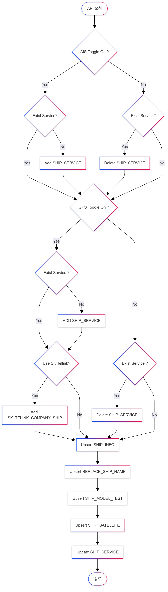

**기록**
- Code-first(⭐), DB-first, Model-first 개발 방식이 있다.
- 엔티티 모델을 정의하는 방식은 Code Naming Convention, Data Annotaion, Fluent API 방식이 있다. 
- DbContext는 thread-safe 하지 않다. 공유하면 멸망할 수 있다는듯
	- [DbContext 수명, 구성 및 초기화 - EF Core | Microsoft Learn](https://learn.microsoft.com/en-us/ef/core/dbcontext-configuration/)
		- DbContext의 생명주기에 대해 간단히 언급. single unit-of-work 동안 인스턴스가 사용된다네 .
- JPA는 수정시 더티 체킹을 해줘서 트랜잭션 생명 주기 끝날 때 쯤 save 호출해준다 
	- 반면 E.F Core에서는 엔티티 속성 변경 후 명시적으로 SaveChangesAsync() 호출해야 동기화가 맞춰진다. 


**SHIP PARTICULAR**
- **Vessel Particulars** 라고도 함
- **선박 제원 정보**를 의미함 🚢
- 이 정보는 선박의 물리적, 설계, 기능적 특성을 정의하는 모든 정략적이고 확정적인 사항들을 포함합니다. 즉, 선박의 명세서 라고 할 수 있습니다.
- SHIP PARTICULAR에는 일반적으로 다음과 같은 중요한 정보들이 포함됩니다 
	- 1. 선박의 크기 및 용적 관련 정보
	- 2. 톤수 
	- 3. 엔진 및 속도
	- 4. 선박 종류 및 용도
	- 5. 선적 능력(Capacity)
	- 6. 등록 및 식별 정보
- 📌사용 목적 
	- SHIP PARTICULAR는 해운, 물류, 보험, 조선 등 다양한 해사 산업 분야에서 **선박의 성능, 능력, 특성을 파악**하고 **각종 계약, 운항 계획, 세금 및 수수료 산정** 등의 목적으로 매우 중요하게 사용됩니다.


---

> SHIP PARTICULAR 모듈에 포함되는 일부 테이블에 대한 CRUD 구현

**테이블 목록**
- 1. SHIP_INFO
- 2. SHIP_SERVICE
- 3. REPLACE_SHIP_NAME
- 4. SHIP_SATELLITE
- 5. SHIP_MODEL_TEST
- 6. SK_TELINK_COMPANY_SHIP

> 🧐 플로우 차트 기준으로는 한꺼번에 처리되는 느낌인데 .. 

---

**프로젝트 생성** 
- 프로젝트명 : `ShipParticularsApi`
- 닷넷 `v8.0` 

**패키지 설치**
- `[도구 > NuGet 패키지 관리자 > 솔루션용 NuGet 패키지 관리...]` 실행
- 닷넷 코어 버전이 v8.x 라서, 동일한 버전대로 설치.

```text
Microsoft.EntityFrameworkCore.SqlServer  // 8.0.20
Microsoft.EntityFrameworkCore.Tools
Microsoft.EntityFrameworkCore.Design
Microsoft.AspNetCore.Diagnostics.EntityFrameworkCore  //추가 설치
```

---
### Data Annotations in Entity Framework 

🏠[Data Annotations in Entity Framework](https://www.luisllamas.es/en/entity-framework-data-annotations/)

>[!info] Data Annotations ara s set of predefined attributes
>데이터 어노테이션은 미리 정의된 속성 집합이다. C# 엔티티 모델에서 구체적인 설정을 할 때 사용한다. 이러한 속성은 엔티티가 테이블과 매핑될떄 어떻게 처리되어야 하는지 구성하는데 도움이 됩니다. (설정하려면 클래스나 속성 앞에 설정하면 됨)

아래 namespace가 필요 
```c#
using System.ComponentModel.DataAnnotations;
using System.ComponentModel.DataAnnotations.Schema;
```

**Table and Column Configuration**

✅ Table 
```c#
[Table("Products")]  
public class Product  
{  
    public int Id { get; set; }  // PK, auto-increment
    public string Name { get; set; }  
}  
```

✅ Column 
```c#
public class Student
{
    public int StudentId { get; set; }

	// Maps the property "Name" to the column "Full_Name"
    [Column("Full_Name")] 
    public string Name { get; set; }
}
```

✅ DataType
```c#
public class Student
{
    public int StudentId { get; set; }

	// Specifies that this property should be an email address
    [DataType(DataType.EmailAddress)] 
    public string Email { get; set; }
}
```


**Key Configuration**

```c#
public class Student
{
    [Key] // Marks this property as the primary key
    public int StudentId { get; set; }

    public string Name { get; set; }
}
```

```c#
public class Product
{
    [Key]
    [DatabaseGenerated(DatabaseGeneratedOption.Identity)]  
    public int Id { get; set; } // Automatically generated upon insertion (IDENTITY)

    [DatabaseGenerated(DatabaseGeneratedOption.Computed)]  
    public DateTime LastUpdated { get; set; } // Calculated by the database (e.g., GETDATE())

    [DatabaseGenerated(DatabaseGeneratedOption.None)]  
    public string ProductCode { get; set; } // Not automatically generated (manual value)
}
```
- `DatabaseGenerated` 경우 속성의 값이 데이터베이스에 어떻게 생성되는지 제어한다
-  It is especially useful for auto-increment fields, calculated values, or automatically generated dates.
	- 특히 자동 증가 필드, 계산된 값, 자동 생성된 날짜에 유용


✅ `[Key]`의 경우 
- 해당 속성이 Primay Key임을 나타냄
- `[Key]` 애노테이션이 붙어 있으면 EF Core는 기본적으로 auto-increment (Identity) 속성을 부여함
- 기본적으로 `Clustered Index` 를 생성

> [!note] `[Key]`에 명시적으로 `[DatabaseGenerated(DatabaseGeneratedOption.Identity)]` 표기하면 안되는가에 대해서
- `[Key]`에서 <u>자동적(Convention)으로 가정하여 관리</u>해주기 떄문에 굳이 붙일 필요는 없다
	- 해당 `[DatabaseGenerated(DatabaseGeneratedOption.Identity)]`의 의미는 insert 시에만 데이터베이스가 식별자를 생성자를 관리한다는 의미
	- `[Key]`만 있어도 auto-icrement가 정상적으로 동작함

 **[DatabaseGenerated] 옵션의 종류와 의미**
  질문하신 대로 이 속성은 데이터베이스가 값을 어떻게 생성하는지를 EF Core에게 알려주는 역할을 합니다. 세 가지 주요 옵션이 있습니다.

   1. `DatabaseGeneratedOption.Identity` (가장 흔함)
       * 의미: 값은 레코드가 INSERT될 때 데이터베이스에 의해 단 한 번 생성됩니다. UPDATE 시에는 변경되지 않습니다.
       * 동작: EF Core는 INSERT SQL 문을 생성할 때 이 컬럼을 포함시키지 않습니다. 대신, INSERT가 성공한 후 데이터베이스가 생성한 새 ID 값을 반환받아 C# 엔티티
         객체의 Id 속성에 채워 넣습니다.
       * 사용 예: 일반적인 숫자 자동 증가 기본 키 (IDENTITY(1,1)).

   2. `DatabaseGeneratedOption.Computed`
       * 의미: 값은 레코드가 INSERT 또는 UPDATE될 때마다 데이터베이스에 의해 계산됩니다.
       * 동작: EF Core는 INSERT나 UPDATE 시에 이 컬럼의 값을 보내려고 시도하지 않습니다. 대신, 작업이 끝난 후 항상 데이터베이스에서 최신 값을 다시 읽어와 엔티티
         객체를 업데이트합니다.
       * 사용 예: FullName AS (FirstName + ' ' + LastName) 같은 SQL의 계산 열, 또는 데이터베이스 트리거(trigger)에 의해 자동으로 갱신되는 LastModifiedDate 컬럼.

   3. `DatabaseGeneratedOption.None`
       * 의미: 데이터베이스가 값을 전혀 생성하지 않습니다. 값은 항상 애플리케이션(C# 코드)에서 제공해야 합니다.
       * 동작: EF Core는 INSERT 시에 C# 엔티티 객체에 할당된 값을 DB에 그대로 전달합니다.
       * 사용 예:
           * SHIP_KEY 처럼 애플리케이션이 직접 생성하고 할당해야 하는 비즈니스 키.
           * Guid 타입의 PK를 코드에서 Guid.NewGuid()로 직접 생성하여 할당하는 경우.

**결론 및 권장 사항**
-  "명시적인 것이 암시적인 것보다 낫다 (Explicit is better than implicit)." 라는 프로그래밍 격언이 있습니다.
- EF Core의 규칙을 알고 있다면 [DatabaseGenerated] 속성을 생략해도 괜찮습니다. 하지만 코드의 명확성을 위해, 그리고 이 코드를 처음 보는 다른 개발자(또는 미래의 나
  자신)를 위해 명시적으로 적어주는 것이 매우 좋은 습관입니다.


**Validation and Constraints**

✅  `[Required]`의 경우 
- NOT NULL에 해당
```c#
public class Student
{
    public int StudentId { get; set; }

    [Required] // Indicates that the name is required
    public string Name { get; set; }
}
```


✅  `[MaxLength(100)]`
- NVARCHAR(100)으로 컬럼 속성 설정
- 100 characters를 초과하게되면 EF Core에서 거부 할 것이다 
```c#
public class Product  
{  
    [MaxLength(100)]  
    public string Name { get; set; } // NVARCHAR(100)  
}  
```


✅`[StringLength(..)]`
- 최대 length와 optional한 최소 length 설정
```c#
[StringLength(50, MinimumLength = 3)]  
public string ShortDescription { get; set; }  
```

✅ `[Range(from, to)]`
- 명시적 범위내의 값만 허용
```c#
public class Course
{
    public int CourseId { get; set; }

    [Range(1, 10)] // The range of allowed values for the number of credits
    public int Credits { get; set; }
}
```


**Relationship Configuration**

✅ `[ForeignKey("..")]`
- `StudentId`가 외래키에 해당한다
```c#
public class Enrollment
{
    public int EnrollmentId { get; set; }

    [ForeignKey("Student")] // Establishes the relationship with the Student entity
    public int StudentId { get; set; }
    
    public Student Student { get; set; }  // Navigation property
}
```

✅ `[InverseProperty("..")]`
- `[InverseProperty("Student")]`가 가르키는 것은 Enrollment의 Student 속성이다.
- 두 관계 엔티티 간의 inverse navigation property (역방향 탐색 속성)이다
```c#
public class Student
{
    public int StudentId { get; set; }
    public string Name { get; set; }

    [InverseProperty("Student")] // Establishes the inverse navigation property
    public ICollection<Enrollment> Enrollments { get; set; }
}
```

**💩 일대다 관계의 자식 테이블에 외래키 설정하는 방법 (2가지) **
📌방법1. 권장되는 표준 방법
```c#
[Key]
[Column("ID")]
[DatabaseGenerated(DatabaseGeneratedOption.Identity)]
public long Id { get; set; }

[Required]
[Column("SHIP_KEY")]
[MaxLength(10)]
public string ShipKey { get; set; }

[ForeignKey(nameof(ShipKey))]
public ShipInfo ShipInfo { get; set; }
```
- 장점 
	- nameof(ShipKey)를 사용했기 때문에, 만약 ShipKey 속성의 이름을 바꾸면 컴파일러가 즉시 오류를 알려줌. 런타임 에러를 방지할 수 있음
	- 가독성 : ShipInfo 속성에 `[ForeignKey]`가 붙어 있어 이 관계는 해당 키를 통해 맺어진다는 의도가 명확해짐

방법2. 
```c#
[Key]
[Column("ID")]
[DatabaseGenerated(DatabaseGeneratedOption.Identity)]
public long Id { get; set; }

[ForeignKey("ShipInfo")] // 이 FK는 ShipInfo 속성과 연결됩니다 (navigation)
[Required]
[Column("SHIP_KEY")]
[MaxLength(10)]
public string ShipKey { get; set; }

public ShipInfo ShipInfo { get; set; }
```
- 단점 : 
	- ShipInfo의 속성 이름이 VesselInfo로 바뀌면 컴파일 오류없이 런타임 에러가 발생 가능
		- 문자열은 리팩토링에 취약
	- 가독성: 관계의 핵심은 ShipInfo라는 '탐색 속성'인데, 설정은 ShipKey라는 '데이터 속성'에 붙어 있어 코드의 의도를 파악하기 위해 두 속성을 번갈아 봐야 함

>[!warning] 위의 경우 유니크한 ShipKey 문자열로 외래키 설정했는데 실행시 동작하지 않는다. 기본적으로 PK 값을 대상으로 연관 관계 설정을 지원하지, `대체키` 같은 경우 Fluent API를 사용하여 세부설정을 해줘야 하는 것으로 확인되나 (250930)


**💩 Trouble Shooting**
외래키 양방향 설정시 migration 생성이 되지 않는다.. (삽질 2시간)
- 양쪽 다 명시했는데 기본적으로 `[InverseProperty]`, `[ForeignKey]` 둘 다 PK (ex. long Id) 를 바라보기 때문에 지금과 같은 `string ShipKey`를 바라보지 않아 빌드 에러가 발생 ..
- 해결 방안 
	- DbContext 설정하는 곳에서 Fluent API 활용하여 명시적으로 대체키에 대한 관계 설정을 할 수 있다.
	- 엔티티 프레임워크 관련 기본 패키지 여러개를 설치 다 했다면 Fluent API가 포함되어 있을 것이다. !
	
```c#
using Microsoft.EntityFrameworkCore;
using ShipParticularsApi.Entities;

namespace ShipParticularsApi.Contexts
{
    public class ShipParticularsContext(DbContextOptions<ShipParticularsContext> options) : DbContext(options)
    {
        public DbSet<ReplaceShipName> ReplaceShipNames { get; set; }
        public DbSet<ShipInfo> ShipInfos { get; set; }
        public DbSet<ShipModelTest> ShipModelTests { get; set; }
        public DbSet<ShipSatellite> ShipSatellites { get; set; }
        public DbSet<ShipService> ShipServices { get; set; }
        public DbSet<SkTelinkCompanyShip> SkTelinkCompanyShips { get; set; }

        protected override void OnModelCreating(ModelBuilder modelBuilder)
        {
            base.OnModelCreating(modelBuilder);

            modelBuilder.Entity<ReplaceShipName>(entity =>
            {
	            // HasOne: ReplaceShipName은 하나의 ShipInfo를 가짐
                entity.HasOne(child => child.ShipInfo)
	            // WithMany: 그 ShipInfo는 여러 개의 ReplaceShipNames를 가짐
                .WithMany(parent => parent.ReplaceShipNames)
                // HasForeginKey : 관계의 외래키는 ReplaceShipName의 ShipKey 속성입니다.
                .HasForeignKey(child => child.ShipKey)
                // HasPrinipalKey : 관계의 대상 키는 ShipInfo의 ShipKey 속성입니다. (PK가 아니다!)
                .HasPrincipalKey(parent => parent.ShipKey);
            });

            modelBuilder.Entity<ShipModelTest>(entity =>
            {
                entity.HasOne(child => child.ShipInfo)
                .WithMany(parent => parent.ShipModelTests)
                .HasForeignKey(child => child.ShipKey)
                .HasPrincipalKey(parent => parent.ShipKey);
            });

            modelBuilder.Entity<ShipSatellite>(entity =>
            {
                entity.HasOne(child => child.ShipInfo)
                .WithMany(parent => parent.ShipSatellites)
                .HasForeignKey(child => child.ShipKey)
                .HasPrincipalKey(parent => parent.ShipKey);
            });

            modelBuilder.Entity<ShipService>(entity =>
            {
                entity.HasOne(child => child.ShipInfo)
                .WithMany(parent => parent.ShipServices)
                .HasForeignKey(child => child.ShipKey)
                .HasPrincipalKey(parent => parent.ShipKey);
            });

            modelBuilder.Entity<SkTelinkCompanyShip>(entity =>
            {
                entity.HasOne(child => child.ShipInfo)
                .WithMany(parent => parent.SkTelinkCompanyShips)
                .HasForeignKey(child => child.ShipKey)
                .HasPrincipalKey(parent => parent.ShipKey);
            });
        }
    }
}

```


**Complete Example** 
```c#
[Table("BlogPosts")]  
public class Post  
{  
    [Key]  
    [DatabaseGenerated(DatabaseGeneratedOption.Identity)]  
    public int PostId { get; set; }  

    [Required]  
    [MaxLength(200)]  
    public string Title { get; set; }  

    [Column("Content", TypeName = "nvarchar(max)")]  
    public string Content { get; set; }  

    [ForeignKey("Author")]  
    public int AuthorId { get; set; }  // 외래키, PK 가르킴

    public Author Author { get; set; }  

    public ICollection<Comment> Comments { get; set; }  // Comment에 외래키 있음
}  

[Table("Authors")]  
public class Author  
{  
    public int Id { get; set; }  

    [Required]  
    [StringLength(100)]  
    public string Name { get; set; }  

    [InverseProperty("Author")]  
    public ICollection<Post> Posts { get; set; }  
}  
```


---
### Migration, Update 명령어 

```shell
// 프로젝트 루트 디렉터리로 이동
> dotnet ef migration add initialCreate

> dotnet ef database update

> dotnet ef migrations remove
```

---

### 플로우 차트 (재작성)
- Yes/No가 반대라서 mermaid로 차트 그려보면서 반전

```text
---
config:
  theme: mc
  layout: dagre
  look: neo
---
flowchart TD
    A(["API 요청"]) --> B{"AIS Toggle On ?"}
    B -- Yes --> C{"Exist Service?"}
        C -- Yes --> G{"GPS Toggle On ?"}
        C -- No --> E["Add SHIP_SERVICE"]
    B -- No --> D{"Exist Service?"}
        D -- Yes --> F["Delete SHIP_SERVICE"]
        D -- No --> G
    E --> G
    F --> G
    G -- Yes --> H{"Exist Service ?"}
        H -- Yes --> K
        H -- No --> J
        J["ADD SHIP_SERVICE"]
        J --> K
        K{"Use SK Tellink?"}
        K -- Yes --> L
        K -- No --> O
        L["Add SK_TELINK_COMPANY_SHIP"]
        L --> O
    G -- No --> I{"Exist Service ?"}
        M["Delete SHIP_SERVICE"]
        I -- Yes --> M
        I -- No --> O
        M --> O


    O["Upsert SHIP_INFO"]
    P["Upsert REPLACE_SHIP_NAME"]
    Q["Upsert SHIP_MODEL_TEST"]
    R["Upsert SHIP_SATELLITE"]
    S["Update SHIP_SERVICE"]
    Z["End"]

    O --> P
    P --> Q
    Q --> R
    R --> S
    S --> Z
```



---

### 플로우 차트 관련 문의 (250930)

```text
플로우 차트 분석하면서 질문을 정리했습니다.
플로우 차트에서 AIS Toggle On과 GPS Toggle On 두 개의 분기가 크게 의식이 되고 관련 서비스가 처리되는 걸로 보입니다.

1-1) AIS Toggle On 여부에 관련 SHIP_SERVICE만 추가/삭제되는 형태일까요?
1-2) GPS Toggle On도 마찬가지로 관련 SHIP_SERVICE만 추가/삭제되는 형태일까요?
1-3) AIS/GPS 관련 SHIP_SERVICE가 어떤 것이 있나요? (*SHIP_SERVICE ERD 첨부)
 
2) AIS Toggle On 여부를 확인하는 컬럼이 SHIP_INFO.IS_USE_AIS (Bit) 일까요?
 
3) GPS Toggle On 여부는 SHIP_INFO.EXTERNAL_SHIP_ID와 SHIP_INFO.IS_USE_KTSAT를 확인하는 걸까요?
 
4) GPS라 위성과 관련되었을거 같은데, 위성 서비스는 SHIP 당 하나의 서비스만 이용하는 걸까요?
 
5) SK Tellink 사용여부는 SHIP_INFO.EXTERNAL_SHIP_ID와 SHIP_INFO.IS_USE_KTSAT 값으로 판별하나요?
 
6) SHIP_INFO와 SHIP_SERVICE는 일대다(1:N) 관계인가요?
 
7) SHIP_INFO와 SK_TELINK_COMPANY_SHIP, SHIP_SATELLITE는 일대일(1:1) 관계인가요?
 
미리 답변 감사드립니다.
```

```text
// 답변
1-1, 1-2 : 맞습니다
1-3 : 확인 후 안내드리겠습니다.
 
2, 3 : 해당 필드와 매칭되는 것이 맞으나, 순서도에 보면 SHIP_INFO 수정은 뒤로 밀려있기 때문에 PARAM으로 받은 AIS TOGGLE ON/OFF, GPS TOGGLE ON/OFF 값으로 구분해야 할 것으로 보입니다.
 
4 : 맞습니다.
 
5. 확인 후 안내드리겠습니다.
 
6. 맞습니다.
 
7. 맞습니다
```
🧐 AIS, GPS, Use SK tellink 여부도 전부다 Param 데이터 기반으로 확인한 후 SHIP_INFO 갱신하는게 아닌가 싶다..

```text
SK TELLINK 사용 유무는 SHIP_SATELLITE 테이블의 SATELLITE_TYPE = SK_TELINK 인 것으로 구분하고 순서도에 따르면 해당 값도 사용자 REQUEST 값으로 전달받아 선제 처리 할 것 같습니다~

1-3 에 대한 답변은 ais 는 sat-ais, gps 는 kt-sat 입니다
```

SK_TELINK를 사용한다면 SHIP_SERVICE, SHIP_SATELLITE, SK_TELLINK* 테이블이 처리되야 하는건가 싶다.. 만약 다른 위성(ex. KT)이라면 SHIP_SERVICE, SHIP_SATELLITE 만 처리되고

---
### 엔티티 연관관계 관련 
SHIP_INFO(부모)
- SHIP_SERVICE와 일대다 관계
- 나머지 테이블과는 일대일 관계

💩 DbContext에 연관관계를 일대일로 바꾸니 HasForeignKey와 HashPrincipalKey에서 컴파일 에러가 발생함

✅ 일대다 관계에서 외래키는 반드시 "다(Many)"쪽에만 존재할 수 있습니다. EF Core는 이 사실을 이미 알고 있기 때문에 HasForeignKey()메서드는 어떤 엔티티의 속성을 가리키는지 헷갈릴 여지가 없습니다. 그냥 child 엔티티의 속성 중 하나를 람다로 넘겨주면 됩니다. 

✅ 하지만 일대일 관계에서는 양쪽다 "일(One)"이기 때문에 어느쪽이 부모과 자식인지 EF Core가 판단할 수 없습니다. 따라서 EF Core는 컴파일 오류로 "어떤 엔티티가 외래 키를 가진 자식 엔티티인지 명확하게 알려줘"라고 요구하는 것이다 

```c#
using Microsoft.EntityFrameworkCore;
using ShipParticularsApi.Entities;

namespace ShipParticularsApi.Contexts
{
    public class ShipParticularsContext(DbContextOptions<ShipParticularsContext> options) : DbContext(options)
    {
        public DbSet<ReplaceShipName> ReplaceShipNames { get; set; }
        public DbSet<ShipInfo> ShipInfos { get; set; }
        public DbSet<ShipModelTest> ShipModelTests { get; set; }
        public DbSet<ShipSatellite> ShipSatellites { get; set; }
        public DbSet<ShipService> ShipServices { get; set; }
        public DbSet<SkTelinkCompanyShip> SkTelinkCompanyShips { get; set; }

        protected override void OnModelCreating(ModelBuilder modelBuilder)
        {
            base.OnModelCreating(modelBuilder);

			// SHIP_INFO와 일대일 관계는 제네릭을 정확히 명시해준다
            modelBuilder.Entity<ReplaceShipName>(entity =>
            {
                entity.HasOne(child => child.ShipInfo)
                .WithOne(parent => parent.ReplaceShipName)
                .HasForeignKey<ReplaceShipName>(child => child.ShipKey)
                .HasPrincipalKey<ShipInfo>(parent => parent.ShipKey);
            });

            modelBuilder.Entity<ShipModelTest>(entity =>
            {
                entity.HasOne(child => child.ShipInfo)
                .WithOne(parent => parent.ShipModelTest)
                .HasForeignKey<ShipModelTest>(child => child.ShipKey)
                .HasPrincipalKey<ShipInfo>(parent => parent.ShipKey);
            });

            modelBuilder.Entity<ShipSatellite>(entity =>
            {
                entity.HasOne(child => child.ShipInfo)
                .WithOne(parent => parent.ShipSatellite)
                .HasForeignKey<ShipSatellite>(child => child.ShipKey)
                .HasPrincipalKey<ShipInfo>(parent => parent.ShipKey);
            });

			// SHIP_INFO와 일대다 관계
            modelBuilder.Entity<ShipService>(entity =>
            {
                entity.HasOne(child => child.ShipInfo)
                .WithMany(parent => parent.ShipServices)
                .HasForeignKey(child => child.ShipKey)
                .HasPrincipalKey(parent => parent.ShipKey);
            });

            modelBuilder.Entity<SkTelinkCompanyShip>(entity =>
            {
                entity.HasOne(child => child.ShipInfo)
                .WithOne(parent => parent.SkTelinkCompanyShip)
                .HasForeignKey<SkTelinkCompanyShip>(child => child.ShipKey)
                .HasPrincipalKey<ShipInfo>(parent => parent.ShipKey);
            });
        }
    }
}

```

---
### Fluent API 
🏠 [Fluent API in Entity Framework](https://www.luisllamas.es/en/entity-framework-fluent-api/)

`Fluent API`는 Entity Framework Core에서 코드로 Data Model을 구성할 수 있는 방법

It is an **imperative approach** to configuring Entity Framework, meaning that the configuration is done through functions _(programmatically)_.
- 이는 Entity Framework를 구성하는 필수적인 접근 방식으로 구성이 함수를 통해(프로그래밍 방식으로) 이루어진다는 의미이다

**✅ Basic Configuration with Fluent API** 
```c#
public class ApplicationDbContext : DbContext
{
    public DbSet<Product> Products { get; set; }
    public DbSet<Category> Categories { get; set; }

    protected override void OnModelCreating(ModelBuilder modelBuilder)
    {
        // Fluent API configurations here
    }
}
```

그 외 아래 내용에 대해 간략하게 다룬다.
- Table and Column Configuration 
- Key Configuration
- Relationship Configuration 
- Constrains and Validations 

---

### EF Core의 Naming 컨벤션

> JPA는 이렇게만 선언해! 우리가 알아서 할게라면 .. 
> EF는 과거 컨벤션부터 Fluent API까지 명시적으로 선언하는 방식으로 발전해왔다.

> ✅ EF Core Naming 컨벤션 + Data Annotation + Fluent API를 사용해 엔티티 모델을 명시적으로 제어할 수 있도록 지원한다는거구나🔖 

> EF Core가 현대적이고, EF6는 레거시에 해당한다
> [공식 - EF6 및 EF Core 비교 | Microsoft Learn](https://learn.microsoft.com/ko-kr/ef/efcore-and-ef6/)
> EF Core 부터 LINQ 쿼리, 변경 내용 추적, 업데이트 및 스키마 마이그레이션을 지원한다
> EF6는 .NET Framework용으로 디자인된 개체 관계형 매퍼이나 .NET Core를 지원한다. 더이상 활발히 개발되고 있지 x


🏠참고. [Entity Framework course - Luis Llamas](https://www.luisllamas.es/en/entity-framework-course/)

**Table Naming Convention** 
```c#
public class Product
{
	public int Id { get; set; }
	public string Name { get; set; }
}
```

```sql 
CREATE TABLE Products (  // in plura, 복수로 생성
    Id INT PRIMARY KEY,  // 그냥 PK 설정되고, 컬럼명도 그대로 따라가네
    Name NVARCHAR(MAX)  
);  
```


**Column Naming Convention**
```c#
public class Student
{
    public int Id { get; set; }
    public string Name { get; set; }
    public int Age { get; set; }
}
```
- EF will create the columns, `Id`, `Name`, `Age` in the `Students` table
- `C# 엔티티의 데이터 유형을 통해 DB의 데이터 타입 유형이 추론`된다
	- `string` ▶️ `nvarchar`
	- `int` ▶️ `INT`

**Prmary Key Naming Convention**
EF Core에는 각 엔티티의 기본 키를 인식하는 규칙이 있음. 
- 엔티티에 `Id` 라는 속성이 있거나 `[클래스명]Id` 속성이 있는 경우

```c#
public class Student
{
    public int StudentId { get; set; }  // Convention for the primary key
    public string Name { get; set; }
    public int Age { get; set; }
}
```
- `Students` 테이블에 StudentId가 PK 생성된다

>[!info] EF follows these rules to identify primary keys:
>- A property named `Id` or `{ClassName}Id` is considered a primary key.
>- If it is of type `int`, `Guid`, or similar, it will be configured as **auto-incrementing**.


**Foreign Key and Relationship Naming Convention**

엔티티 간에 관계가 있는 경우 EF Core는 관련 엔티티의 이름 뒤에 Id가 붙은 속성을 찾습니다.
아래의 예시에서 EF Core는 CourseId 라는 속성을 찾아 외래키로 표현합니다.
```c#
public class Course
{
    public int CourseId { get; set; }
    public string Name { get; set; }
    public ICollection<Student> Students { get; set; }
}

public class Student
{
    public int StudentId { get; set; }
    public string Name { get; set; }
    public int Age { get; set; }

    public int CourseId { get; set; }  // Convention for the foreign key
    public Course Course { get; set; }
}
```
- 이 경우 EF Core는 Student 클래스의 CourseId 속성을 Courses 테이블과 관련된 외래키로 인식합니다.

>[!note] C# 엔티티 모델에서 정의되는 속성은 두 main type으로 구분된다
>- `Scalar properties` : int, string, decimal, DataTime 등과 같은 간단한 values
>- `Navigation properties` : 엔티티간의 관계를 나타낸다 

>[!note] 맵핑 데이터 타입
>- int ▶️ INT
>- string ▶️ VARCHAR
>- DateTime ▶️ DATETIME
>- bool ▶️ BIT

---
### Relationships in Entity Framework
- `One to One (1:1)`
	- 예시▶️ `User - Profile`, `Empolyee - Computer`, `Passport - Person`
	- [One-to-One Relationships in Entity Framework](https://www.luisllamas.es/en/one-to-one-relationships-entity-framework/)
- `One to Many (1:N)`
	- 예시▶️ `Publisher -> Books`, `Deparment -> Employees`, `Customer -> Orders`
	- [One to Many Relationships in Entity Framework](https://www.luisllamas.es/en/entity-framework-one-to-many/)
- `Many to Many (N:N)`
	- 예시▶️ `Students <-> Courses`, `Products <-> Orders`, `Users <-> Roles`
	- [Many to Many Relationships in Entity Framework](https://www.luisllamas.es/en/many-to-many-relationships-entity-framework/)

> 관계를 설정할 때 Naming Convention ▶️ Data Annotation ▶️ Fluent API 순으로 세부적이게 처리 가능


---

```c#
namespace EFCoreCodeFirstDemo.Entities
{
	public class Student 
	{
		// SQL Type: INT (NOT NULL, PK)
		public int Id { get; set; } 
		
		// SQL Type: NVARCHAR(MAX) (NOT NULL)
		public string FirstName { .. } 
		
		// SQL Type: NVARCHAR(MAX) (NULL)	
		public string? LastName { .. } 
		
		// SQL Type: DATETIME2 (NULL)
		public DateTime? DateOfBirth { .. } 
		
		// SQL Type: DECIMAL(18, 2) (NOT NULL)
		public decimal GPA { .. } 
		
		// SQL Type: BIT (NOT NULL)
		public bool IsActive { .. }
		
		// SQL Type: VARBINARY(MAX) (NOT NULL)
		public byte[] ProfilePricture { .. }
		
		// SQL Type : Int (NOT NULL, beacuse enum are stored as INT)
		public virtual Gender Gender { .. }
		
		// SQL Type: This would create a foreign key with default INT (if Address is required, it would be NOT NULL) 
		public virtual Address Address { get; set; } 
		
		// SQL Type: This would create a join table for many-to-many relationships
		public virtual ICollection<Course> Courses { get; set; } 
	}
}
```
- `string`은 기본 `NVARCHAR(MAX)`로 설정
- `?` : optional 의미하며 Null 허용 설정
	- 없으면 기본적으로 NOT NULL
- enum은 기본적으로 int 로 저장된다 (순서 번호💩)
- Student 테이블은 Address 테이블과 일대일 관계다, 외래키는 Address에 있다
- Studnet 테이블과 Course 테이블은 다대다 관계이다

```c#
namespace EFCoreCodeFirstDemo.Entities
{
	public class Teacher
	{
		public int TeacherId { .. }
		
		// ..
		
		// TIME, Not Null
		public TimeSpan WorkHours { .. }
		
		// DECIMAL(18, 2), Not Null
		public decimal Salary { .. }
		
		// One-to-Many relationship
		public virtual ICollection<Course> Courses { get; set; } 
	}
}
```
- Teacher와 Course는 일대다 관계
	- 외래키는 Course에 있다

```c#
namespace EFCoreCodeFirstDemo.Entities
{
	public class Course
	{
		public int CourseId { .. }
		
		// .. 
		
		// FLOAT, NOT NULL
		public double Credits { .. }
		
		public int TeacherId { .. }
		public virtual Teacher Teacher { .. } // Navigation property
		
		// Many-to-Many relationship
		public virtual ICollection<Student> Students { get; set; }
	}
}
```
- Course는 한명의 Teacher만을 가진다. 

---
[인덱스 - EF Core | Microsoft Learn](https://learn.microsoft.com/ko-kr/ef/core/modeling/indexes?tabs=data-annotations)

[DbContext 수명, 구성 및 초기화 - EF Core | Microsoft Learn](https://learn.microsoft.com/ko-kr/ef/core/dbcontext-configuration/#configuring-the-database-provider)
- 데이터베이스별로 필요한 NuGet 패키지 표있음 

[값 변환 - EF Core | Microsoft Learn](https://learn.microsoft.com/ko-kr/ef/core/modeling/value-conversions?tabs=data-annotations)
- enum 문자열 관련된 내용인데 어렵..

[관계 소개 - EF Core | Microsoft Learn](https://learn.microsoft.com/ko-kr/ef/core/modeling/relationships)
- 연관 관계에 대한 내용 
	- 일대다, 일대일, 다대일, 다대다


