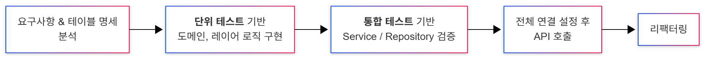

## 2. 진행절차 
- flowchart 작성 

```text
---
config:
  theme: mc
---
flowchart LR
    A[요구사항 & 테이블 명세 <br/> 분석] --> B[**단위 테스트** 기반 <br/> 도메인, 레이어 로직 구현]
    B --> C[**통합 테스트** 기반 <br/> Service / Repository 검증]
    C --> D[전체 연결 설정 후<br/> API 호출]
    D --> E[리팩터링]
```



## 7. Reference.
- 종류별로 구분해서 나열
- 한장더 추가해서 도서 추천

```text
.NET & E.F Core  
- [공식 .NET 문서](https://learn.microsoft.com/ko-kr/dotnet/)
- [자습서: ASP.NET Core를 사용하여 컨트롤러 기반 웹 API 만들기](https://learn.microsoft.com/ko-kr/aspnet/core/tutorials/first-web-api?view=aspnetcore-8.0&tabs=visual-studio) 
- [Entity Framework Core official docs](https://learn.microsoft.com/en-us/ef/core/)
- [What is Entity Framework](https://www.luisllamas.es/en/what-is-entity-framework/)

Testing 
- [xUnit.net v2](https://xunit.net/docs/getting-started/v2/getting-started)
- [Moq Framework](https://github.com/devlooped/moq)
- [FluentAssertions](https://fluentassertions.com/)
- [aspnet core integration-tests official docs](https://learn.microsoft.com/en-us/aspnet/core/test/integration-tests?view=aspnetcore-8.0&pivots=xunit)
- [SQLite Memory Testing](https://github.com/dotnet/EntityFramework.Docs/blob/live/samples/core/Testing/TestingWithoutTheDatabase/SqliteInMemoryBloggingControllerTest.cs#L50
)

Tools
- ERD : Draw.io
- Flow Chart : Mermaid
- Code Image : Carbon

```


---

## 기타. 아쉬운점 
- 커스텀 Exception을 마지막에 넣어서 예외 케이스를 테스트하지 못한거
- DB에 대한 주도권이 개발자한테 있는데 DB 통합 테스트를 SQLite로 한거 
	- `TestContainer + MSSQL` 
- Controller 테스트를 작성해보지 못한거
	- 현재 서비스 레이어 기준으로 통합 테스트, 단위 테스트로 동작을 확인하다보니 
	- http 스크립트를 작성해서 API 호출 확인하는 것으로 넘어감
- 엔티티에 접근 제어자..

✅ 언급할만한 이미지..
- 테스트와 생산성에 관한
- TDD 사이클 이미지


