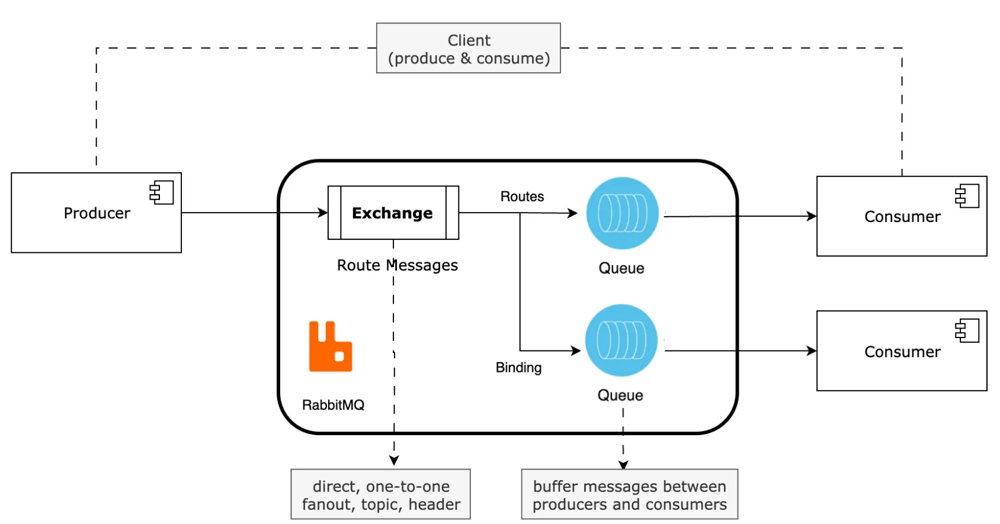

참고. 
- [AWS - RabbitMQ vs Kafka](https://aws.amazon.com/ko/compare/the-difference-between-rabbitmq-and-kafka/)
- [ZDNET korea - 아마존 CTO "이벤트 드리븐 아키텍처로 가라"](https://zdnet.co.kr/view/?no=20221202183934)
- [F-lab. 메시지 브로커와 이벤트 브로커: ..] (https://f-lab.kr/insight/message-broker-event-broker?gad_source=1&gbraid=0AAAAACGgUFeKgrz8-WR_U0x7Zupa8cKrf&gclid=Cj0KCQjw5azABhD1ARIsAA0WFUG1yOOiSHGGC-RXdc5Ua3iev4MphDgtYZGaK4CM969s4oJvMnP0tycaAn9DEALw_wcB)
- [RabbitMQ Tutorials](https://www.rabbitmq.com/tutorials)


Todo.
- RabbitMQ vs Kafka 비교 정리하기
- 주요 용어


## 섹션1. 쉽게 이해하는 RabbitMQ 개요과 비동기 아키텍처

slack에 notification 날린다는데 없네? ㅋㅋㅋ

### 3. RabbitMQ 설치


**도커로 설치** 
```shell
$ docker run -it --rm --name rabbitmq -p 5672:5672 -p 15672:15672 rabbitmq:4.0-management
```
- `--rm` : ctrl + c 로 종료할 경우 컨테이너 삭제 됨
- default 로그인 정보 : `guest` / `guest`
	- 최초 계정은 guest이기 때문에 admin 권한을 갖는 다른 계정을 추가해주고 default user 는 삭제 해주는게 보안상 권고
- [도커 허브 - RabbitMQ](https://hub.docker.com/_/rabbitmq)

> RabbitMQ 콘솔 주소
> localhost:15672 

> [!info] F-lab 참조 게시글
> RabbitMQ : 메시지 브로커, 비유하자면 택배 서비스
> Kafka: 이벤트 브로커, 비유하자면 도서관


**Mac 설치**
```text
// brew install 
[https://brew.sh/](https://brew.sh/)

// 설치 전에 brew 업데이트 
brew update 

// rabbitmq 설치 
brew install rabbitmq

// starts a local RabbitMQ node 
brew services start rabbitmq 

// stops the locally running RabbitMQ node 
brew services stop rabbitmq

// 삭제
brew uninstall rabbitmq

// 삭제 후 관련 디렉터리도 삭제 해줘야 함
rm -r /opt/homebrew/etc/rabbitmq 
rm -r /opt/homebrew/var/lib/rabbitmq 
rm -r /opt/homebrew/var/log/rabbitmq
```


**다른 운영체제**
```markdown
// 바이너리나 인스톨러 등을 활용해서 설치 [https://www.rabbitmq.com/docs/download(https://www.rabbitmq.com/docs/download)

// 윈도우의 경우 환경 변수에서 RabbitMQ 실행 bin 폴더를 지정해주면 됨
C:\Program Files\RabbitMQ Server\rabbitmq_server-4.0.3\sbin
```


### 4. AMQP의 이해

> Advanced Message Queing Protocal의 약자
> MQ의 오픈소스에 기반한 표준 프로토콜을 의미


**메세지큐를 사용하는 이유**
- 비동기 처리가 가능한 분야에서는 메세지 큐를 통해 느슨한 결합을 가지고 처리하도록 한다
	- 비동기 메시지를 사용하여 다른 응용프로그램 사이에 데이터를 송수신
- 복잡한 프로세스를 동기로 처리시 병목 현상, 장애전파, 확장성 제한 등의 문제 발생가능
	- 클라이언트에 대한 동기 처리는 병목의 요인으로 비동기로 처리해도 될 영역에 대해서는 큐를 통해 분리해서 처리한다
- 결국 분산환경에서 응용프로그램들을 분리하고 독립적으로 확장하기 위해서 사용, 기능별로 모듈 구성이 용이하다 (**Scalability**)
- 요청에 대한 응답을 기다릴 필요 ❌
	- 각 영역의 역할만 신경쓰면 된다
	- 어플리케이션 레벨에서 분리 할 수 있다
- 데이터를 메모리 대신에 디스크에 저장하여 데이터 유실을 방지(**Reliability**)
	- 즉시 처리하지 않아도 나중에 다시 처리가 가능하다 
	- 메시지 영구 저장, 메시지 확인, 장애 복구 메커니즘을 통해 메시지의 신뢰성을 보장
- **확장성**
	- 여러 노드에 걸쳐 쉽게 확장할 수 있어 높은 가용성 제공
	- 필요에 따라 메시지를 클러스터링하거나 페더레이션(federation) 방식으로 확장할 수 있다
- **유연성**
	- 다양한 exchange 유형과 라우팅 규칙을 지원하여 메시지를 효과적으로 라우팅하고 관리할 수 있다.
	- **광범위한 프로토콜 지원**: 기본적으로 AMQP 사용, STOMP, MQTT, HTTP 등을 포함한 다양한 프로토콜을 지원
	- **풍부한 클라이언트 라이브러리**:  Java, Python, Ruby, .NET 등 다양한 언어로 클라이언트 라이브러리를 제공하여 다양한 애플리케이션에서 사용할 수 있다



- 여기서 말하는 exchange의 `one-to-one fanout`의 경우 
	- 여러 큐에 메시지를 브로드 캐스트하지만, 각 큐에 연결된 소비자는 한 명이므로 **메시지는 각각의 큐에서 하나의 소비자에게만 전달**되므로 1:1 방식의 메시지 소비를 뜻한다
	- **여러 소비자에게 동시에 메시지를 전달하되 각 메시지가 단일 소비자에게만 전달되도록 보장하고 싶은 경우를 의미**한다고 보면 된다

**AMQP 특징**
이전에도 상용화된 MQ 제품들이 많았지만, 대부분 플랫폼 종속적이라 서로 다른 이기종간에 메시지를 교환하기 위해 메시지 포맷 컨버전(속도 저하 발생)을 위한 메시지 브릿지를 이용하거나 시스템 자체를 통일시켜야 하는 불편함과 비효율성이 있었다. 즉, **AMQP의 목적**은 서로 다른 시스템 간에 (비용/기술/시간 측면에서)효율적으로 메시지를 교환하기 위한 MQ 프로토콜로 특징은 다음과 같다
- 모든 broker들은 똑같은 방식으로 동작할 것  
- 모든 client들은 똑같은 방식으로 동작할 것 
- 네트워크 상으로 전송되는 명령어 표준화
- 프로그래밍 언어 중립적


**메모.**
exchange 방식은 여러가지 
큐는 버퍼의 역할 (생산자와 소비자 사이)

// 로그를 logback, ELK 활용해서 수집하는 방법도 있고
// 메시지 큐를 활용해서 수집 모듈(소비자)에서 따로 저장하는 방식도 생각할 수 있겠네

### 5. 주요용어와 Exchange의 이해 

**메모.**
가장 눈에 띄는게 consumer가 메세지를 처리한 이후에 ACK를 보내야 한다.
보내지 않는 경우 RabbitMQ에서 메시지를 다시 큐에 넣어 다른 소비자가 처리하도록 할 수 있다
<-> Kafka는 최신 offset 기준으로 조회하고 갱신(?)해주는걸로 알고 있음

Prdocuer -> Exchange로 갈때는 `routing key`가 사용됨
Exchange -> Queue로 갈때는 `binding key`가 사용됨
// 모호하네 ..  키 두 개를 구분 지어라는 건가?

**🤔 그러면 "생산자 모듈에서 두 키를 지정하나요?" 에 대해 (Chat-gpt)**

> ❌ **아니요! 생산자는 `routing key`만 지정합니다.**  
> ✅ **`binding key`는 큐 바인딩 시 서버 또는 인프라 레벨에서 설정합니다.**

- **Producer**:  
    `convertAndSend(exchangeName, routingKey, message)`  
    (👉 routing key만 신경 씀)
    
- **Consumer**:  
    큐와 exchange를 바인딩할 때 **binding key를 지정**


**Routing Model Components**
AMQP의 라우팅 모델은 아래와 같은 3개의 중요한 component로 구성된다
- **Exchange**
	- producer에서 보낸 메시지를 적절한 큐 또는 다른 exchange로 분배하는 라우터의 기능을 함
- **Binding**
	- exchange와 큐와의 관계를 정의한 **일종의 라우팅 테이블**
	- 같은 큐가 여러 개의 exchange에 bind 될 수 도 있고, 하나의 exchange 에 여러 개의 큐가 binding 될 수 있다
- **Queue**
	- 메모리나 디스크에 메시지를 저장하고, consumer에게 전달하는 역할을 함


![[Pasted image 20250426132410.png]]


**RabbitMQ의 주요 용어 정리**
- Producer (생산자)
	- 메시지를 생성하고 RabbitMQ에 전송하는 애플리케이션
	- 특정 Exchange에 메시지를 전송하고 Exchange는 메시지를 라우팅하여 큐에 배치
- Exchange
	- Producer로부터 받은 메시지를 큐에 전달하는 역할 
	- 유형
		- Direct: 특정 라우팅 키와 정확히 일치하는 큐에 메시지를 전송 
		- Fanout: 모든 큐에 메시지를 브로드캐스트 
		- Topic: 라우팅 키 패턴을 기반으로 메시지를 특정 큐에 전달 
		- Headers: 메시지 헤더 속성에 따라 메시지를 라우팅 
	- 메시지가 Exchange로 전송될때, Routing Key가 함께 전달
- Routing Key
	- 메시지를 전송할 때 Producers가 Exchange에 전달하는 키
	- Exchange는 이 Routing Key를 참고하여 어떤 큐에 메시지를 전달할지 결정
- Queue
	- 메시지를 일시적으로 저장하는 버퍼 역할
	- RabbitMQ의 큐는 FIFO 방식으로 동작하며, 메시지가 소비자에게 전달될 때까지 보관
	- 각 큐는 여러 Consumer가 구독(수신)할 수 있으며, 메시지는 큐에 들어온 순서대로 전달
	- 비동기적으로 동작하며, 여러 컨슈머가 동시에 메시지를 소비할 수 있다
		- 단, 하나의 메시지가 여러 소비자에게  중복으로 전달될 수 없음
		- 동일한 메시지를 수신하려면 fanout Exchange 방식으로 동작해야만 함
- Binding
	- exchange와 큐 간의 관계를 정의
	- 바인딩은 메시지를 라우팅할 때 어떤 조건으로 큐에 보낼지 정의하고 이를 위해 binding key가 사용됨 
	- Binding Key와 Routing Key가 일치하면 해당 큐로 메시지가 전달 (패턴 매칭 지원)
- Consumer (소비자)
	- 큐에서 메시지를 가져와 처리하는 애플리케이션
	- RabbitMQ는 여러 소비자에게 메시지를 로드 밸런싱 할 수 있다
	- Consumer는 큐에서 메시지를 받아 처리하면 메시지에 대한 확인(ACK, acknowledgment)을 브로커에 전송함
	- 확인을 보내지 않으면, 브로커는 메시지를 재전송하거나 설정한 다른 Consumer에게 전달할 수 있다
- Message Acknowledgment (메세지 확인)
	- 메시지가 성공적으로 처리되었음을 RabbitMQ에 알리는 과정
	- 만약 소비자가 메시지를 성공적으로 처리하지 못했다면, 메시지를 다시 큐에 넣어 다른 소비자가 처리하도록 할 수 있다


**절차 요약**
```text
1. Producer가 메시지와 Routing Key를 Exchange에 전송
2. Exchange가 Routing Key를 사용해 Binding Key가 일치하는 큐에 메시지를 라우팅
3. Consumer가 큐에서 메시지를 가져와 처리하고, 성공적으로 처리되었음을 acknowledgment로 RabbitMQ에 알림
```


**추가 용어**
- Prefetch Count
	- 소비자가 받을 수 있는 최대 메시지 수 설정
	- 한 번에 많은 양의 메시지를 처리하지 않도록 해 소비자의 성능 최적화
- Virtual Host (가상 호스트)
	- RabbitMQ 서버 내의 논리적인 구획으로, 메시지 큐, 익스체인지, 사용자 권한 등을 구분 
	- 하나의 RabbitMQ 서버 내에 여러 개의 가상 호스트를 설정하여 서로 다른 애플리케이션의 메시지를 격리 할 수 있다
- Dead Letter Queue (DLQ)
	- 메시지가 처리되지 못하거나 유효 기간이 지난 경우 별도의 큐로 이동하는 구조도 설정할 수 있다

**Exchange 유형에 따른 처리**
- 1. Direct Exchange
	- 메시지가 routing key에 따라 특정 큐로 하나씩 전달되는 방식
	- 메시지 발행시 사용하는 라우팅 키와 동일한 키로 익스체인지에 바인딩 된 모든 큐에 메시지를 전달
	- 해당 라우팅 키와 일치하는 큐에만 메시지가 전달되는 방식이기 때문에 Direct Exchange 라고 함
	- 예시. 주문에 따른 상태 지시
		- 활용: 주문 상태별로 **라우팅 키**를 정의, 각 상태에 해당하는 큐가 메시지를 받는다. 매핑이 정확하게 되는 한 개의 키만 있으니깐 1:1로 가능할 거 같은데, **하나의 라우팅 키**에 대해 **여러 큐**가 바인딩 될 수 있기 때문에 **1:N** 매칭이 가능하다.
			- 메시지가 명확하게 특정 큐로 전달되어야 할 때
			- 큐마다 고유한 라우팅 규칙을 적용하여 메시지를 분류해야 할 때
	- **예시 업무**: 주문 상태 처리, 결제 처리, 사용자 알림 시스템 등
- 2. Topic Exchange
	- 라우팅 키를 **패턴 기반**으로 정의하여 여러 큐에 유연하게 전달할 수 있는 방식
	- 라우팅 키에 와일드카드(`*, #`) 매칭을 사용하여 더 복잡한 라우팅이 가능하다
		- 와일드카드 \* 의 경우 하나의 단어를 대체하는 의미로 log.info, log.warn과 같은 패턴의 메시지를 수신할 때 log.\*로 매칭되어 전부 수신가능 
		- \#의 경우 0개 이상의 단어를 대체하므로 app.order.success, app.payment.sucess와 같은 라우팅 키를 \#.success로 다 수신할 수 있다
	- 동적이고 유연한 라우팅이 필요할 때 사용 
	- 예시: 로그 수집 시스템, 이벤트 기반 모니터링 등
- 3. Fanout Exchange
	- 브로드캐스트 방식으로 메시지를 모든 바인딩된 큐에 전달한다
	- 한 번의 메시지 발행으로 모든 큐가 동일한 메시지를 받는다
		- 이벤트가 발생하면 모든 서비스가 동일한 메시지를 받는 서비스에서 유용
	- 예시. 시스템 점검 공지 등 
- 4. Headers Exchange
	- 메시지의 속성(헤더)에 기반한 복잡한 라우팅이 필요할 때 사용 
	- 메시지 헤더에 `language: "ko"`등의 값을 설정하여 헤더 기반 라우팅 수행
		- `language: "ko"`로 설정된 메시지는 한국어 이메일 서비스에서 처리 
		- `language: "en"`로 설정된 메시지는 영어 이메일 서비스에서 처리 


**메시지 전송 단계별 프로세스**
![[메시지단계별flow.png]]
1. 메시지 전송 
	1. Producer ➡️ Broker (RabbitMQ)
	2. 이때 메시지는 큐에 저장되며, Exchange와 Binding 설정에 따라 적절한 큐로 라우팅
2. 메시지 전달 
	1. Broker ➡️ Consumer
	2. Consumer는 **큐에서 메시지를 가져가거나(Polling) 메시지를 푸시(Push)** 받는 방식으로 수신
3. 메시지 확인(ACK) 또는 커절(NACK)
	1. **ACK** : 
		1. Consumer가 메시지를 성공적으로 처리 후 Broker에게 ACK 전송
		2. 이 경우 Broker는 해당 메시지를 큐에서 제거하고 Producer에게 **Message Acknowledged** 응답을 전송 (Producer가 Publisher Confirms 사용시 활용)
	2. **NACK** : 
		1. Consumer가 메시지 처리에 실패하거나 메시지를 거절당할 경우 NACK을 전송
		2. NACK에는 메시지를 다시 큐로 보내야 할지(requeue) 또는 폐기해야 할지 (discard) 설정 가능 
			1. Requeue(재전송) : 메시지를 다시 큐로 보내고 재처리할 수 있도록 설정
			2. Discard(폐기) : 메시지를 큐에서 제거하고 폐기
4. Producer에 응답 (Message Acknowledged / Message Rejected)
	1. Producer가 Publisher Confirms를 활성화한 경우 Broker는 ACK또는 NACK 결과를 Producer에게 전송
	2. ACK를 받은 경우 메시지가 성공적으로 소비된 것으로 간주
	3. NACK를 받는 경우 Producer는 메시지 실패를 기록하거나 재전송

---

## 섹션2. RabbitMQ 기본 튜토리얼 

### 6~7. 단순 메시지 전송 (Producer to Consumer)

```shell
docker run -it -d --name rabbitmq -p 5672:5672 -p 15672:15672 rabbitmq:4.0-management
```

계정 추가하면 Can access virtual hosts가 No access 확인됨 (접근 권한 x 상태)


➡️ Name을 누르고 설정 이동하면 Set Permission 버튼을 눌러줌
➡️ 이전 화면으로 돌아가면 No access 사라짐 


인텔리제이 프로젝트 설치
- HelloMessageQueue
	- JDK17
	- 의존성: Spring Boot Dev Tools, Spring Web, Spring for RabbitMQ, Lombok

application.yml 작성
```shell
spring:
  rabbitmq:
    host: localhost
    port: 5672  // 기본 통신 포트, 15672는 주로 관리 및 모니터링(admin) 용도로 사용
    username: guestuser
    password: guestuser
  application:
    name: HelloWorldMessageQueue
server:
  port: 8080

```

`RabbitMQConfig` Bean 생성
- `Queue queue()` 
	- Bean은 Queue 인스턴스를 생성하고, 애플리케이션이 사용할 RabbitMQ를 정의
	- 첫번째 인자 QUEUE_NAME: 메시지가 쌓이고 처리할 큐의 이름을 정의
	- 두번째 인자 durable (boolean) : 큐가 휘발성(volatile)인지 영속성(persistent)인지 여부 지정
- `RabbitTemplate rabbitTemplate(ConnectionFactory connectionFactory)`
	- RabbitMQ 통신을 위한 템플릿 클래스, 메시지를 보내고 받을 때 사용
	- RabbitTemplate은 Spring의 JdbcTemplate과 비슷하게, RabbitMQ와 상호작용하기 위한 간단한 API를 제공합니다. 
	- 주로 메시지 전송을 담당
	- **ConnectionFactory** : RabbitMQ와의 연결을 관리하는 객체로, rabbitTemplate에 주입하여 메시지를 전송할 떄 사용할 커넥션을 제공
	- **사용 용도**: 메시지를 전송하는 Sender가 `rabbitTemplate.convertAndSend()` 메서드를 사용해 큐에 메시지를 넣는데 사용
- `SimpleMessageListenerContainer container(ConnectionFactory connectionFactory, MessageListenerAdapter listenerAdapter)`
	- 이 Bean은 RabbitMQ 메시지를 비동기적으로 수신하기 위해 리스너를 생성함
	- 이 컨테이너는 특정 큐를 지속적으로 모니터링하고, 메시지 수신하며 지정된 리스너(MessageListenerAdapter)를 통해 처리함
	- `ConnectionFactory` : RabbitMQ와 연결을 유지하며, 수신하는 메시지를 이 연결을 통해 가져옴
	- `setQueueName(QUEUE_NAME)`: 특정 큐 이름을 설정, 이 컨테이너는 해당 큐에서 수신되는 메시지를 모니터링
	- `setMessageListener(listenerAdapter)`: listenerAdapter를 설정하여, 메시지가 수신될 때 호출할 리스너를 지정
	- Spring AMQP에서 메시지를 자동으로 수신하려면 SimpleMessageListenerContainer가 필요
		- 메시지 수신과 관련된 스레드 관리, 연결 유지, 큐 모니터링 작업을 자동으로 처리함
		- 만약 없이 구현한다면
			- RabbitTemplate의 `receiveAndConvert()` 메서드를 수동 호출하여 메시지를 가져오는 동기적 방식으로 구현해야 함
			- 이는 비효율적이며, 큐의 상태를 주기적으로 확인(polling)해야 하기 때문에 자원을 낭비할 수 있습니다.
- `MessageListenerAdapter listenerAdapter(Receiver receiver)`
	- `MessageListenerAdapter`: 수신한 메시지를 특정 클래스의 특정 메서드로 전달하는 어댑터 역할을 함
		- receiver 객체는 메시지를 처리하는 역할을 하는 빈 (사용자 정의 컴포넌트 빈)
		- receiveMessage 메서드를 호출합니다 (default 명칭 **"handleMessage"**, 문자열 지정 가능) ➡️ MessageListenerAdapter 생성자 확인
		- MessageListenerAdapter는 RabbitMQ에서 수신된 메시지를 특정 메서드에 전달할 수 있도록 해 줌
			- 이 경우 `receiveMessage()`가 자동 호출되며, 메시지 내용을 인자로 받음
			- Receiver 클래스의 receiveMessage()가 메시지를 수신하여 처리하도록 설정
	- RabbitMQ에서 수신된 메시지가 `receiver.receiveMessage(String message)`로 전달된다

step1 생성 후 http 호출 테스트 
```text
###  
POST http://localhost:8080/api/messages/send  
Content-Type: application/json  
  
"hello world"


-------------------------

POST http://localhost:8080/api/messages/send

HTTP/1.1 200 
Content-Type: text/plain;charset=UTF-8
Content-Length: 44
Date: Sat, 26 Apr 2025 07:24:16 GMT

[#] Message sent successfully! "hello world"
```

```text
// 콘솔 
[#] Sent : "hello world"
[#] Received message: "hello world"
```

**참고.** [기억보단 기록을 - 인텔리제이 http](https://jojoldu.tistory.com/266)

### 8 ~ 9. Consumer간 작업 분배

