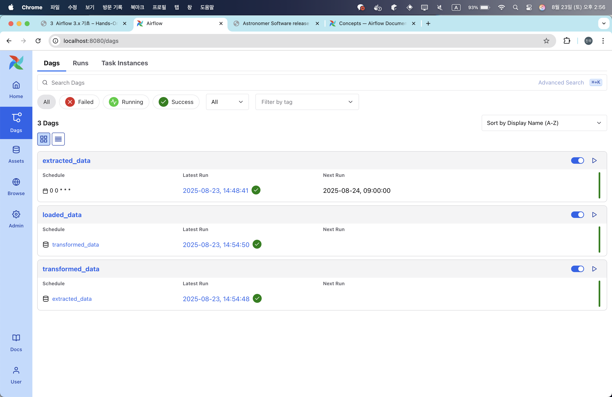

- apache airflow korea
	- https://discourse.airflow-kr.org/


- https://sangkon.com/practice-airflow3/
- 어떤 업무나 행위를 규칙성에 맞춰서 수행
	- 워크플로우 오케스트레이션
		- bash로 간단히 한다?
	- ex. 결제 메일이 두 번 나가는 경우
- airflow는 script language 
- 스프링 사용시 
	- `백오피스` 분리해서 개발해야 함
	- 책임/역할에 따라 웹 서비스 
- python
	- 장고는 어드민을 기본으로 제공


워크플로우 오케스트레이션 필요한 기능 
- 스케쥴러
- 데이터 저장
- UI, 웹 서버 필요

아스트로 노멀사에서 제공하는 툴킷이 따로 있다..
- 도커가 필요 
- 도커가 없으면 redhat 팟맨 써야 한다는데 정보가 없음..🪏

### 설치하기


도커 설치 되어 있는 경우
```shell
❯ brew install astro
❯ astro version
Astro CLI Version: 1.35.1

❯ mkdir hello-astro
❯ cd hello-astro
❯ astro dev init
❯ astro dev start
```
- hello-astro*, postgres, mysql:8.0 컨테이너 여러 개가 올라가네


> `PyTorch`, 파이썬 버전 주의


오늘 목표, bash shell을 사용하지 않고 airflow 사용하여 아래 시나리오대로 실행한다
```shell
$ sudo apt install curl jq mysql-client
$ vim ./quote_fetcher.sh

#!/bin/bash

# 0. 환경 변수 및 설정
API_URL="https://zenquotes.io/api/quotes"
...

# 1. 데이터베이스 테이블 생성
create_table() { ... }

# 2. API에서 인용구 가져오기
fetch_quote() { ... }

# 3. 데이터베이스에 저장
save_to_db() { ... }

# 4. 통계 출력
show_stats() { ... }

# 5. 메일 발송 함수
send_email_report() { ... }

# 메인 함수
main() { ... }

main "${1:-1}"
```


> dags 디렉터리에 파이썬 파일 만들어 보는거만 신경쓰면 됨


docker file에서 버전을 `3.0.9`-> `3.0.2`로 다운 그레이드 
```text
FROM astrocrpublic.azurecr.io/runtime:3.0-2
```
https://sangkon.com/practice-airflow3/notes/basic.html#api-%EC%9D%91%EB%8B%B5-%EB%B3%80%ED%99%98%ED%95%98%EA%B8%B0

https://www.astronomer.io/docs/software/release-notes


3.1.3.1 태스크 중심 접근 방식
https://sangkon.com/practice-airflow3/notes/basic.html#airflow-3-%EC%86%8C%EA%B0%9C


> 태스크 vs 애셋 방식
> - 작업하기에는 태스크가 좀 더 쉽다
> - 업무적으로는 애셋을 선호
>   
> - 그러나 태스크가 중간에 뻑나면 망함
> - 애셋은 중간에 뻑나면 디비에 기록 가능


### hello-world 예시
간단하게 두 값을 합산하는 결과를 애셋 기반으로 해본다

dags/hello-world.py
```python
# hello-world.py

from airflow.sdk import asset


@asset(schedule="@daily") # 00시 UTC 기준(*주의)
def extracted_data():
    return {"a": 23, "b": 19}


@asset(schedule=extracted_data) # extracted_date 끝나면 실행됨
def transformed_data(context): # context는 airflow에서 주입해줌
	# airflow로부터 값을 가져올 수 있다
	## ti: task instance
    my_data = context["ti"].xcom_pull(
        dag_id="extracted_data",
        task_ids="extracted_data",
        key="return_value",
        include_prior_dates=True,
    )
    
    # 합산
    summed_data = my_data["a"] + my_data["b"]
    return summed_data


@asset(schedule=transformed_data)
def loaded_data(context):
    my_sum = context["ti"].xcom_pull(
        dag_id="transformed_data",
        task_ids="transformed_data",
        key="return_value",
        include_prior_dates=True,
    )
    return f"Sum of a and b is {my_sum}"
```
- 스케쥴 사용시 표준 시간대 설정이 중요
	- DB도 중요 
		- datatime 
- 48kb 이상이 필요하면 디비, s3를 써야 함
	- 지금같이 디비를 사용하지 않는 경우에는 공용 메모리를 사용한다는 의미인듯 
	- https://sangkon.com/practice-airflow3/notes/basic.html#xcom-%EC%9D%B4%EB%9E%80

> 데이터베이스 클리닝, 어그리게이션(통계) 같은거 간단하게 하기 좋다





각  asset 별로 실행 로그 확인 가능


### 

> airflow 도서는 국내에 하나 뿐인데 2.x대 버전이다.
- 병렬로 실행하거나
- 태스크 길이가 다른 경우 
- 예시는 초급자 형태

3.3 Asset을 사용한 파이프라인 작성하기
https://sangkon.com/practice-airflow3/notes/basic.html#asset%EC%9D%84-%EC%82%AC%EC%9A%A9%ED%95%9C-%ED%8C%8C%EC%9D%B4%ED%94%84%EB%9D%BC%EC%9D%B8-%EC%9E%91%EC%84%B1%ED%95%98%EA%B8%B0

> pycon


```python
# create_newsletter.py

from airflow.sdk import asset  

@asset(schedule="@daily")  
def raw_zen_quotes():  
	# 📌 전역에 두면 GC가 안되서 메모리 부족할 수 있어서 함수안에 둠
    import requests 
    
    # json을 랜덤하게 제공해준다
    r = requests.get("https://zenquotes.io/api/quotes/random")
    quotes = r.json()
    return quotes  
```
- import 모듈을 전역에 둘지 지역에 둘지는 선택하기 !
	- GC는 어떻게, 언제 호출되는걸까
- astro 설치시 기본으로 셋팅해주나 봄
	- 안정적이고 심리스(?)
- 참고. https://www.astronomer.io/events/webinars/


// ?
```shell
astro dev run dags reserialize
```


```python
@asset(schedule=[raw_zen_quotes])
def selected_quotes(context: dict) -> dict: # 힌팅??
    import numpy as np

    raw_zen_quotes = context["ti"].xcom_pull(
        dag_id="raw_zen_quotes",
        task_ids=["raw_zen_quotes"],
        key="return_value",
        include_prior_dates=True,
    )[0]

    # 문자 수 기반 분석
    quotes_character_counts = [int(quote["c"]) for quote in raw_zen_quotes]
    median = np.median(quotes_character_counts)
    
    # 중간값에 가장 가까운 인용구 찾기
    median_quote = min(
        raw_zen_quotes,
        key=lambda quote: abs(int(quote["c"]) - median),
    )
    raw_zen_quotes.pop(raw_zen_quotes.index(median_quote))

    # 짧은 인용구와 긴 인용구 찾기
    short_quote = [quote for quote in raw_zen_quotes if int(quote["c"]) < median][0]
    long_quote = [quote for quote in raw_zen_quotes if int(quote["c"]) > median][0]    
    
    return {
        "median_q": median_quote,
        "short_q": short_quote,
        "long_q": long_quote,
    }
```
- 힌팅??
	- c++에서 사용하는가?
	- 가독성을 높이기 위해 python에서도 사용을 권장하여 예제 작성함
	- 리턴 값에 대해 알려주는 용도
- 반복문에서 문제 발생하면 try-catch 해주는게 좋다 
	- 심리스하게 한다 ??

> numpy가 깔려 있다면  워크플로우 정상 실행되는지 확인 가능하다


python splalechemy `audit` log sample 
- audit 키워드를 붙여서 검색

판다스??
- 파이썬 데이터 분석??


뉴스레터 포맷 어디다 만드냐?
```text
===========================================
      Daily Reality Tunnel {date}
===========================================

Hello Cosmic Traveler,

As you surf the probabilistic waves of existence today, 
take these three quotes with you:

1. "{quote_text_1}" - {quote_author_1}
2. "{quote_text_2}" - {quote_author_2}
3. "{quote_text_3}" - {quote_author_3}

Have a fantastic journey!
AllThingsLookingUp Team

======================================================
Consider also subscribing to our other newsletters: 
"Weekly Dose of Happiness" and "Monthly Wonder".

"...reality is always plural and mutable." - R.A.W.
======================================================
```
- 현재 프로젝트의 `include/newsletter/newsletter_template.txt`
- `{}` : 템플릿 엔진 포맷
	- ex. 타임리프, jsp, jinja
	- 파이썬에 장고 탬플릿 엔진이 존재
- 템플릿 엔진을 사용하지 않으므로.. 직접 key 정의해서 합쳐줘야 한다
	- `io` 에러가 발생가능
	- 파일은 s3에 저장 


```python
import os

OBJECT_STORAGE_SYSTEM = os.getenv("OBJECT_STORAGE_SYSTEM", default="file")
OBJECT_STORAGE_CONN_ID = os.getenv("OBJECT_STORAGE_CONN_ID", default=None)
OBJECT_STORAGE_PATH_NEWSLETTER = os.getenv(
    "OBJECT_STORAGE_PATH_NEWSLETTER",
    default="include/newsletter",
)


@asset(schedule=[selected_quotes])
def formatted_newsletter(context: dict) -> None:
    from airflow.sdk import ObjectStoragePath

    object_storage_path = ObjectStoragePath(
        f"{OBJECT_STORAGE_SYSTEM}://{OBJECT_STORAGE_PATH_NEWSLETTER}",
        conn_id=OBJECT_STORAGE_CONN_ID,
    )
    
    # 날짜 가져옴 (공식 문서에 "dag_run" variables 검색해보기)
    date = context["dag_run"].run_after.strftime("%Y-%m-%d")
    selected_quotes = context["ti"].xcom_pull(
        dag_id="selected_quotes",
        task_ids=["selected_quotes"],
        key="return_value",
        include_prior_dates=True,
    )[0]

	# 파일 경로, python pathlib (`/`, sperator 구분자)
    newsletter_template_path = object_storage_path / "newsletter_template.txt"
    newsletter_template = newsletter_template_path.read_text()
    newsletter = newsletter_template.format(
        quote_text_1=selected_quotes["short_q"]["q"],
        quote_author_1=selected_quotes["short_q"]["a"],
        quote_text_2=selected_quotes["median_q"]["q"],
        quote_author_2=selected_quotes["median_q"]["a"],
        quote_text_3=selected_quotes["long_q"]["q"],
        quote_author_3=selected_quotes["long_q"]["a"],
        date=date,
    )
    date_newsletter_path = object_storage_path / f"{date}_newsletter.txt"
    date_newsletter_path.write_text(newsletter)
```
- none이라고 표기되어 있는데 
	- 메일 작업에 대한 결과를 저장해야 리포팅 / 추적 가능 
- **pendulum** datetime
	- tz : timezone
	- 타임존 관련 지원되는 모듈, 라이브러리 

> 발표자는 파이참 사용한다함 


실행하니 실패 드네 
```text
1. Dag
    
    [formatted_newsletter](http://localhost:8080/dags/formatted_newsletter)
    

2. Dag Run
    
    [2025-08-23, 15:40:35](http://localhost:8080/dags/formatted_newsletter/runs/manual__2025-08-23T06:40:36.667852+00:00)
    

3. Task
    
    formatted_newsletter
    

[

formatted_newsletter

](http://localhost:8080/dags/formatted_newsletter/tasks/formatted_newsletter)

1s

0s

0s

[

](http://localhost:8080/dags/formatted_newsletter/runs/manual__2025-08-23T06:40:36.667852+00:00/)

[](http://localhost:8080/dags/formatted_newsletter/runs/manual__2025-08-23T06:40:36.667852+00:00/tasks/formatted_newsletter)

## formatted_newsletter

## 2025-08-23, 15:40:36

## Operator

_AssetMainOperator

## Start

2025-08-23, 15:40:36

## End

2025-08-23, 15:40:37

## Duration

0.18s

## DAG Version

v1

[

Logs

](http://localhost:8080/dags/formatted_newsletter/runs/manual__2025-08-23T06:40:36.667852+00:00/tasks/formatted_newsletter "Logs")[

Rendered Templates

](http://localhost:8080/dags/formatted_newsletter/runs/manual__2025-08-23T06:40:36.667852+00:00/tasks/formatted_newsletter/rendered_templates "Rendered Templates")[

XCom

](http://localhost:8080/dags/formatted_newsletter/runs/manual__2025-08-23T06:40:36.667852+00:00/tasks/formatted_newsletter/xcom "XCom")[

Audit Logs

](http://localhost:8080/dags/formatted_newsletter/runs/manual__2025-08-23T06:40:36.667852+00:00/tasks/formatted_newsletter/events "Audit Logs")[

Code

](http://localhost:8080/dags/formatted_newsletter/runs/manual__2025-08-23T06:40:36.667852+00:00/tasks/formatted_newsletter/code "Code")[

Details

](http://localhost:8080/dags/formatted_newsletter/runs/manual__2025-08-23T06:40:36.667852+00:00/tasks/formatted_newsletter/details "Details")[

Asset Events

](http://localhost:8080/dags/formatted_newsletter/runs/manual__2025-08-23T06:40:36.667852+00:00/tasks/formatted_newsletter/asset_events "Asset Events")

``   Log message source details: sources=["/usr/local/airflow/logs/dag_id=formatted_newsletter/run_id=manual__2025-08-23T06:40:36.667852+00:00/task_id=formatted_newsletter/attempt=1.log"]  [2025-08-23, 15:40:36] `INFO` - DAG bundles loaded: dags-folder: source="airflow.dag_processing.bundles.manager.DagBundlesManager"  [2025-08-23, 15:40:36] `INFO` - Filling up the DagBag from /usr/local/airflow/dags/create_newsletter.py: source="airflow.models.dagbag.DagBag"  [2025-08-23, 15:40:36] `INFO` - TaskInstance Details: : dag_id="formatted_newsletter": task_id="formatted_newsletter": dagrun_id="manual__2025-08-23T06:40:36.667852+00:00": map_index=-1: run_start_date="2025-08-23T06:40:36.839382Z": try_number=1: op_classpath=["airflow.sdk.definitions.asset.decorators._AssetMainOperator","airflow.providers.standard.operators.python.PythonOperator","airflow.models.baseoperator.BaseOperator"]: source="task"  [2025-08-23, 15:40:37] `ERROR` - Task failed with exception: source="task"TypeError: list indices must be integers or slices, not str  File "/usr/local/lib/python3.12/site-packages/airflow/sdk/execution_time/task_runner.py", line 918 in run  File "/usr/local/lib/python3.12/site-packages/airflow/sdk/execution_time/task_runner.py", line 1213 in _execute_task  File "/usr/local/lib/python3.12/site-packages/airflow/sdk/bases/operator.py", line 397 in wrapper  File "/usr/local/lib/python3.12/site-packages/airflow/providers/standard/operators/python.py", line 216 in execute  File "/usr/local/lib/python3.12/site-packages/airflow/providers/standard/operators/python.py", line 239 in execute_callable  File "/usr/local/lib/python3.12/site-packages/airflow/sdk/execution_time/callback_runner.py", line 81 in run  File "/usr/local/airflow/dags/create_newsletter.py", line 75 in formatted_newsletter         ``

## formatted_newsletter

``   Log message source details: sources=["/usr/local/airflow/logs/dag_id=formatted_newsletter/run_id=manual__2025-08-23T06:40:36.667852+00:00/task_id=formatted_newsletter/attempt=1.log"]  [2025-08-23, 15:40:36] `INFO` - DAG bundles loaded: dags-folder: source="airflow.dag_processing.bundles.manager.DagBundlesManager"  [2025-08-23, 15:40:36] `INFO` - Filling up the DagBag from /usr/local/airflow/dags/create_newsletter.py: source="airflow.models.dagbag.DagBag"  [2025-08-23, 15:40:36] `INFO` - TaskInstance Details: : dag_id="formatted_newsletter": task_id="formatted_newsletter": dagrun_id="manual__2025-08-23T06:40:36.667852+00:00": map_index=-1: run_start_date="2025-08-23T06:40:36.839382Z": try_number=1: op_classpath=["airflow.sdk.definitions.asset.decorators._AssetMainOperator","airflow.providers.standard.operators.python.PythonOperator","airflow.models.baseoperator.BaseOperator"]: source="task"  [2025-08-23, 15:40:37] `ERROR` - Task failed with exception: source="task"TypeError: list indices must be integers or slices, not str  File "/usr/local/lib/python3.12/site-packages/airflow/sdk/execution_time/task_runner.py", line 918 in run  File "/usr/local/lib/python3.12/site-packages/airflow/sdk/execution_time/task_runner.py", line 1213 in _execute_task  File "/usr/local/lib/python3.12/site-packages/airflow/sdk/bases/operator.py", line 397 in wrapper  File "/usr/local/lib/python3.12/site-packages/airflow/providers/standard/operators/python.py", line 216 in execute  File "/usr/local/lib/python3.12/site-packages/airflow/providers/standard/operators/python.py", line 239 in execute_callable  File "/usr/local/lib/python3.12/site-packages/airflow/sdk/execution_time/callback_runner.py", line 81 in run  File "/usr/local/airflow/dags/create_newsletter.py", line 75 in formatted_newsletter         ``
```


### 직접 해보기
- 태스크는 집에서 
- 멜론 탑100 크롤링 해서 json으로 만들기 
	- 임영웅을 제외한 가장 많은 곡을 가지고 있는 가수 뽑기
	- 또는 좋아요 수가 가장 많은 곡을 뽑기
- `멜론 탑100 8월 첫째주` 와 같이 html 파일로 만들어보기
- 깃헙 정적 페이지로 개시