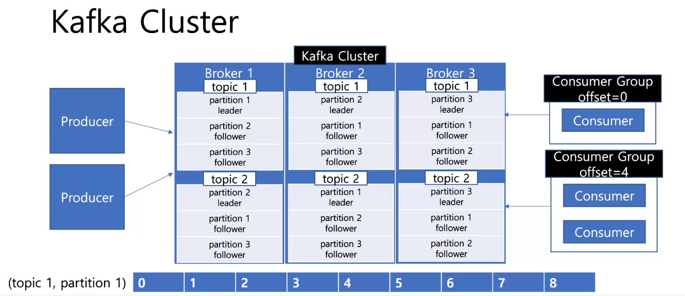
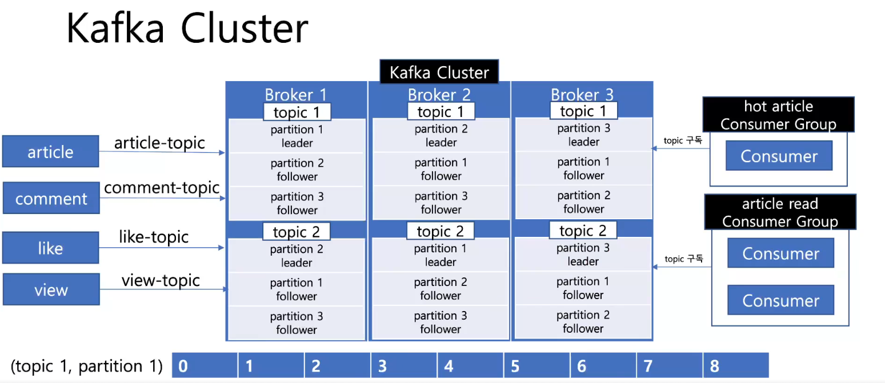

**todo.**
- service에 dto 클래스 보면 response에 AllArg* 있는데 굳이 필요하지 않아 보인다. 
	- 오히려 pojo 방식으로 선언해서 할당하는게 가독성이 좋아 보임
	- article, comment 모듈 수정하기 


## 게시글 


## 댓글 

> **대댓글 (2depth) 방식**과 **무한 depth 방식** 둘 다 구현


- **대댓글** : comment_parent_id 기반으로 계층형 구조
- **무한 depth**: varchar(25) path, 25개 문자열 기반으로 5개씩 나눠 계층 표현
	- 총 5depth 존재 00000 00000 00000 00000 ~ zzzzz zzzzz zzzzz zzzzz zzzzz
	- 각 자리는 **0-9A-Za-z**, 총 **62개** 문자열 중 하나
		- 텍스트 선언 후 인덱스 기반으로 다음 문자열 가져와 처리
	- depth 별로 댓글은 62^5 = 약 9억개 정도 할당 가능 
	- depth 별로 댓글이 9억개가 넘어가면 문자열 길이(path)를 늘리거나 하면 됨
- **삭제**의 경우 
	- 자식이 있으면 논리적 삭제(`deleted = true`업데이트)
	- 자식이 없으면 물리적 삭제(DB)

**두 방식 비교.**


**TODO.**
- 게시판을 두개다 만들건지 아니면 하나만 할건지 선택해서 남겨두자 


## 좋아요

> **비관적 락(pessmistic lock)**, **낙관적 락(optimistick lock)** 방식을 둘 다 사용해 봄


| 기능     | REST 표현                | HTTP 메서드 | 설명                   |
| ------ | ---------------------- | -------- | -------------------- |
| 좋아요    | `/articles/{id}/likes` | `POST`   | 좋아요 추가 (Like 리소스 생성) |
| 좋아요 해제 | `/articles/{id}/likes` | `DELETE` | 좋아요 취소 (Like 리소스 제거) |
- 좋아요 응답은 201 created
- 좋아요 해제 응답은 204 no content

|서비스 유형|추천 방식|
|---|---|
|**정합성 최우선 (재고/주문)**|비관적 락 (Pessimistic Lock)|
|**많은 트래픽, 정확성 중요 (좋아요)**|낙관적 락 + 재시도, 또는 Redis 누적 후 DB 반영|
|**캐시 허용 가능 (조회수, 좋아요)**|Redis 기반 처리 (성능 우선)|
|**낮은 충돌 가능성 (로그 등)**|락 없이 처리|
- 비관적 락을 사용하는 경우 
	- update 방식과 select .. for update 방식이 있음
	- 정합성은 높으나 데드락 위험 있음
- 낙관적 락을 사용하는 경우 
	- 재시도 로직이 필요함 (spring-retry)
	- 재시도 로직이 없는 경우 데이터 유실 높음


> 통합 테스트만 작성하는 걸로 함, 왜냐하면 service, repository 둘다 의미 없어 보이고 
> 동시성 이슈에 대한 확인만 하면 되기 때문에 controller 단에서만 테스트하는게 맞다고 생각
> - 처음에는 강의와 같이 비관적 락 (2개, `update`, `select .. for update`), 낙관적 락 테스트(재시도 x)
> - `spring-retry` 추가해서 낙관적 락만 사용하는 걸로 최종 결정 후 리팩터링 


낙관적락 테스트시 beforeEach에서 데이터 초기화하면 바로 OptimisticLockingFailureException 발생  > beforeEach를 빼면 정상 실행은 되나 재시도 로직이 없어 전체 1000개 실패 


1000개 넣는데 
- 비관적 락1(update) 300ms
- 비관적 락2(select for update) 1156ms
- 낙관적 락 (재시도x) 테스트 실패 (7/3)
	- (7/4) 문제 원인은 h2는 read committed인데 flush(), clear() 한다고 commit 되는게 아니었음 > 하나의 트랜잭션이 종료되어야 commit 실행함
	- ArticleLikeCount에 `of(..)` 정적 팩토리 메서드에서 version = 0L 초기화하는 것과, @BeforeEach에서 ArticleLikeCount 초기화하는거 지우니 정상 동작
	- success : 212, fail:788, time: 533ms, count: 212
		- retry가 없어서 OptimisticLockingFailureException 터져서 실패가 많음
- 낙관적 락 (재시도 o, 7/4) 

| 구분                          | success | failure | time    |
| --------------------------- | ------- | ------- | ------- |
| 비관적 락(update)               | 1,000   | 0       | 300ms   |
| 비관적 락(select .. for update) | 1,000   | 0       | 1,156ms |
| 낙관적 락(재시도 x)                | 212     | 788     | 533ms   |
| 낙관적 락(재시도 o)                | 978     | 22      | 1313ms  |
- 재시도 3회, 100ms 간격
	- scale-out하더라도 단일 DB의 경우 row write로 인해 병목 현상 발생 가능
	- Redis 저장해서 일정 주기마다 db 백업 (flush)
		- **실시간 반응성 + 정확도**가 필요한 영역 사용 가능
		- 단, 인프라 비용 및 복잡도 증가
- ✅ 낙관적 락은 재시도와 함께 사용하면 정합성 유지에 매우 효과적
	- 단, 재시도가 없으면 실패율이 압도적이며, 재시도를 추가하면 성공률은 높지만 성능 비용이 증가
		- 따라서 **낙관적 락은 재시도 로직 없이는 실전에서 쓰기 어렵다는 교훈**을 주는 테스트였다.******


> [!note] @Version은 되도록이면 직접 초기화하지 않기 
> - 초기값이 null 이고, 다음이 0이되야 하는데 null이 아닌 경우 JPA는 해당 엔티티를 이미 DB에 존재하는 엔티티라고 잘못 판단하게 됨 
> - 결과적으로 Insert가 아닌 update를 시도하게 되는데, DB에 데이터가 없으니`StaleObjectStateException` 또는 `OptimisticLockException` 발생
> - 버전이 null인 경우 새 엔티티로 인식


다시 낙관적 락(재시도x)에 setup을 추가하더라도 에러가 발생해서 chat-gpt 질문함
```java
@BeforeEach 
void setUp() { 
	articleLikeCountRepository.save(ArticleLikeCount.of(1L, 0L)); //
	articleLikeCountRepository.flush(); 
	entityManager.clear(); 
}
```

```text
// 무한 루프 돌면서 insert 시도
article version : null, count : 0
article version : null, count : 0
article version : null, count : 0
article version : null, count : 0
article version : null, count : 0
article version : null, count : 0
article version : null, count : 0
article version : null, count : 0
article version : null, count : 0
..
```

**🔍 문제의 본질**
**테스트 초기화는 정상적으로 되어 있는데도, 동시성 테스트 시 `findById`가 null을 반환하는 이유는 무엇일까?**
> ▶ 이는 SpringBootTest에서의 멀티 스레드 환경에서 **트랜잭션 전파/격리 레벨**과 **H2의 MVCC 특성**, 그리고 **영속성 컨텍스트/쓰기 지연 플러시** 등의 복합적인 요인이 작용한 결과입니다.

|원인|설명|
|---|---|
|**스레드마다 트랜잭션이 분리**|SpringBootTest 환경에서 `@Transactional`이 클래스 레벨에 없다면, 각 테스트 메서드는 **스레드마다 트랜잭션을 독립적으로 실행**|
|**flush 이후에도 `clear()` 하지 않으면 `1차 캐시` 영향**|`entityManager.clear()`를 호출했더라도, 스레드가 생성한 새로운 트랜잭션 내에서는 다시 DB를 읽어야 함|
|**H2의 트랜잭션 격리 수준**|H2는 기본적으로 `READ COMMITTED`, 즉 다른 트랜잭션에서 커밋하지 않으면 `SELECT` 시 조회되지 않음|
|**flush가 커밋이 아니다**|`flush()`는 DB로 쿼리를 날리지만, `commit`을 하기 전까지는 다른 트랜잭션에서 조회 불가 (MVCC)|
**✅ 정리하자면**
- `@BeforeEach`에서 save → flush → clear 해도 **commit이 되지 않으면 다른 스레드가 SELECT로 읽을 수 없음**
- → 그래서 각 스레드가 `findById()`를 했을 때, 아직 커밋되지 않은 데이터라 `Optional.empty()` 발생
- → insert 시도 → 중복 key 예외 또는 JPA 내부 충돌 발생

**🔍 왜 멀티 스레드에서 하나도 `commit`되지 않았나?**
테스트 흐름은 다음과 같았을 가능성이 높습니다:
1. `@BeforeEach`에서 `save + flush + clear`를 호출했으나,  
    → **JUnit 테스트 클래스에 `@Transactional`이 붙어 있어서 해당 트랜잭션이 끝날 때까지 커밋이 안 됨**  
    → 즉, DB에는 쿼리는 날아가되 **물리적 커밋이 안 된 상태**입니다.
2. 테스트 본문(`@Test`)에서 1000개의 스레드를 만들어 `likeOptimisticLock()`을 호출  
    → 이 중 일부는 `findById(...)`가 실패하여 `ArticleLikeCount.of(...)`로 새 엔티티 생성  
    → 동시에 같은 PK로 insert 시도 → **JPA 내부 충돌 or DB Constraint 위반 발생**💩
3. 그 와중에 초기화 데이터의 트랜잭션도 끝나지 않음 (즉, 여전히 `commit` 안 된 상태)  
    → **다른 트랜잭션에서는 해당 데이터를 보지 못함**


✅ `@BeforeEach` setup 메서드 없이도 통과한 이유는 ?
- `@BeforeEach`에서 `save()` 후 `flush()`를 하더라도 **트랜잭션이 커밋되지 않으면**, 다른 스레드나 트랜잭션에서는 **해당 데이터가 보이지 않음**  → 왜냐면 H2의 기본 격리 수준은 `READ COMMITTED`이기 때문입니다.
- `@BeforeEach` 없이 진행하면, **멀티 스레드 중 하나가 가장 먼저 `ArticleLikeCount.of(...)`로 생성 및 저장**  
	- → 그 스레드의 트랜잭션이 **우연히 가장 먼저 커밋되면**  
	- → 이후에 오는 다른 스레드들이 `findById(...)`로 정상 조회 가능  
	- → 따라서 일부 요청만 성공하게 되는 현상이 생깁니다
- commit은 트랜잭션이 종료되었을때 물리 트랜잭션 통해 발생하는건데, 이전에는 save(), flush(), clear()만 하고, 커밋되지 않아 h2에는 데이터가 없고 영속성 컨텍스트 내부에서 계속 insert 시도 발생하여 중복 발생


성공하는 테스트 (낙관적 락)
```java
@Transactional  
@ActiveProfiles("test")  
@SpringBootTest  
class ArticleLikeServiceTest {  
  
    @Autowired  
    private ArticleLikeService articleLikeService;  
  
    @Autowired  
    private ArticleLikeCountRepository articleLikeCountRepository;  
  
    @Autowired  
    private ArticleLikeRetryService articleLikeRetryService;  
  
    @Autowired  
    private PlatformTransactionManager transactionManager;  

    // 트랜잭션 탬플릿 통해 바로 커밋(h2)하도록 초기화
    @BeforeEach  
    void setUp() {  
        TransactionTemplate tx = new TransactionTemplate(transactionManager);  
        tx.executeWithoutResult(status -> {  
            articleLikeCountRepository.save(ArticleLikeCount.of(1L, 0L));  
        });    
	}  
	
    @Test  
    void optimisticLockPerformanceWithRetry() throws InterruptedException {  
        int threadCount = 1000;  
        ExecutorService executorService = Executors.newFixedThreadPool(10);  
  
        List<Callable<Void>> tasks = new ArrayList<>();  
        for (int i = 2; i <= threadCount + 1; i++) {  
            long userId = i;  
            tasks.add(() -> {  
                articleLikeService.likeOptimisticLock(1L, userId);  
                return null;  
            });        
		}  
        long start = System.currentTimeMillis();  
  
        List<Future<Void>> futures = executorService.invokeAll(tasks);  
  
        AtomicInteger success = new AtomicInteger();  
        AtomicInteger failure = new AtomicInteger();  
  
        for (Future<Void> f : futures) {  
            try {  
                f.get();  
                success.incrementAndGet();  
            } catch (ExecutionException ex) {  
                failure.incrementAndGet();  
            }        
		}  
		
        long end = System.currentTimeMillis();  
  
        System.out.println("success : " + success.get() + ", failure : " + failure.get());  
        System.out.println((end - start) + "ms");  
  
        ArticleLikeCount articleLikeCount = articleLikeCountRepository.findById(1L).get();  
        System.out.println(articleLikeCount.getLikeCount());  
    }}
```

[📚 Hibernate @Version](https://docs.jboss.org/hibernate/orm/current/userguide/html_single/Hibernate_User_Guide.html#locking-optimistic)

**TODO.**
- `userId`를 컨트롤러에서 path로 받는데 스프링 시큐리티나 그런걸로 주입받아 사용하는게 좋을듯함 
	- 정책 : 로그인한 사용자에 한해서 `좋아요/좋아요 해제` 가능

**비관적 락 (경량형, 업데이트 선 시도 전략)**
- update
- 초기 데이터를 넣지 않고 테스트를 할 경우 아래와 같은 에러가 발생하고 테스트는 실패💩
	- update할 articleLikeCount가 없어서 insert에 대한 멀티 스레드의 경합이 발생한게 원인으로 추측

```text
2025-07-04T12:01:48.993+09:00 ERROR 24181 --- [article-like-service] [pool-2-thread-2] o.h.engine.jdbc.spi.SqlExceptionHelper   : Unique index or primary key violation: "PRIMARY KEY ON PUBLIC.ARTICLE_LIKE_COUNT(ARTICLE_ID) ( /* key:1 */ CAST(1 AS BIGINT), CAST(1 AS BIGINT))"; SQL statement:
insert into article_like_count (like_count,article_id) values (?,?) [23505-232]
```

**🤖 주의사항** 
- **멀티 쓰레드에서 동시에 `increase()`가 실패할 수 있음**
    - 여러 쓰레드가 동시에 `increase()` 시도 → 모두 0 return → 여러 insert 시도 → **PK 충돌**
    - 이때는 **`insert or ignore` 혹은 `insert on duplicate key update`** 같은 **DB 종속적인 방법**이 필요하거나, `try-catch`로 방어해야 함
- **정상적인 케이스에서도 insert 분기 발생**
    - 최초 1회는 insert, 그 외는 update지만, 경쟁이 있을 땐 **insert 시도 여러 번 발생 가능**
- **실제로는 완전한 비관적 락은 아님**
    - `select for update`처럼 명시적 락은 없음 → 트랜잭션 컨트롤이 더 어려울 수 있음

```java
 // @Transactional을 지워야 정상 동작함.. commit이 안되서 save에서 경합 발생
@ActiveProfiles("test")  
@SpringBootTest 
class ArticleLikeServiceTest {  
  
    @Autowired  
    private ArticleLikeService articleLikeService;  
  
    @Autowired  
    private ArticleLikeCountRepository articleLikeCountRepository;  
  
    @Autowired  
    private PlatformTransactionManager transactionManager;  
  
    @BeforeEach  
    void setUp() {  
        TransactionTemplate tx = new TransactionTemplate(transactionManager);  
        tx.executeWithoutResult(status -> {  
            articleLikeCountRepository.save(ArticleLikeCount.of(1L, 0L));  
        });    
	}  
	
    @Test  
    void like() throws InterruptedException {  
        int threadCount = 1000;  
        ExecutorService executorService = Executors.newFixedThreadPool(10);  
        CountDownLatch latch = new CountDownLatch(threadCount);  
  
        long start = System.currentTimeMillis();  
        for (int i = 2; i <= threadCount + 1; i++) {  
            long userId = i;  
            executorService.submit(() -> {  
                articleLikeService.like(1L, userId);  
                latch.countDown();  
            });        }  
        latch.await();  
  
        long end = System.currentTimeMillis();  
        System.out.println((end - start) + "ms");  
  
        ArticleLikeCount articleLikeCount = articleLikeCountRepository.findById(1L).get();  
        assertThat(articleLikeCount.getLikeCount()).isEqualTo(threadCount);  
    }
}
```


**낙관적 락(retry x)**
- @Version을 사용하니 controller 통합 테스트에서 @Transactional 없으면 테스트 실패함 
- ArticleLikeCount에 **@Version private Long version** 만 선언하고 팩토리에서 초기화 하지 않기 !!
	- 💩 default null로 version 필드 초기화되고, null이 아니면 update 발생해 테스트시 충돌로 인해 비정상 종료됨

```java
@ActiveProfiles("test")  
@AutoConfigureMockMvc  
@SpringBootTest(webEnvironment = SpringBootTest.WebEnvironment.MOCK)  
@Transactional  // 이거 추가 안해주면 Primary key 충돌 나서 unlike 제외하고 모두 실패
class ArticleLikeControllerTest {  
    @Autowired  
    private MockMvc mockMvc;  
  
    @Autowired  
    private ObjectMapper objectMapper;  
  
    @Autowired  
    private PlatformTransactionManager transactionManager;  
  
    @Autowired  
    private ArticleLikeRepository articleLikeRepository;  
  
    @Autowired  
    private ArticleLikeCountRepository articleLikeCountRepository;  
  
    @BeforeEach  
    void setUp() {  
        TransactionTemplate tx = new TransactionTemplate(transactionManager);  
        tx.executeWithoutResult(status -> {  
            articleLikeRepository.save(ArticleLike.of(1L, 1L, 1L));  
            articleLikeCountRepository.save(ArticleLikeCount.of(1L, 1L));  
        });    }  
    @Test  
    void read() throws Exception {  
        mockMvc.perform(get("/v1/article-like/article/{articleId}/user/{userId}", 1L, 1L))  
                .andExpectAll(status().isOk(),  
                        jsonPath("$.articleId").value(1L),  
                        jsonPath("$.userId").value(1L)  
                );    }  
    @Test  
    void like() throws Exception {  
        mockMvc.perform(post("/v1/article-like/article/{articleId}/user/{userId}", 1L, 2L))  
                .andExpect(status().isCreated());  
  
        ArticleLikeCount articleLikeCount = articleLikeCountRepository.findById(1L).get();  
        assertThat(articleLikeCount.getLikeCount()).isEqualTo(2L);  
    }  
    
    @Test  
    void unlike() throws Exception {  
        mockMvc.perform(delete("/v1/article-like/article/{articleId}/user/{userId}", 1L, 1L))  
                .andExpect(status().isNoContent());  
  
        ArticleLikeCount articleLikeCount = articleLikeCountRepository.findById(1L).get();  
        assertThat(articleLikeCount.getLikeCount()).isEqualTo(0L);  
    }  
    
    @Test  
    void count() throws Exception {  
        MvcResult mvcResult = mockMvc.perform(get("/v1/article-like/article/{articleId}/count", 1L))  
                .andExpect(status().isOk())  
                .andReturn();  
  
        MockHttpServletResponse response = mvcResult.getResponse();  
        String contentAsString = response.getContentAsString();  
        Long result = objectMapper.readValue(contentAsString, Long.class);  
  
        assertThat(result).isEqualTo(1L);  
    }}
```

**서비스 테스트**
- 재시도가 없으므로 낙관적 락이 실패하는 경우가 생겨 매번 결과 예측 불가 
- success : 201, failure : 799, 실행 시간 : 447ms, 카운트 : 201
```java
@ActiveProfiles("test")  
@SpringBootTest  
class ArticleLikeServiceTest {  
  
    @Autowired  
    private ArticleLikeService articleLikeService;  
  
    @Autowired  
    private ArticleLikeCountRepository articleLikeCountRepository;  
  
    @Autowired  
    private PlatformTransactionManager transactionManager;  
  
    @BeforeEach  
    void setUp() {  
        TransactionTemplate tx = new TransactionTemplate(transactionManager);  
        tx.executeWithoutResult(status -> {  
            articleLikeCountRepository.save(ArticleLikeCount.of(1L, 0L));  
        });    
	}  
	
    @Test  
    void likeWithoutRetry() throws InterruptedException {  
        int threadCount = 1000;  
        ExecutorService executorService = Executors.newFixedThreadPool(10);  
  
        List<Callable<Void>> tasks = new ArrayList<>();  
        for (int i = 2; i <= threadCount + 1; i++) {  
            long userId = i;  
            tasks.add(() -> {  
                articleLikeService.like(1L, userId);  
                return null;  
            });        }  
        long start = System.currentTimeMillis();  
  
        List<Future<Void>> futures = executorService.invokeAll(tasks);  
  
        AtomicInteger success = new AtomicInteger();  
        AtomicInteger failure = new AtomicInteger();  
  
        for (Future<Void> f : futures) {  
            try {  
                f.get();  
                success.incrementAndGet();  
            } catch (ExecutionException e) {  
                failure.incrementAndGet();  
            }        }  
        long end = System.currentTimeMillis();  
  
        System.out.println("success : " + success.get() + ", failure : " + failure.get());  
        System.out.println((end - start) + "ms");  
  
        ArticleLikeCount articleLikeCount = articleLikeCountRepository.findById(1L).get();  
        System.out.println(articleLikeCount.getLikeCount());  
    }
}
```

**낙관적 락2(재시도 o)**
- build.gradle에 추가
```text
implementation 'org.springframework.retry:spring-retry'
implementation 'org.springframework.boot:spring-boot-starter-aop'
```

- `@EnableRetry`를 LikeApplication 클래스에 추가
- 어노테이션 기반으로 서비스 로직에 선언 

```java
@Service  
@RequiredArgsConstructor  
@Transactional  
public class ArticleLikeService {  
    private final Snowflake snowflake = new Snowflake();  
  
    private final ArticleLikeRepository articleLikeRepository;  
    private final ArticleLikeCountRepository articleLikeCountRepository;  
  
    @Transactional(readOnly = true)  
    public ArticleLikeResponse read(Long articleId, Long userId) {  
        return articleLikeRepository.findByArticleIdAndUserId(articleId, userId)  
                .map(ArticleLikeResponse::from)  
                .orElseThrow();  
    }  
    @Retryable(  
            retryFor = {ObjectOptimisticLockingFailureException.class, StaleObjectStateException.class},  
            maxAttempts = 3,  
            backoff = @Backoff(delay = 100) // 100ms 간격 재시도  
    )  
    public void like(Long articleId, Long userId) {  
        articleLikeRepository.save(ArticleLike.of(snowflake.nextId(), articleId, userId));  
  
        ArticleLikeCount articleLikeCount = articleLikeCountRepository.findById(articleId)  
                .orElseGet(() -> ArticleLikeCount.of(articleId, 0L));  
  
        articleLikeCount.increase();  
        articleLikeCountRepository.save(articleLikeCount);  
    }  
    @Retryable(  
            retryFor = {ObjectOptimisticLockingFailureException.class},  
            maxAttempts = 3,  
            backoff = @Backoff(delay = 100) // 100ms 간격 재시도  
    )  
    public void unlike(Long articleId, Long userId) {  
        articleLikeRepository.findByArticleIdAndUserId(articleId, userId)  
                .ifPresent(articleLike -> {  
                    articleLikeRepository.delete(articleLike);  
                    ArticleLikeCount articleLikeCount = articleLikeCountRepository.findById(articleId).orElseThrow();  
                    articleLikeCount.decrease();  
                });    }  
    @Transactional(readOnly = true)  
    public Long count(Long articleId) {  
        return articleLikeCountRepository.findById(articleId)  
                .map(ArticleLikeCount::getLikeCount)  
                .orElse(0L);  
    }}
```

- 테스트 코드는 그대로, 마찬가지로 낙관적 락이 실패하는 경우가 있음
	- success : 963, failure : 37, 실행시간: 1222ms, 카운터 : 963
- 대규모 서비스가 아니라면 **비관적 락(select for update..)** 만으로 충분하다고 판단됨

✅ 커밋 이력 정리
히스토리를 아래와 같이 기록, revert로 이력을 남기고 최종적으로 비관적 락(select for update)르 사용
- 낙관적 락 + retry
- 낙관적 락 + retry x
- 비관적 락 (select for update)
- 비관적 락 (update)

```shell
$ git log --oneline

23ddfb2 (HEAD -> article-like) refactor: optimistic lock + retry
7852c11 add spring-aop, retry dependency
4733bc7 refactor: @Version 낙관적 락 적용 (재시도 x)
21cbb87 refactor: select..for update 비관적 락 사용
e1666f6 create application-test.yml
5c24c87 create ArticleLikeController

$ git revert 23ddfb2 7852c11 4733bc7

$ git log --oneline
ec80657 (HEAD -> article-like) Revert "refactor: @Version 낙관적 락 적용 (재시도 x)"
aa6c31e Revert "add spring-aop, retry dependency"
811758c Revert "refactor: optimistic lock + retry"
23ddfb2 refactor: optimistic lock + retry
7852c11 add spring-aop, retry dependency
4733bc7 refactor: @Version 낙관적 락 적용 (재시도 x)
21cbb87 refactor: select..for update 비관적 락 사용
e1666f6 create application-test.yml
5c24c87 create ArticleLikeController
```

---
## 5. 조회수


**절차** 
- redis에 게시글 조회수를 카운팅한다 
- 게시글 조회수가 `1000`(=BATCH_SIZE) 단위로 올라가면 DB에 백업한다 
- 이때 조회수 어뷰징을 위해 redis 분산락을 사용한다 (ttl = 10분)


**고려할 부분. 서버 재시작시**
- 조회수 데이터가 Redis 캐시에 없어서 데이터 부정합 발생 
	- 지연 로딩이나 서버 시작 시 일괄 초기화


**추가**
- 임베디드 레디스 사용 
	- `testImplementation 'com.github.codemonstur:embedded-redis:1.0.0'`
	- 2024.03.26까지 release 발행
	- https://github.com/codemonstur/embedded-redis
- redis connection factory로 lettuce 사용
	- 기억보단 기록을 기술 블로그 참고
- redis container가 종료되어 있는데 실행되는 이유
- redis 서버 재시작시 조회 캐시가 없는데 이 경우는 어떻게? (by Chat-GPT)
	- 지연(Lazy) 초기화 전략
	- 서버 시작시 일괄 초기화 (`@EventListener(ApplicationReadyEvent.class)`)
		- top N 게시글에 대해서만 
	- Redis AOF/RDB 설정으로 복원 
		- AOF : Append Only File
		- RDB : Snapshotting

참고 
- [조회수를 rdb에만 저장하고 있는 서비스에 redis 도입 질문](https://www.inflearn.com/community/questions/1550681/%EC%A1%B0%ED%9A%8C%EC%88%98%EB%A5%BC-rdb%EC%97%90%EB%A7%8C-%EC%A0%80%EC%9E%A5%ED%95%98%EA%B3%A0-%EC%9E%88%EB%8A%94-%EC%84%9C%EB%B9%84%EC%8A%A4%EC%97%90%EC%84%9C-redis-%EB%8F%84%EC%9E%85-%EA%B4%80%EB%A0%A8%ED%95%B4%EC%84%9C-%EC%A7%88%EB%AC%B8%EC%9E%85%EB%8B%88%EB%8B%A4)
- [조회수 redis 장애시 fallback 관련해서 질문](https://www.inflearn.com/community/questions/1620809/%EC%A1%B0%ED%9A%8C%EC%88%98-redis-%EC%9E%A5%EC%95%A0%EC%8B%9C-fallback-%EA%B4%80%EB%A0%A8%ED%95%B4%EC%84%9C-%EC%A7%88%EB%AC%B8)


---

## 6. 인기글 

> kafka 활용
- consumer는 `hot-article`에 위치
	- producer는 각 서비스 모듈마다 위치해야 하는건가?


**Kafka Cluster**
- Message Broker에서 Consumer한테 push하는게 아니라, Consumer가 Message Broker에서 데이터를 pull 해온다 
	- 이를 통해 Consumer는 자신의 처리량에 따라서 조절 가능
- 즉, Producer가 데이터를 생산(publish)하면, Consumer는 데이터를 구독(subscribe)해서 가져옴
	- **pub/sub 패턴**

**Kafka Broker ?**
- Kafka에서 데이터를 중개 및 처리해주는 애플리케이션 실행 단위
- Producer는 Broker에 데이터를 생산하고, Consumer는 Broker에서 데이터를 소비 


**Topic**
- Kafka는 데이터를 구분하기 위해 **topic 단위**를 사용
	- topic : Kafka에서 생산 및 소비되는 데이터를 **논리적으로 구분하는 단위**
	- Producer는 topic 단위로 이벤트를 생산 및 전송
	- Consumer는 topic 단위로 이벤트를 구독 및 소비 

> Q) 🤔 만약 처리해야 할 데이터가 늘어난다면?
> A) 여러 대의 Kafka Brocker를 연결하여 Cluster를 이루게 하고 처리량을 늘려볼 수 있다
- topic은 논리적인 구분 단위라서, 여러 Broker에서 병렬 처리함으로써 처리량을 늘릴 수 있다
- `Broker > topic > partition`

partition으로 분산하여 처리할 때 순서가 중요하다면 ? 
- Producer는 topic에 생산되는 이벤트에 대해 직접 partition을 지정할 수도 있다
- partition을 지정하지 않는다면 라운드 로빈 방식으로 적절히 분산할 수도 있다
- 즉, **순서 보장이 필요한 이벤트들에 대해서는 동일한 partition으로 보내준다**

특정 kafka에 장애가 발생한다면?
- replication factor = 3 설정을 한다면, 각 partition의 데이터는 3개로 복제된다. 
	- leader에 데이터를 쓰면, follower로 데이터가 복제된다 
	- 각 복제본은 kafka에서 여러 broker 간에 균등하게 분산해준다
- Broker2가 장애 발생하더라도 partition 2의 데이터가 broker1,2에 복제되어 있음 
	- 이때 복제로 인한 비용 발생 
- Producer의 **acks** 설정으로 제어 가능 (선택지를 제공한다는 거네)
	- `acks = 0` : Broker에 데이터 전달되었는지 확인하지 x, 매우 빠르지만 데이터 유실 가능
	- `acks = 1` : leader에 전달되면 성공, follower 전달 안되면 장애 시에 유실 가능성 있으나, acks = 0 보다 안전  (리더에 전달되는지만 확인한다는 듯🤔)
	- `acks = 2` : leader와 모든 follower(min.insync.replicas 만큼)에 데이터 기록되면 성공, 가장 안전하지만, 지연될 수 있다.


**min.insync.replicas**
- 데이터 전송 성공으로 간주하기  위해 최소 몇 개의 ISR이 있어야 하는지 설정 

**ISR(In-Sync Replicas)**
- leader의 데이터가 복제본으로 동기화되어 있는 follower들을 의미, `acks = all` 설정일 때 함께 동작

> 만약 acks = all, min.insync.replicas = 2, replication factor = 3 설정인 경우 
- 각 partition은 3개로 복제되어야 하지만, Producer는 2개의 데이터만 확실하게 쓰면 성공 응답을 받는다.
- 이때 2개(min.insync.replicas)의 복제는 동기적으로 확인 
- 3개 (replication factor)는 비동기적으로 확인 


**kafka의 데이터 관리**
- `broker > topic > partition` 단위
- Kafka는 순서가 보장된 데이터 로그를 각 topic의 partition 단위로 Broker의 디스크에 저장한다 
- 그리고 각 데이터는 고유한 offset을 가지고 있다 
- Consumer는 offset을 기반으로 데이터를 읽어갈 수 있다. 
- 여러 Consumer가 한 `{topic, partition}`을 읽어 처리한다면 offset은 어떻게 관리?
	- 따로 관리해야 한다.  => Offset은 **Consumer Group 단위**로 관리된다
- ✅ 여러 Consumer가 동일한 Consumer Group이라면, 각 topic의 각 partiton에 대해 동일한 offset을 공유한다 



> Q) 그렇다면 Broker, Topic, Partition, Consumer Group, Offset 등의 정보(메타데이터)는 누가 관리?
> A) Zookeeper는 Kafka에서 사용되는 메타 데이터를 관리 => Zookeeper가 늘어나면 복잡도 증가 
- `Kafka 2.8` 이후부터 메타 데이터 관리에 대해 Kafka Broker 자체적으로 관리할 수 있게 됨 👍
- KRaft 모드로 Zookeeper 의존성 제거하여, 구조가 더 간단해짐 
- 로컬 개발 환경에서는 KRaft 모드에서 Broker 1대로만 처리해 볼 예정 



- `hot-article`과 `article-read` 모듈은 서로다른 consumer group이라서 offset 따로 관리됨
	- 같은 consumer group인 경우 offset 공유

**📚 개념 정리**
- Producer
	- Kafka로 데이터를 보내는 클라이언트
	- 데이터를 생산 및 전송
	- Topic 단위로 데이터 전송 
- Consumer
	- Kafka에서 데이터를 읽는 클라이언트
	- 데이터를 소비 및 처리 
	- Topic 단위로 구독하여 데이터 처리
- Broker
	- Kafka에서 데이터를 중개 및 처리해주는 애플리케이션 실행 단위  
	- Producer와 Consumer 사이에서 데이터를 주고 받는 역할 
- Kafka Cluster
	- 여러 개의 Broker가 모여서 하나의 분산형 시스템을 구성한 것 
	- 대규모 데이터에 대해 고성능, 안정성, 확장성, 고가용성 등 지원 
		- 데이터의 복제, 분산 처리, 장애 복구 등 
- Topic
	- 데이터가 구분되는 논리적인 단위 
		- article-topic : 게시글 이벤트용
		- comment-topic : 댓글 이베느트 
- Partition
	- Topic이 분산되는 단위 (**Queue** 에 해당🤔)
	- 각 Topic은 여러 개의 Partiton으로 분산 저장 및 병렬 처리됨 
	- 각 Partition 내에서 데이터가 순차적으로 기록되므로, Partition 간에는 순서가 보장되지 않는다
	- Partition은 여러 Broker에 분산되어 Cluster의 확장성을 높인다 
- Offset
	- 각 데이터에 대해 고유한 위치 
		- 데이터는 각 Topic의 Partition 단위로 순차적으로 기록되고, 기록된 데이터는 offset을 가진다 
	- Consumer Grouop은 각 그룹이 처리한 Offset을 관리한다 
		- 데이터를 어디까지 읽었는지 
- Consumer Group
	- 각 Topic의 Partition 단위로 Offset을 관리한다 
		- Consumer Group은 여러개가 될 수 있다 
			- 인기글 서비스용, 조회 최적화 서비스용
	- 같은 Consumer Group 내에 Consumer들은 데이터를 중복해서 읽지 않을 수 있따 
		- offset을 공유하므로 
	- Consumer Group 별로 데이터를 병렬로 처리할 수 있다


### kafka 셋팅 (by docker)

```shell
> docker run -d --name board-kafka -p 9092:9092 apache/kafka:3.8.0
> docker exec --workdir /opt/kafka/bin/ -it board-kafka sh 

# 토픽 생성 (article, comment, like, view)

$ ./kafka-topics.sh --bootstrap-server localhost:9092 --create --topic board-article --replication-factor 1 --partitions 3
Created topic board-article.
$ ./kafka-topics.sh --bootstrap-server localhost:9092 --create --topic board-comment --replication-factor 1 --partitions 3
$ ./kafka-topics.sh --bootstrap-server localhost:9092 --create --topic board-like --replication-factor 1 --partitions 3
$ ./kafka-topics.sh --bootstrap-server localhost:9092 --create --topic board-view --replication-factor 1 --partitions 3

## 기타
# 토픽 확인 
$ ./kafka-topics.sh --bootstrap-server localhost:9092 --list

# 특정 토픽 상세 
$ ./kafka-topics.sh --bootstrap-server localhost:9092 --describe --topic board-article

# 소비자 그룹 확인
$ ./kafka-consumer-groups.sh --bootstrap-server localhost:9092 --list

# 특정 소비자 그룹의 오프셋 확인 
$ ./kafka-consumer-groups.sh --bootstrap-server localhost:9092 --describe --group my-consumer-group


```


### 인기글 consumer 설계 

> Consumer : 인기글 서비스 해당
   Producer : 게시글/댓글/좋아요/조회수 서비스 해당

- 일 단위로 상위 10건 인기글 설정
- 매일 오전 1시 업데이트
- 좋아요 수(3), 댓글 수(2), 조회수(1) 기반 가중치 두어 점수 게산 
- 최근 7일간 인기글 내역 조회 

가정
- 매일 게시글 새성 트래픽이 수백~수천만건 이상

먼저 배치 처리를 고려 가능 
- 1시간만에 처리하기에는 시간이 촉박할 수 있다
- 인기글 선정을 위해 1시간 만에 각 서비스(like, view, comment)에 무수히 많은 데이터 요청이 필요
	- 인기글 작업으로 인해 타 서비스 부하 증가 
- 그래서 시간적인 제약, 개발 복잡성, 노출 시간 정책 등에 따라서 배치 처리에는 한계가 생길 수 있다

**스트림 처리(Stream Processing)**
- 스트림?
	- 연속적인 데이터 흐름
	- 실시간으로 발생하는 로그, 센거 감지, 주식 거래 데이터 등과 같이 연속적으로 들어오는 데이터 
- 스트림 처리 
	- 스트림을 처리하는 것
	- 연속적으로 들어오는 실시간 데이터를 처리하는 방식
- <u> 인기글 선정을 위해 스트림 처리 애플리케이션을 구축해본다 </u>
	- 게시글 생성/수정/삭제 이벤트
	- 댓글 생성/삭제 이벤트
	- 좋아요 생성/삭제 이벤트
	- 조회수 집계 이벤트 
- 절차 
	- 1. 인기글 선정에 필요한 이벤트를 스트림으로 받는다 
	- 2. 실시간으로 각 게시글의 점수를 계산한다.
	- 3. 실시간으로 상위 10건의 인기글 목록을 만든다 
	- 4. Client는 인기글 목록을 조회한다
- 인기글 데이터는 7일간 데이터 내역만 저장하면 되기 때문에 **Redis** 활용 
	- sorted set과 ttl 사용해 인기글 관리 ✅


**방법1. API**
- 게시글/좋아요/조회수/댓글 서비스의 데이터 변경이 생길 경우 
	- 인기글 서비스 API를 이용해 이벤트 전송 
- 장점
	- 간단한 구현 
- 단점
	- 타 서비스에 직접적 의존하게 되어 시스템간 결합도 증가 
	- 서버 부하 전파 및 장애 전파로 인해 데이터 유실 등의 위험이 높다

**방법2. Message Broker**✨
- 게시글/좋아요/조회수/댓글 서비스의 데이터 변경이 생길 경우 
	- 메시지 브로커(kafka)로 이벤트 전송하고, 인기글 서비스에서 이벤트를 가져와 처리한다
- 장점
	- 메시지 브로커를 의존하여 시스템간 결합도 감소 (간접적인 의존성)
	- 대규모 데이터를 안전하게 처리 가능
- 단점
	- 구현 복잡도 증가 

> 이벤트를 주고 받으며 마이크로 서비스 간에 통신하는 아키텍처를 Event Driven Architecture라고 한다


Redis sorted set 사용 
- 키는 날짜 사용 (YYYYMMDD)
- data는 article_id와 score는 점수 계산하여 반영
- 250101 데이터를 사전 작업해두면 클라이언트는 250101 데이터를 조회 (실제 날짜는 250102)
- 최근 7일가지 관리 및 조회하기 때문에 **ttl**을 활용

인기글 서비스에서 점수 계산을 하기 위해 각 서비스에 요청하게 되면 결합도가 증가하게 된다!
- kafka로 이벤트를 생산할 때 각 서비스가 필요한 정보를 전달한다 
- 따라서, 점수 계산에 필요한 데이터를 실시간으로 각 서비스에 다시 요청하지 않고, 인기글 서비스가 자체적인 데이터를 가지도록 한다. 
- 이러한 데이터는 하루만 보관하면 되므로, 용량이 크진 않지만 접근이 빠르고 휘발성을 가지는 Redis를 사용해본다 

> 🤔그러고보니 게시글/좋아요/조회수/댓글에 대한 정보가 비동기적으로 오기 때문에 어딘가에는 저장되어 있어야 하긴 함 ➡️ kafka 메시지를 polling 하고, 인기글에 대한 정보는 redis에 저장해서 이벤트마다 연산


**인기글(7/10)**
- `common:data-serializer` 모듈 생성
	- 카프카 메시지 직렬화, 역직렬화 담당 
- `common:event` 모듈 생성 
	- payload 패키지에 종류별로 선언 
- `hot-article` 
	- 인기글 모듈 
	- kafka 메시지 consumer 
	- 이벤트별로 HotArticleService에서 분기 처리 
	- Redis에 데이터를 저장 
	- 인기글에 대한 articleId를 저장하기 때문에 ArticleClient 통해서 article 서버에 읽기 요청한다 

```java
// 인기글을 redis에 저장할때
public void add(Long articleId, LocalDateTime dateTime, Long score, Long limit, Duration ttl) {
	redisTemplate.executePipelined((RedisCallback<?>)  action -> {
	    StringRedisConnection connection = (StringRedisConnection) action;
	    String key = generateKey(dateTime);
	    connection.zAdd(key, score, String.valueOf(articleId));
	    connection.zRemRange(key, 0, - limit - 1); // 상위 항목을 유지하고, score가 낮은 항목부터 삭제
	    connection.expire(key, ttl.toSeconds());
	    return null;
	});
}
```

> sorted set은 score 기준으로 오름차순 정렬이 기본 
> 마지막 데이터부터 -1, -2, -3 

삭제 명령: zRemRange(key, 0, -limit - 1) >> ZREMRANGEBYRANK 호출하는 듯?
- 상위 10개 인기 게시글을 남기고 삭제 (날짜별 key로 구분)
- 오름차순 기준으로 index 0부터 index (total_size - 11)까지 삭제
- 가장 낮은 score를 가진 항목부터 삭제해서 limit만큼만 유지
- 0 : 첫번째 (가장 낮은 score, 기본 오름차순)
- `-1` : 마지막 (가장 높은 score)
- 만약 redis에 20개가 있을때 
  - `-1`은 20에 해당, `-2`는 19번 인덱스에 해당 
- 💡 자, 그럼 zRemRange(key, 0, -11)의 의미는?
	- 시작 인덱스: 0 → 가장 낮은 score부터 시작
	- 종료 인덱스: -11 → 위 예시에서는 index 9까지 포함
	- 즉, index 0 ~ 9 (가장 낮은 score 10개)를 삭제하게 됩니다.
	- 결과적으로 상위 10개(가장 높은 score 10개)만 남기는 동작입니다.
- 만약에 redis에 9개 게시글이 있다면 zRemRange(key, 0, -11)은
	-  현재 인덱스 범위는 0 ~ 8 (총 9개)
	- `-1`은 8번째 요소 (가장 높은 score)
	- `-11`은 존재하지 않음 → Redis는 이를 내부적으로 start > end 로 간주 (아무것도 삭제 안함 !)

> 📌 즉, 안전하게 상위 limit개만 유지하려는 목적으로 설계된 로직입니다.


**트러블슈팅**
- reverseRange를 하면 Set\<String\>으로 value만 받아오고 reverseRangeWithScore를 하면 Tuple 형태로 value와 score를 가져온다
-  opsZSet에서 key와 value가 동일하면 업데이트가 되버린다. >> articleId가 value인데 1L로 고정해서 테스트해버리니 redis에 데이터 하나뿐이었음 
- `@DataRedisTest`의 경우 CrudRepository 인터페이스를 상속받은 repository 인터페이스에 대해서 의존성을 주입해준다  ➡️ 현재 일반 클래스에 @Repository를 붙인 컴포넌트 빈인데 그러다보니 @DataRedisTest 실행시 의존성 주입이 되지 않아 no qualify bean 예외가 출력됨 


**7/11**
- repository 생성 ➡️ 전부 StringRedisTemplate 사용
	- ArticleCommentCountRepository
	- ArticeLikeCountRepository
	- ArticleViewCountRepository
	- ArticleViewCountRepository
	- ArticleCreatedTimeRepository
- 매번 다른 서버에 요청하면 부하가 증가하기 때문에 hot-article 모듈에서 redis에 저장하여 인기글 비즈니스 로직 처리


> Q) ArticleCreatedTimeRepository 을 article 모듈에서 처리해야 하는게 아닐까?
> A) 인기글을 위한 비즈니스 책임, 역할을 hot-article 모듈에서 가지는게 자연스러워보인다


섹션 6-47
- utils 패키지 생성, TimeCalculatorUtils 생성 
  - 자정까지 남은 시간을 계산하는 헬퍼 메서드 추가 
- **HotArticleService 생성 
  - kafka를 통해 이벤트를 주입받아 비즈니스 로직을 수행한다 
- HotArticleScoreUpdater, HotArticleScoreCalculator 생성
- EventHandler 인터페이스 정의 
  - 이벤트 핸들러 구현체 생성 (**7개** 😂)

섹션 6-48
- controller 와 kafka consumer 생성 
- controller에서는 날짜 기준으로 데이터 조회 호출 
- consumer는 kafka를 구독해서 polling하여 처리
  - common:event에 topic 정보가 다 있으니깐 설정하기 유용하네 
  

**HotArticleScoreCalculator 생성**
- 좋아요 , 댓글 수, 조회수를 redis에서 조회해 계산한 score를 반환
- Mockito 테스트 적합*

**HotArticleScoreUpdater 생성** 
- Event, EventHandler 타입을 매개변수로 받는다

**EventHandler 구현체 생성** (7개)
- ArticleUnlikedEventHandler 호출시 handle에서 똑같이 createOrUpdate를 호출하는데 
  (내생각에는) 이미 감소된 like count를 전달해서 반영하는 듯함?

```java
@Override
public void handle(Event<ArticleUnlikedEventPayload> event) {
	ArticleUnlikedEventPayload payload = event.getPayload();
	articleLikeCountRepository.createOrUpdate(..);
}
```


**Repository**
- 임베디드 레디스 테스트 수행 


**HotArticleService에서**
```java
@Service
@RequiredArgsConstructor
public class HotArticleService {
    private final ArticleClient articleClient;
    private final List<EventHandler<EventPayload>> eventHandlers; // ?
    private final HotArticleScoreUpdater hotArticleScoreUpdater;
    private final HotArticleListRepository hotArticleListRepository;
	
     //..
}
```
- 스프링에서 빈 주입해줄 때 해당 타입의 빈을 전부 컬렉션에 담아 생성자 초기화 해준다!


**Controller**
- WebMvcTest를 수행 


**ArticleClient**
- 인기글 조회시 사용  (Redis에서 ids 조회)
- RestClient로 article 서버에 요청 
- `@RestClientTest` 사용하기 위해서는 RestClient.Builder를 주입받아 사용하는 빈 클래스에 한해 테스트 가능 (Spring Boot 3.2부터 지원하는 걸로 알려진듯)

> Annotation for a Spring rest client test that focuses only on beans that use RestTemplateBuilder or RestClient. Builder.


```java
// before
@Component
public class ArticleClient {
    private final RestClient restClient;

    @Value("${endpoints.board-article-service.url}")
    private String articleServiceUrl; // 테스트 시점에 null이라서 restful api 주소만 비교하게 됨

    public ArticleClient(RestClient.Builder builder) {
        this.restClient = builder.baseUrl(articleServiceUrl).build();
    }

    //..
}


// after
@Component
public class ArticleClient {
    private final RestClient restClient;

    public ArticleClient(RestClient.Builder builder, @Value("${endpoints.board-article-service.url}") String articleServiceUrl) {
        this.restClient = builder.baseUrl(articleServiceUrl).build(); // 생성자 초기화시 주입받음
    }
```


**트러블슈팅**
- Repository 테스트하려는 Kafka 로그가 신경쓰임 
- @EnableAutoConfiguration exclude는 AutoConfiguration 대상 (META-INF)에 등록된 거만 제외가능 !
	- kafkaConfig, HotArticle..EventConsumer는 그냥 컴포넌트 빈이라 대상이 안됨 
- `@MockitoBean`처리하여 해결 

```java
@MockitoBean
private KafkaConfig kafkaConfig;

@MockitoBean
private HotArticleEventConsumer hotArticleEventConsumer;
```


**Kafka Consumer 테스트**
- Mockito 방식과 EmbeddedKafka 방식 둘 다 테스트 
- 문제)`@EmbeddedKafka` 테스트시 어쩌다가 성공하거나 실패하는 경우가 발생함 
- 해결)`auto-offset-reset=earliest` 
	- 메시지를 보내고 어느 offset부터 consumer가 소비할지 지정하지 않다보니 카프카 초기화시점이랑 메시지 보낸 시점 그리고 polling 하는 시점이 꼬여서 메시지를 가져오지 못한 것으로 판단됨

```text
server:
  port: 9004
spring:
  application:
    name: article-hot-service
  data:
    redis:
      host: 127.0.0.1
      port: 6379
  kafka:
    bootstrap-servers: localhost:9092
    consumer:
      group-id: board-hot-article-service
      key-deserializer: org.apache.kafka.common.serialization.StringDeserializer
      value-deserializer: org.apache.kafka.common.serialization.StringDeserializer
      enable-auto-commit: false
      auto-offset-reset: earliest        /// 이거 유무에 따라 임베디드 테스트 성공 실패 나눠짐
    properties:
      spring.json.trusted.packages: '*'
endpoints:
  board-article-service:
    url: http://127.0.0.1:9000
```

| 원인                            | 설명                                   |
| ----------------------------- | ------------------------------------ |
| `auto-offset-reset: latest`   | 테스트 중 이미 발행된 메시지를 소비하지 않음            |
| `auto-offset-reset: earliest` | 발행된 메시지를 전부 소비하므로 테스트 성공             |
| `consumerFactory` 직접 등록 시     | 명시적으로 `earliest`를 지정했다면 메시지를 잘 받았을 것 |

auto.offset.reset는 카프카 컨슈머를 다루는데 있어 아주 중요한 부분입니다.  해당 옵션이 가질 수 있는 값은 다음과 같습니다.
- `earliest` : 마지막 커밋 기록이 없을 경우, 가장 예전(낮은 번호 오프셋) 레코드부터 처리 
- `latest` : 마지막 커밋 기록이 없을 경우, 가장 최근(높은 번호 오프셋) 레코드부터 처리
- `none` : 커밋 기록이 없을 경우 throws Exception


> Q)`@ActiveProfiles("test")`를 했는데 application.yml이 주입되는 이유?
> A)테스트 실행시 기본적으로 application.yml을 먼저 읽고, application-test.yml 오버라이딩함 


