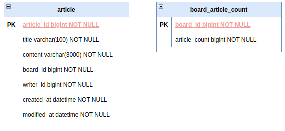
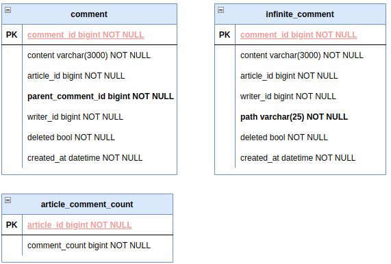
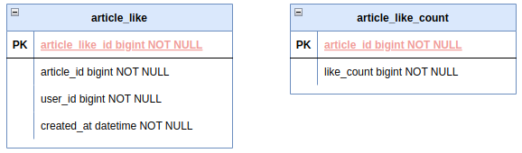
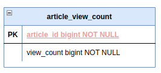
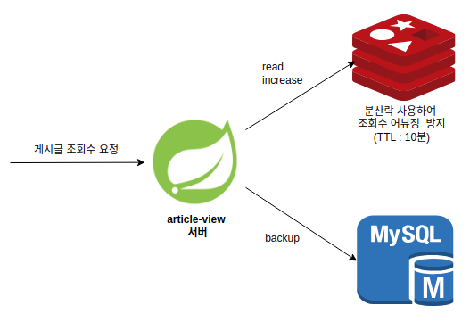
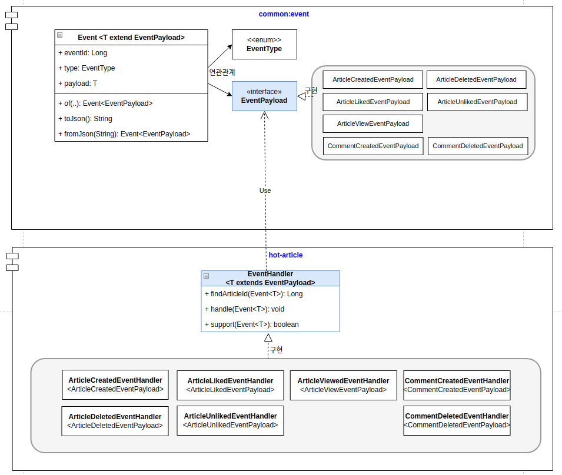
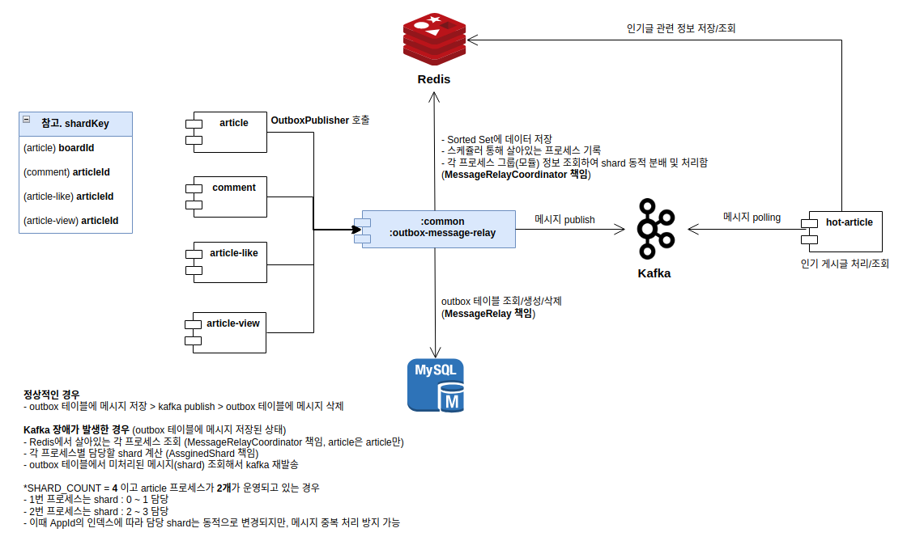

**todo.**
- service에 dto 클래스 보면 response에 AllArg* 있는데 굳이 필요하지 않아 보인다. 
	- 오히려 pojo 방식으로 선언해서 할당하는게 가독성이 좋아 보임
	- article, comment 모듈 수정하기 


## 게시글 




## 댓글 

> **대댓글 (2depth) 방식**과 **무한 depth 방식** 둘 다 구현


- **대댓글** : comment_parent_id 기반으로 계층형 구조
- **무한 depth**: varchar(25) path, 25개 문자열 기반으로 5개씩 나눠 계층 표현
	- 총 5depth 존재 00000 00000 00000 00000 ~ zzzzz zzzzz zzzzz zzzzz zzzzz
	- 각 자리는 **0-9A-Za-z**, 총 **62개** 문자열 중 하나
		- 텍스트 선언 후 인덱스 기반으로 다음 문자열 가져와 처리
	- depth 별로 댓글은 62^5 = 약 9억개 정도 할당 가능 
	- depth 별로 댓글이 9억개가 넘어가면 문자열 길이(path)를 늘리거나 하면 됨
- **삭제**의 경우 
	- 자식이 있으면 논리적 삭제(`deleted = true`업데이트)
	- 자식이 없으면 물리적 삭제(DB)

**두 방식 비교.**


**TODO.**
- 게시판을 두개다 만들건지 아니면 하나만 할건지 선택해서 남겨두자 


## 좋아요

> **비관적 락(pessmistic lock)**, **낙관적 락(optimistick lock)** 방식을 둘 다 사용해 봄



| 기능     | REST 표현                | HTTP 메서드 | 설명                   |
| ------ | ---------------------- | -------- | -------------------- |
| 좋아요    | `/articles/{id}/likes` | `POST`   | 좋아요 추가 (Like 리소스 생성) |
| 좋아요 해제 | `/articles/{id}/likes` | `DELETE` | 좋아요 취소 (Like 리소스 제거) |
- 좋아요 응답은 201 created
- 좋아요 해제 응답은 204 no content

|서비스 유형|추천 방식|
|---|---|
|**정합성 최우선 (재고/주문)**|비관적 락 (Pessimistic Lock)|
|**많은 트래픽, 정확성 중요 (좋아요)**|낙관적 락 + 재시도, 또는 Redis 누적 후 DB 반영|
|**캐시 허용 가능 (조회수, 좋아요)**|Redis 기반 처리 (성능 우선)|
|**낮은 충돌 가능성 (로그 등)**|락 없이 처리|
- 비관적 락을 사용하는 경우 
	- update 방식과 select .. for update 방식이 있음
	- 정합성은 높으나 데드락 위험 있음
- 낙관적 락을 사용하는 경우 
	- 재시도 로직이 필요함 (spring-retry)
	- 재시도 로직이 없는 경우 데이터 유실 높음


> 통합 테스트만 작성하는 걸로 함, 왜냐하면 service, repository 둘다 의미 없어 보이고 
> 동시성 이슈에 대한 확인만 하면 되기 때문에 controller 단에서만 테스트하는게 맞다고 생각
> - 처음에는 강의와 같이 비관적 락 (2개, `update`, `select .. for update`), 낙관적 락 테스트(재시도 x)
> - `spring-retry` 추가해서 낙관적 락만 사용하는 걸로 최종 결정 후 리팩터링 


낙관적락 테스트시 beforeEach에서 데이터 초기화하면 바로 OptimisticLockingFailureException 발생  > beforeEach를 빼면 정상 실행은 되나 재시도 로직이 없어 전체 1000개 실패 


1000개 넣는데 
- 비관적 락1(update) 300ms
- 비관적 락2(select for update) 1156ms
- 낙관적 락 (재시도x) 테스트 실패 (7/3)
	- (7/4) 문제 원인은 h2는 read committed인데 flush(), clear() 한다고 commit 되는게 아니었음 > 하나의 트랜잭션이 종료되어야 commit 실행함
	- ArticleLikeCount에 `of(..)` 정적 팩토리 메서드에서 version = 0L 초기화하는 것과, @BeforeEach에서 ArticleLikeCount 초기화하는거 지우니 정상 동작
	- success : 212, fail:788, time: 533ms, count: 212
		- retry가 없어서 OptimisticLockingFailureException 터져서 실패가 많음
- 낙관적 락 (재시도 o, 7/4) 

| 구분                          | success | failure | time    |
| --------------------------- | ------- | ------- | ------- |
| 비관적 락(update)               | 1,000   | 0       | 300ms   |
| 비관적 락(select .. for update) | 1,000   | 0       | 1,156ms |
| 낙관적 락(재시도 x)                | 212     | 788     | 533ms   |
| 낙관적 락(재시도 o)                | 978     | 22      | 1313ms  |
- 재시도 3회, 100ms 간격
	- scale-out하더라도 단일 DB의 경우 row write로 인해 병목 현상 발생 가능
	- Redis 저장해서 일정 주기마다 db 백업 (flush)
		- **실시간 반응성 + 정확도**가 필요한 영역 사용 가능
		- 단, 인프라 비용 및 복잡도 증가
- ✅ 낙관적 락은 재시도와 함께 사용하면 정합성 유지에 매우 효과적
	- 단, 재시도가 없으면 실패율이 압도적이며, 재시도를 추가하면 성공률은 높지만 성능 비용이 증가
		- 따라서 **낙관적 락은 재시도 로직 없이는 실전에서 쓰기 어렵다는 교훈**을 주는 테스트였다.******


> [!note] @Version은 되도록이면 직접 초기화하지 않기 
> - 초기값이 null 이고, 다음이 0이되야 하는데 null이 아닌 경우 JPA는 해당 엔티티를 이미 DB에 존재하는 엔티티라고 잘못 판단하게 됨 
> - 결과적으로 Insert가 아닌 update를 시도하게 되는데, DB에 데이터가 없으니`StaleObjectStateException` 또는 `OptimisticLockException` 발생
> - 버전이 null인 경우 새 엔티티로 인식


다시 낙관적 락(재시도x)에 setup을 추가하더라도 에러가 발생해서 chat-gpt 질문함
```java
@BeforeEach 
void setUp() { 
	articleLikeCountRepository.save(ArticleLikeCount.of(1L, 0L)); //
	articleLikeCountRepository.flush(); 
	entityManager.clear(); 
}
```

```text
// 무한 루프 돌면서 insert 시도
article version : null, count : 0
article version : null, count : 0
article version : null, count : 0
article version : null, count : 0
article version : null, count : 0
article version : null, count : 0
article version : null, count : 0
article version : null, count : 0
article version : null, count : 0
..
```

**🔍 문제의 본질**
**테스트 초기화는 정상적으로 되어 있는데도, 동시성 테스트 시 `findById`가 null을 반환하는 이유는 무엇일까?**
> ▶ 이는 SpringBootTest에서의 멀티 스레드 환경에서 **트랜잭션 전파/격리 레벨**과 **H2의 MVCC 특성**, 그리고 **영속성 컨텍스트/쓰기 지연 플러시** 등의 복합적인 요인이 작용한 결과입니다.

|원인|설명|
|---|---|
|**스레드마다 트랜잭션이 분리**|SpringBootTest 환경에서 `@Transactional`이 클래스 레벨에 없다면, 각 테스트 메서드는 **스레드마다 트랜잭션을 독립적으로 실행**|
|**flush 이후에도 `clear()` 하지 않으면 `1차 캐시` 영향**|`entityManager.clear()`를 호출했더라도, 스레드가 생성한 새로운 트랜잭션 내에서는 다시 DB를 읽어야 함|
|**H2의 트랜잭션 격리 수준**|H2는 기본적으로 `READ COMMITTED`, 즉 다른 트랜잭션에서 커밋하지 않으면 `SELECT` 시 조회되지 않음|
|**flush가 커밋이 아니다**|`flush()`는 DB로 쿼리를 날리지만, `commit`을 하기 전까지는 다른 트랜잭션에서 조회 불가 (MVCC)|
**✅ 정리하자면**
- `@BeforeEach`에서 save → flush → clear 해도 **commit이 되지 않으면 다른 스레드가 SELECT로 읽을 수 없음**
- → 그래서 각 스레드가 `findById()`를 했을 때, 아직 커밋되지 않은 데이터라 `Optional.empty()` 발생
- → insert 시도 → 중복 key 예외 또는 JPA 내부 충돌 발생

**🔍 왜 멀티 스레드에서 하나도 `commit`되지 않았나?**
테스트 흐름은 다음과 같았을 가능성이 높습니다:
1. `@BeforeEach`에서 `save + flush + clear`를 호출했으나,  
    → **JUnit 테스트 클래스에 `@Transactional`이 붙어 있어서 해당 트랜잭션이 끝날 때까지 커밋이 안 됨**  
    → 즉, DB에는 쿼리는 날아가되 **물리적 커밋이 안 된 상태**입니다.
2. 테스트 본문(`@Test`)에서 1000개의 스레드를 만들어 `likeOptimisticLock()`을 호출  
    → 이 중 일부는 `findById(...)`가 실패하여 `ArticleLikeCount.of(...)`로 새 엔티티 생성  
    → 동시에 같은 PK로 insert 시도 → **JPA 내부 충돌 or DB Constraint 위반 발생**💩
3. 그 와중에 초기화 데이터의 트랜잭션도 끝나지 않음 (즉, 여전히 `commit` 안 된 상태)  
    → **다른 트랜잭션에서는 해당 데이터를 보지 못함**


✅ `@BeforeEach` setup 메서드 없이도 통과한 이유는 ?
- `@BeforeEach`에서 `save()` 후 `flush()`를 하더라도 **트랜잭션이 커밋되지 않으면**, 다른 스레드나 트랜잭션에서는 **해당 데이터가 보이지 않음**  → 왜냐면 H2의 기본 격리 수준은 `READ COMMITTED`이기 때문입니다.
- `@BeforeEach` 없이 진행하면, **멀티 스레드 중 하나가 가장 먼저 `ArticleLikeCount.of(...)`로 생성 및 저장**  
	- → 그 스레드의 트랜잭션이 **우연히 가장 먼저 커밋되면**  
	- → 이후에 오는 다른 스레드들이 `findById(...)`로 정상 조회 가능  
	- → 따라서 일부 요청만 성공하게 되는 현상이 생깁니다
- commit은 트랜잭션이 종료되었을때 물리 트랜잭션 통해 발생하는건데, 이전에는 save(), flush(), clear()만 하고, 커밋되지 않아 h2에는 데이터가 없고 영속성 컨텍스트 내부에서 계속 insert 시도 발생하여 중복 발생


성공하는 테스트 (낙관적 락)
```java
@Transactional  
@ActiveProfiles("test")  
@SpringBootTest  
class ArticleLikeServiceTest {  
  
    @Autowired  
    private ArticleLikeService articleLikeService;  
  
    @Autowired  
    private ArticleLikeCountRepository articleLikeCountRepository;  
  
    @Autowired  
    private ArticleLikeRetryService articleLikeRetryService;  
  
    @Autowired  
    private PlatformTransactionManager transactionManager;  

    // 트랜잭션 탬플릿 통해 바로 커밋(h2)하도록 초기화
    @BeforeEach  
    void setUp() {  
        TransactionTemplate tx = new TransactionTemplate(transactionManager);  
        tx.executeWithoutResult(status -> {  
            articleLikeCountRepository.save(ArticleLikeCount.of(1L, 0L));  
        });    
	}  
	
    @Test  
    void optimisticLockPerformanceWithRetry() throws InterruptedException {  
        int threadCount = 1000;  
        ExecutorService executorService = Executors.newFixedThreadPool(10);  
  
        List<Callable<Void>> tasks = new ArrayList<>();  
        for (int i = 2; i <= threadCount + 1; i++) {  
            long userId = i;  
            tasks.add(() -> {  
                articleLikeService.likeOptimisticLock(1L, userId);  
                return null;  
            });        
		}  
        long start = System.currentTimeMillis();  
  
        List<Future<Void>> futures = executorService.invokeAll(tasks);  
  
        AtomicInteger success = new AtomicInteger();  
        AtomicInteger failure = new AtomicInteger();  
  
        for (Future<Void> f : futures) {  
            try {  
                f.get();  
                success.incrementAndGet();  
            } catch (ExecutionException ex) {  
                failure.incrementAndGet();  
            }        
		}  
		
        long end = System.currentTimeMillis();  
  
        System.out.println("success : " + success.get() + ", failure : " + failure.get());  
        System.out.println((end - start) + "ms");  
  
        ArticleLikeCount articleLikeCount = articleLikeCountRepository.findById(1L).get();  
        System.out.println(articleLikeCount.getLikeCount());  
    }}
```

[📚 Hibernate @Version](https://docs.jboss.org/hibernate/orm/current/userguide/html_single/Hibernate_User_Guide.html#locking-optimistic)

**TODO.**
- `userId`를 컨트롤러에서 path로 받는데 스프링 시큐리티나 그런걸로 주입받아 사용하는게 좋을듯함 
	- 정책 : 로그인한 사용자에 한해서 `좋아요/좋아요 해제` 가능

**비관적 락 (경량형, 업데이트 선 시도 전략)**
- update
- 초기 데이터를 넣지 않고 테스트를 할 경우 아래와 같은 에러가 발생하고 테스트는 실패💩
	- update할 articleLikeCount가 없어서 insert에 대한 멀티 스레드의 경합이 발생한게 원인으로 추측

```text
2025-07-04T12:01:48.993+09:00 ERROR 24181 --- [article-like-service] [pool-2-thread-2] o.h.engine.jdbc.spi.SqlExceptionHelper   : Unique index or primary key violation: "PRIMARY KEY ON PUBLIC.ARTICLE_LIKE_COUNT(ARTICLE_ID) ( /* key:1 */ CAST(1 AS BIGINT), CAST(1 AS BIGINT))"; SQL statement:
insert into article_like_count (like_count,article_id) values (?,?) [23505-232]
```

**🤖 주의사항** 
- **멀티 쓰레드에서 동시에 `increase()`가 실패할 수 있음**
    - 여러 쓰레드가 동시에 `increase()` 시도 → 모두 0 return → 여러 insert 시도 → **PK 충돌**
    - 이때는 **`insert or ignore` 혹은 `insert on duplicate key update`** 같은 **DB 종속적인 방법**이 필요하거나, `try-catch`로 방어해야 함
- **정상적인 케이스에서도 insert 분기 발생**
    - 최초 1회는 insert, 그 외는 update지만, 경쟁이 있을 땐 **insert 시도 여러 번 발생 가능**
- **실제로는 완전한 비관적 락은 아님**
    - `select for update`처럼 명시적 락은 없음 → 트랜잭션 컨트롤이 더 어려울 수 있음

```java
 // @Transactional을 지워야 정상 동작함.. commit이 안되서 save에서 경합 발생
@ActiveProfiles("test")  
@SpringBootTest 
class ArticleLikeServiceTest {  
  
    @Autowired  
    private ArticleLikeService articleLikeService;  
  
    @Autowired  
    private ArticleLikeCountRepository articleLikeCountRepository;  
  
    @Autowired  
    private PlatformTransactionManager transactionManager;  
  
    @BeforeEach  
    void setUp() {  
        TransactionTemplate tx = new TransactionTemplate(transactionManager);  
        tx.executeWithoutResult(status -> {  
            articleLikeCountRepository.save(ArticleLikeCount.of(1L, 0L));  
        });    
	}  
	
    @Test  
    void like() throws InterruptedException {  
        int threadCount = 1000;  
        ExecutorService executorService = Executors.newFixedThreadPool(10);  
        CountDownLatch latch = new CountDownLatch(threadCount);  
  
        long start = System.currentTimeMillis();  
        for (int i = 2; i <= threadCount + 1; i++) {  
            long userId = i;  
            executorService.submit(() -> {  
                articleLikeService.like(1L, userId);  
                latch.countDown();  
            });        }  
        latch.await();  
  
        long end = System.currentTimeMillis();  
        System.out.println((end - start) + "ms");  
  
        ArticleLikeCount articleLikeCount = articleLikeCountRepository.findById(1L).get();  
        assertThat(articleLikeCount.getLikeCount()).isEqualTo(threadCount);  
    }
}
```


**낙관적 락(retry x)**
- @Version을 사용하니 controller 통합 테스트에서 @Transactional 없으면 테스트 실패함 
- ArticleLikeCount에 **@Version private Long version** 만 선언하고 팩토리에서 초기화 하지 않기 !!
	- 💩 default null로 version 필드 초기화되고, null이 아니면 update 발생해 테스트시 충돌로 인해 비정상 종료됨

```java
@ActiveProfiles("test")  
@AutoConfigureMockMvc  
@SpringBootTest(webEnvironment = SpringBootTest.WebEnvironment.MOCK)  
@Transactional  // 이거 추가 안해주면 Primary key 충돌 나서 unlike 제외하고 모두 실패
class ArticleLikeControllerTest {  
    @Autowired  
    private MockMvc mockMvc;  
  
    @Autowired  
    private ObjectMapper objectMapper;  
  
    @Autowired  
    private PlatformTransactionManager transactionManager;  
  
    @Autowired  
    private ArticleLikeRepository articleLikeRepository;  
  
    @Autowired  
    private ArticleLikeCountRepository articleLikeCountRepository;  
  
    @BeforeEach  
    void setUp() {  
        TransactionTemplate tx = new TransactionTemplate(transactionManager);  
        tx.executeWithoutResult(status -> {  
            articleLikeRepository.save(ArticleLike.of(1L, 1L, 1L));  
            articleLikeCountRepository.save(ArticleLikeCount.of(1L, 1L));  
        });    }  
    @Test  
    void read() throws Exception {  
        mockMvc.perform(get("/v1/article-like/article/{articleId}/user/{userId}", 1L, 1L))  
                .andExpectAll(status().isOk(),  
                        jsonPath("$.articleId").value(1L),  
                        jsonPath("$.userId").value(1L)  
                );    }  
    @Test  
    void like() throws Exception {  
        mockMvc.perform(post("/v1/article-like/article/{articleId}/user/{userId}", 1L, 2L))  
                .andExpect(status().isCreated());  
  
        ArticleLikeCount articleLikeCount = articleLikeCountRepository.findById(1L).get();  
        assertThat(articleLikeCount.getLikeCount()).isEqualTo(2L);  
    }  
    
    @Test  
    void unlike() throws Exception {  
        mockMvc.perform(delete("/v1/article-like/article/{articleId}/user/{userId}", 1L, 1L))  
                .andExpect(status().isNoContent());  
  
        ArticleLikeCount articleLikeCount = articleLikeCountRepository.findById(1L).get();  
        assertThat(articleLikeCount.getLikeCount()).isEqualTo(0L);  
    }  
    
    @Test  
    void count() throws Exception {  
        MvcResult mvcResult = mockMvc.perform(get("/v1/article-like/article/{articleId}/count", 1L))  
                .andExpect(status().isOk())  
                .andReturn();  
  
        MockHttpServletResponse response = mvcResult.getResponse();  
        String contentAsString = response.getContentAsString();  
        Long result = objectMapper.readValue(contentAsString, Long.class);  
  
        assertThat(result).isEqualTo(1L);  
    }}
```

**서비스 테스트**
- 재시도가 없으므로 낙관적 락이 실패하는 경우가 생겨 매번 결과 예측 불가 
- success : 201, failure : 799, 실행 시간 : 447ms, 카운트 : 201
```java
@ActiveProfiles("test")  
@SpringBootTest  
class ArticleLikeServiceTest {  
  
    @Autowired  
    private ArticleLikeService articleLikeService;  
  
    @Autowired  
    private ArticleLikeCountRepository articleLikeCountRepository;  
  
    @Autowired  
    private PlatformTransactionManager transactionManager;  
  
    @BeforeEach  
    void setUp() {  
        TransactionTemplate tx = new TransactionTemplate(transactionManager);  
        tx.executeWithoutResult(status -> {  
            articleLikeCountRepository.save(ArticleLikeCount.of(1L, 0L));  
        });    
	}  
	
    @Test  
    void likeWithoutRetry() throws InterruptedException {  
        int threadCount = 1000;  
        ExecutorService executorService = Executors.newFixedThreadPool(10);  
  
        List<Callable<Void>> tasks = new ArrayList<>();  
        for (int i = 2; i <= threadCount + 1; i++) {  
            long userId = i;  
            tasks.add(() -> {  
                articleLikeService.like(1L, userId);  
                return null;  
            });        }  
        long start = System.currentTimeMillis();  
  
        List<Future<Void>> futures = executorService.invokeAll(tasks);  
  
        AtomicInteger success = new AtomicInteger();  
        AtomicInteger failure = new AtomicInteger();  
  
        for (Future<Void> f : futures) {  
            try {  
                f.get();  
                success.incrementAndGet();  
            } catch (ExecutionException e) {  
                failure.incrementAndGet();  
            }        }  
        long end = System.currentTimeMillis();  
  
        System.out.println("success : " + success.get() + ", failure : " + failure.get());  
        System.out.println((end - start) + "ms");  
  
        ArticleLikeCount articleLikeCount = articleLikeCountRepository.findById(1L).get();  
        System.out.println(articleLikeCount.getLikeCount());  
    }
}
```

**낙관적 락2(재시도 o)**
- build.gradle에 추가
```text
implementation 'org.springframework.retry:spring-retry'
implementation 'org.springframework.boot:spring-boot-starter-aop'
```

- `@EnableRetry`를 LikeApplication 클래스에 추가
- 어노테이션 기반으로 서비스 로직에 선언 

```java
@Service  
@RequiredArgsConstructor  
@Transactional  
public class ArticleLikeService {  
    private final Snowflake snowflake = new Snowflake();  
  
    private final ArticleLikeRepository articleLikeRepository;  
    private final ArticleLikeCountRepository articleLikeCountRepository;  
  
    @Transactional(readOnly = true)  
    public ArticleLikeResponse read(Long articleId, Long userId) {  
        return articleLikeRepository.findByArticleIdAndUserId(articleId, userId)  
                .map(ArticleLikeResponse::from)  
                .orElseThrow();  
    }  
    @Retryable(  
            retryFor = {ObjectOptimisticLockingFailureException.class, StaleObjectStateException.class},  
            maxAttempts = 3,  
            backoff = @Backoff(delay = 100) // 100ms 간격 재시도  
    )  
    public void like(Long articleId, Long userId) {  
        articleLikeRepository.save(ArticleLike.of(snowflake.nextId(), articleId, userId));  
  
        ArticleLikeCount articleLikeCount = articleLikeCountRepository.findById(articleId)  
                .orElseGet(() -> ArticleLikeCount.of(articleId, 0L));  
  
        articleLikeCount.increase();  
        articleLikeCountRepository.save(articleLikeCount);  
    }  
    @Retryable(  
            retryFor = {ObjectOptimisticLockingFailureException.class},  
            maxAttempts = 3,  
            backoff = @Backoff(delay = 100) // 100ms 간격 재시도  
    )  
    public void unlike(Long articleId, Long userId) {  
        articleLikeRepository.findByArticleIdAndUserId(articleId, userId)  
                .ifPresent(articleLike -> {  
                    articleLikeRepository.delete(articleLike);  
                    ArticleLikeCount articleLikeCount = articleLikeCountRepository.findById(articleId).orElseThrow();  
                    articleLikeCount.decrease();  
                });    }  
    @Transactional(readOnly = true)  
    public Long count(Long articleId) {  
        return articleLikeCountRepository.findById(articleId)  
                .map(ArticleLikeCount::getLikeCount)  
                .orElse(0L);  
    }}
```

- 테스트 코드는 그대로, 마찬가지로 낙관적 락이 실패하는 경우가 있음
	- success : 963, failure : 37, 실행시간: 1222ms, 카운터 : 963
- 대규모 서비스가 아니라면 **비관적 락(select for update..)** 만으로 충분하다고 판단됨

✅ 커밋 이력 정리
히스토리를 아래와 같이 기록, revert로 이력을 남기고 최종적으로 비관적 락(select for update)르 사용
- 낙관적 락 + retry
- 낙관적 락 + retry x
- 비관적 락 (select for update)
- 비관적 락 (update)

```shell
$ git log --oneline

23ddfb2 (HEAD -> article-like) refactor: optimistic lock + retry
7852c11 add spring-aop, retry dependency
4733bc7 refactor: @Version 낙관적 락 적용 (재시도 x)
21cbb87 refactor: select..for update 비관적 락 사용
e1666f6 create application-test.yml
5c24c87 create ArticleLikeController

$ git revert 23ddfb2 7852c11 4733bc7

$ git log --oneline
ec80657 (HEAD -> article-like) Revert "refactor: @Version 낙관적 락 적용 (재시도 x)"
aa6c31e Revert "add spring-aop, retry dependency"
811758c Revert "refactor: optimistic lock + retry"
23ddfb2 refactor: optimistic lock + retry
7852c11 add spring-aop, retry dependency
4733bc7 refactor: @Version 낙관적 락 적용 (재시도 x)
21cbb87 refactor: select..for update 비관적 락 사용
e1666f6 create application-test.yml
5c24c87 create ArticleLikeController
```

---
## 5. 조회수



**절차** 
- redis에 게시글 조회수를 카운팅한다 
- 게시글 조회수가 `1000`(=BATCH_SIZE) 단위로 올라가면 DB에 백업한다 
- 이때 조회수 어뷰징을 위해 redis 분산락을 사용한다 (ttl = 10분)





**고려할 부분. 서버 재시작시**
- 조회수 데이터가 Redis 캐시에 없어서 데이터 부정합 발생 
	- 지연 로딩이나 서버 시작 시 일괄 초기화


**추가**
- 임베디드 레디스 사용 
	- `testImplementation 'com.github.codemonstur:embedded-redis:1.0.0'`
	- 2024.03.26까지 release 발행
	- https://github.com/codemonstur/embedded-redis
- redis connection factory로 lettuce 사용
	- 기억보단 기록을 기술 블로그 참고
- redis container가 종료되어 있는데 실행되는 이유
- redis 서버 재시작시 조회 캐시가 없는데 이 경우는 어떻게? (by Chat-GPT)
	- 지연(Lazy) 초기화 전략
	- 서버 시작시 일괄 초기화 (`@EventListener(ApplicationReadyEvent.class)`)
		- top N 게시글에 대해서만 
	- Redis AOF/RDB 설정으로 복원 
		- AOF : Append Only File
		- RDB : Snapshotting

참고 
- [조회수를 rdb에만 저장하고 있는 서비스에 redis 도입 질문](https://www.inflearn.com/community/questions/1550681/%EC%A1%B0%ED%9A%8C%EC%88%98%EB%A5%BC-rdb%EC%97%90%EB%A7%8C-%EC%A0%80%EC%9E%A5%ED%95%98%EA%B3%A0-%EC%9E%88%EB%8A%94-%EC%84%9C%EB%B9%84%EC%8A%A4%EC%97%90%EC%84%9C-redis-%EB%8F%84%EC%9E%85-%EA%B4%80%EB%A0%A8%ED%95%B4%EC%84%9C-%EC%A7%88%EB%AC%B8%EC%9E%85%EB%8B%88%EB%8B%A4)
- [조회수 redis 장애시 fallback 관련해서 질문](https://www.inflearn.com/community/questions/1620809/%EC%A1%B0%ED%9A%8C%EC%88%98-redis-%EC%9E%A5%EC%95%A0%EC%8B%9C-fallback-%EA%B4%80%EB%A0%A8%ED%95%B4%EC%84%9C-%EC%A7%88%EB%AC%B8)


---

## 6. 인기글 

> kafka 활용
- consumer는 `hot-article`에 위치
	- producer는 각 서비스 모듈마다 위치해야 하는건가? 
		- `:common:outbox-message-relay` 에서 kafka 메시지 발송 책임
		- article, view, like, comment 모듈에서는 해당 모듈 주입받아 메시지 전달하여 발송

### kafka 셋팅 (by docker)

```shell
> docker run -d --name board-kafka -p 9092:9092 apache/kafka:3.8.0
> docker exec --workdir /opt/kafka/bin/ -it board-kafka sh 

# 토픽 생성 (article, comment, like, view)

$ ./kafka-topics.sh --bootstrap-server localhost:9092 --create --topic board-article --replication-factor 1 --partitions 3
Created topic board-article.
$ ./kafka-topics.sh --bootstrap-server localhost:9092 --create --topic board-comment --replication-factor 1 --partitions 3
$ ./kafka-topics.sh --bootstrap-server localhost:9092 --create --topic board-like --replication-factor 1 --partitions 3
$ ./kafka-topics.sh --bootstrap-server localhost:9092 --create --topic board-view --replication-factor 1 --partitions 3

## 기타
# 토픽 확인 
$ ./kafka-topics.sh --bootstrap-server localhost:9092 --list

# 특정 토픽 상세 
$ ./kafka-topics.sh --bootstrap-server localhost:9092 --describe --topic board-article

# 소비자 그룹 확인
$ ./kafka-consumer-groups.sh --bootstrap-server localhost:9092 --list

# 특정 소비자 그룹의 오프셋 확인 
$ ./kafka-consumer-groups.sh --bootstrap-server localhost:9092 --describe --group my-consumer-group


```

### outbox 테이블 설계 
- article, view, like, comment 데이터베이스에 각각 outbox 테이블 생성해야 함
	- 자기 메시지만 관리함
- 각 서버가 scale-out하는 경우 shard 분배를 통해 메시지 중복 처리 및 충돌 방지 
	- redis 통해 운영 서버 관리 및 AssignedShard 클래스 통해 샤드 분배

```sql


```


### 인기글 consumer 설계 
- kafka 메시지를 polling해서 처리
- redis sorted set 에 데이터 저장 
	- 게시글 생성/삭제
	- 좋아요, 댓글수, 조회수에 대한 가중치 계산 및 인기글 목록




> 책임 연쇄 패턴은 또 다른 내용이네, 체이닝 방식으로 핸들러를 연속해서 처리 
> https://inpa.tistory.com/entry/GOF-%F0%9F%92%A0-Chain-Of-Responsibility-%ED%8C%A8%ED%84%B4-%EC%99%84%EB%B2%BD-%EB%A7%88%EC%8A%A4%ED%84%B0%ED%95%98%EA%B8%B0#%EC%B1%85%EC%9E%84_%EC%97%B0%EC%87%84_%ED%8C%A8%ED%84%B4_%EA%B5%AC%EC%A1%B0


### 전체 flow
- article, comment, article-like, article-view 모듈에서 :common:outbox-message-relay 의존
- request 요청시 이벤트발송에 대한 책임을 OutboxPublisher에서 위임
- 정상적인 경우 
	- outbox 테이블에 메시지 저장 
	- kafka 메시지 발송 
	- (1초후) outbox 메시지 삭제
- kafka 서버 다운 된 경우 
	- outbox 테이블에 메시지가 저장된 상태
	- 스케쥴러 통해 운영 중인 프로세스 확인 
		- 이때 redis에 각 모듈 그룹 단위로 해서 프로세스 정보를 관리함 
		- article 1, 2 서버가 올라가 있으면 각 서버에 스케쥴러가 실행됨 
		- redis 조회해서 각 서버가 담당할 shard 계산 
		- outbox 테이블에서 미처리된 메시지(shard) 가져와 재발송 후 삭제



- 참고로 `ArticleUpdatedEventPayload` 사용하지 않음 
	- `HotArticleService`에서도 핸들러 조회시 ArticleUpdatedEventHandler 빈이 없기 때문에 null 반환되어 안전하게 return 처리됨 