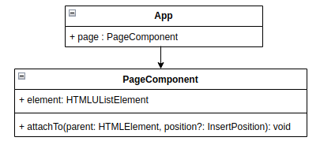
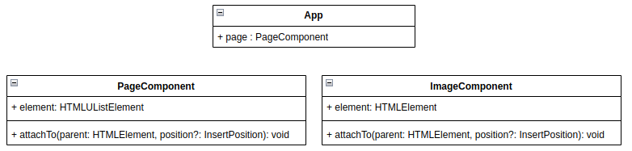
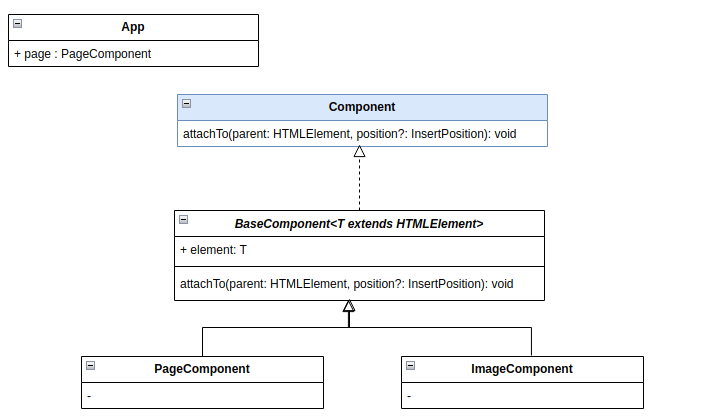
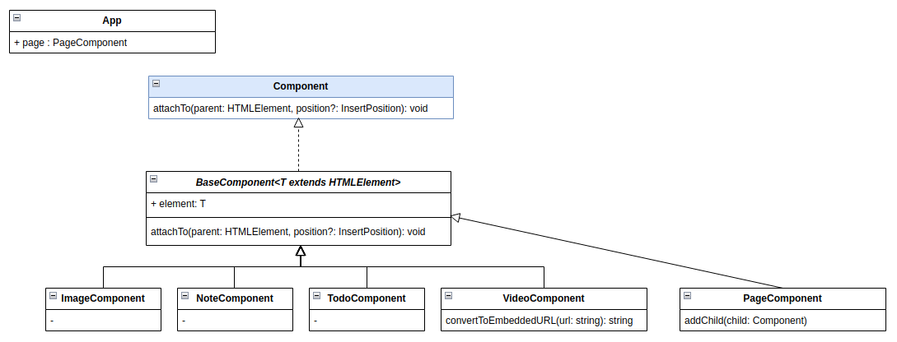
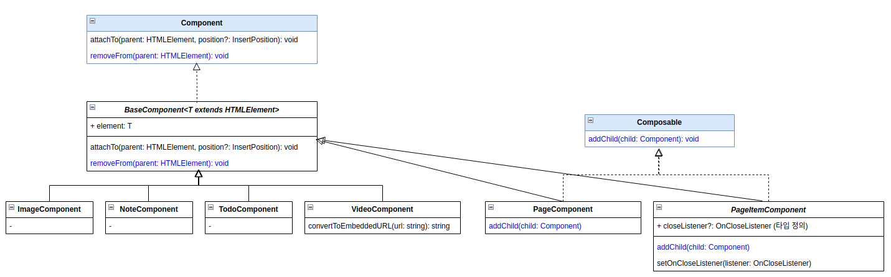
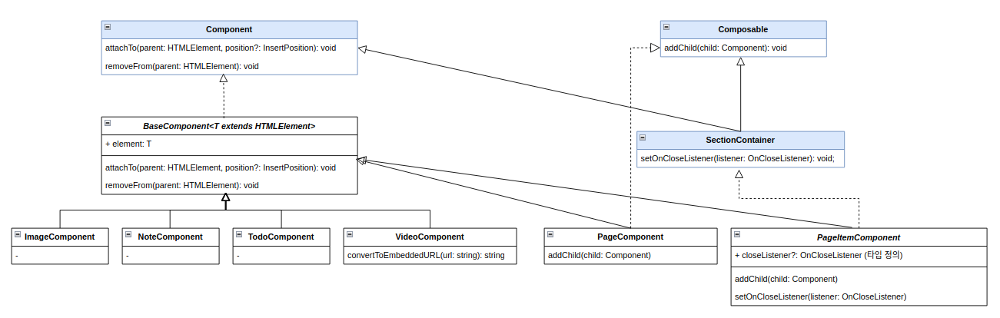
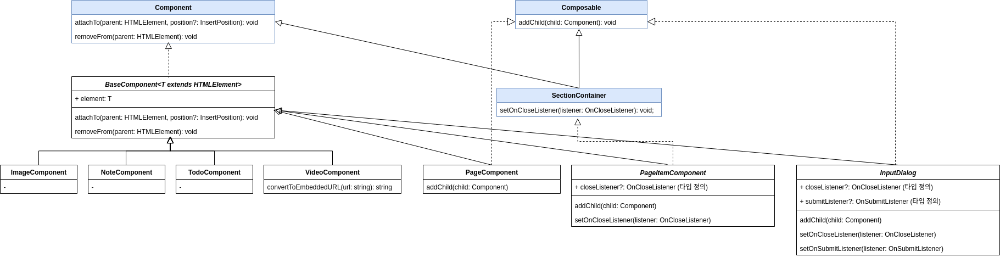
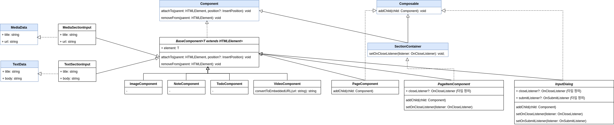

- [저장소](https://github.com/dream-coding-academy/typescript_motion) 
- npm 으로 tsc , live-server 설치
- [온라인 - 클래스 다이어그램 툴](https://plantuml.com/ko/class-diagram)
- 눈에 띄는 부분
	- 14.17에 Composable 인터페이스 추가 
	- 14.18 아이템 삭제에서 Component 인터페이스에 메서드 추가
	- PageComponent에 하위 타입을 정의하는 부분
		- Composable 정의는 `컴포지트 패턴`이 아닌가 싶다
	- PageComponent에 생성자 주입시 타입 정의 것이 `전략 패턴`으로 보인다
	- app.ts에 dialog 관리하기 위해 인터페이스 정의하는 부분
	- drag and drop을 사용할 때 `옵저버 패턴` 사용하는게 아닌가 싶다
	- 마지막에 `데코레이터 패턴`인듯 하다

**14.4 ~ 5. 레이아웃과 첫번째 Page 컴포넌트 만들기** 



📁 src/app.ts
```typescript
import { PageComponent } from './components/page.js';

class App {
	private readonly page: PageComponent;

	constructor(appRoot: HTMLElement) {
		this.page = new PageComponent();
		this.page.attachTo(appRoot);
	}
}

new App(document.querySelector('.document')! as HTMLElement);
```

📁 src/components/page.ts
```typescript
export class PageComponent {
	private element: HTMLUListElement;

	constructor() {
		this.element = document.createElement('ul');
		this.element.setAttribute('class', 'page');
		this.element.textContent = 'This is PageComponent';
	}

	attachTo(parent: HTMLElement, position: InsertPosition = 'afterbegin') {
		parent.insertAdjacentElement(position, this.element);	
	}
}
```


- [tsconfig](https://www.typescriptlang.org/tsconfig/)

**13.5 프로젝트 계획을 세우는 테크닉**
- 1. What are the features ? 
- 2. What is the roadmap ?
	- 2-1. must have 
		- ✅ [User Story](https://www.justinmind.com/blog/examples-user-story-best-practices/) 기반으로 작성
	- 2-2. good to have
	- 2-3. nice to have

> actors(클래스들), interactions (클래스간 상호작용)

**14.6 DOM을 잘 모르는 ..**
- HTML DOM은 `tag`
- JavaScript에서는 `node`라고 부름
- `Node -> EventTarget`을 상속 받음
	- Node 하위에는 Document, Element, Text가 있고, 상속 받음

**14.7 ~ 8 이미지 컴포넌트 만들기**



📁 src/components/page.ts ➡️ src/components/page/page.ts

📁 src/components/page/item/image.ts
```typescript 
export class ImageComponent {

	private element: HTMLElement;
	
	constructor(title: string, url: string) {
		const template = document.createElement('template');
		
		template.innerHTML = `
			<section class="image">
				<div class="image__holder">
					
				</div>
				<p class="image__title"></p>
			</section>
		`;
		
		this.element = template.content.firstElementChild! as HTMLElement;
		
		const imageElement = this.element.querySelector('.image__thumbnail')! as HTMLImageElement;
	
		imageElement.src = url;
		imageElement.alt = title;
		
		const titleElement = this.element.querySelector('.image__title')! as HTMLParagraphElement;
		
		titleElement.textContent = title;
	
	}
	
	attachTo(parent: HTMLElement, position: InsertPosition = 'afterbegin') {
		parent.insertAdjacentElement(position, this.element);
	}

}
```
- `<template>` 태그를 사용하는 이유?
- `app.ts`에 추가

```typescript 
import { PageComponent } from './components/page.js';
import { ImageComponent } from './components/page/item/image.js';

class App {
	private readonly page: PageComponent;
	
	constructor(appRoot: HTMLElement) {
		this.page = new PageComponent();
		this.page.attachTo(appRoot);
	
		const image = new ImageComponent('Image Title', 'https://picsum.photos/600/300');
		image.attachTo(appRoot, 'beforeend');
	}

}

new App(document.querySelector('.document')! as HTMLElement);
```

```shell
$ tsc -w 
```
- 타입스크립트 파일을 컴파일해서 `dist`  디렉터리에 생성
- `dist/*.js` 파일을 index.html에서 호출하여 사용


**14.9 ~ 14.10 컴포넌트 리팩터링** 
- image와 page는 공통적인 일을 하고 있다
- 중복 로직을 클래스에 올린다
	- 인터페이스 : 역할, 구현체 : 정책



```typescript 
export interface Component {
	attachTo(parent: HTMLElement, position?: InsertPosition): void;
}

class BaseComponent<T extends HTMLElement> implements Component {
	protected readonly element: T;
	
	constructor(htmlString: string) {
		const template = document.createElement('template');
		template.innerHTML = htmlString;
		this.element = template.content.firstElementChild! as T;
	}

	attachTo(parent: HTMLElement, position: InsertPosition = 'afterbegin') {
		parent.insertAdjacentElement(position, this.element);
	}

}
```
- `image.ts` , `page.ts`를 리팩터링한다 
- 제네릭 클래스를 상속받는다
- template 태그에 요소를 한번 감싼 후 this.element 할당하는 행위를 BaseComponent에서 한다

📁 src/components/page/page.ts
```typescript 
import { BaseComponent } from "./component.js";

export class PageComponent extends BaseComponent<HTMLUListElement> {
	constructor() {
		super('<ul class="page">This is PageComponent</ul>');
	}
}
```

📁 src/components/page/item/image.ts
```typescript

import { BaseComponent } from "../../component.js";

export class ImageComponent extends BaseComponent<HTMLElement>{
	constructor(title: string, url: string) {
		super(`
		<section class="image">
			<div class="image__holder">
				
			</div>
			<p class="image__title"></p>
		</section>`);

	const imageElement = this.element.querySelector('.image__thumbnail')! as HTMLImageElement;

	imageElement.src = url;
	imageElement.alt = title;

	const titleElement = this.element.querySelector('.image__title')! as HTMLParagraphElement;
	
	titleElement.textContent = title;
	}
}

```

**모든 섹션 구현하기** 



> [!info]
> **HTMLHeadElement**: HTML의 head 태그를 대표하는 요소
> **HTMLHeadingElement**: h1과 같은 heading 태그를 대표하는 요소

📁 src/components/page/item/note.ts
```typescript
import { BaseComponent } from "../../component.js";

export class NoteComponent extends BaseComponent<HTMLElement> {
	constructor(title: string, body: string) {
		super(`<section class="note">
		<h2 class="note__title"></h2>
		<p class="note__body"></p>
		</section>`);
		
		const titleElement = this.element.querySelector('.note__title')! as HTMLHeadElement;
		
		titleElement.textContent = title;
		
		const bodyElement = this.element.querySelector('.note__body')! as HTMLParagraphElement;
		
		bodyElement.textContent = body;
		
	}
}
```

📁 src/components/page/item/todo.ts
```typescript
import { BaseComponent } from "../../component.js";

export class TodoComponent extends BaseComponent<HTMLElement> {
	constructor(title: string, todo: string) {
		super(`<section class="todo">
		<h2 class="todo__title"></h2>
		<input type="checkbox" class="todo-checkbox">
		</section>`);
		
		const titleElement = this.element.querySelector('.todo__title')! as HTMLHeadElement;
		titleElement.textContent = title;
	
		const todoElement = this.element.querySelector('.todo-checkbox')! as HTMLInputElement;
		todoElement.insertAdjacentText('afterend', todo);
	}

}

```

📁 src/components/page/item/video.ts
```typescript
import { BaseComponent } from "../../component.js";

export class VideoComponent extends BaseComponent<HTMLElement> {

	constructor(title: string, url: string) {
		super(`
		<section class="video">
		<div class="video__player">
		<iframe frameborder="0" class="video__iframe"></iframe>
		</div>
		<h3 class="video__title"></h3>
		</section>`);
		
		const iframe = this.element.querySelector('.video__iframe')! as HTMLIFrameElement;
		
		iframe.src = this.convertToEmbeddedURL(url);
		
		const titleElement = this.element.querySelector('.video__title')! as HTMLHeadingElement;
		
		titleElement.textContent = title;
	}

	private convertToEmbeddedURL(url: string): string {
		const regExp = /^(?:https?:\/\/)?(?:www\.)?(?:(?:youtube.com\/(?:(?:watch\?v=)|(?:embed\/))([a-zA-Z0-9-]{11}))|(?:youtu.be\/([a-zA-Z0-9-]{11})))/;
		const match = url.match(regExp);
		const videoId = match ? match[1] || match[2] : undefined;
		
		if(videoId) {
			return `https://www.youtube.com/embed/${videoId}`;
		}
		
		return url;	
	}

}

```


```typescript
import { PageComponent } from './components/page.js';
import { ImageComponent } from './components/page/item/image.js';
import { NoteComponent } from './components/page/item/note.js';
import { TodoComponent } from './components/page/item/todo.js';
import { VideoComponent } from './components/page/item/video.js';

class App {
	private readonly page: PageComponent;

	constructor(appRoot: HTMLElement) {
		this.page = new PageComponent();
		this.page.attachTo(appRoot);
		
		const image = new ImageComponent('Image Title', 'https://picsum.photos/600/300');
		image.attachTo(appRoot, 'beforeend');
		
		const note = new NoteComponent('Note Title', 'Note Body');
		note.attachTo(appRoot, 'beforeend');
		
		const todo = new TodoComponent('Todo Title', 'Todo Item');
		todo.attachTo(appRoot, 'beforeend');
		
		const video = new VideoComponent('Video Title', 'https://youtu.be/eti78d9CL4I');
		video.attachTo(appRoot, 'beforeend');
	}
}

new App(document.querySelector('.document')! as HTMLElement);
```


**14.16 ~ 20 PageItemComponent (컨테이너) 만들기, 삭제 기능 추가**
- 공통적인 삭제 버튼 같은 걸 넣기 위해 한번 더 감싼다
- Composal 인터페이스나 Component 인터페이스에 신규 메서드 추가



```typescript

import { BaseComponent, Component } from "./component.js";

export interface Composable {
	addChild(child: Component): void;
}

type OnCloseListener = () => void;

class PageItemComponent extends BaseComponent<HTMLElement> implements Composable {

	private closeListener?: OnCloseListener;
	
	constructor() {
		super(`<li class="page-item">
		<section class="page-item__body"></section>
		<div class="page-item__controls">
		<button class="close">&times;</button>
		</div>
		</li>`);
		
		const closeBtn = this.element.querySelector('.close')! as HTMLButtonElement;
		
		closeBtn.onclick = () => {
			this.closeListener && this.closeListener(); // null이 아니라면 호출
		}
	}
	
	addChild(child: Component) { // image,  video, todo, note 
		const container = this.element.querySelector('.page-item__body')! as HTMLElement;
		child.attachTo(container); // container에 child를 요소 추가
	}
	
	setOnCloseListener(listener:OnCloseListener) { // 삭제용 콜백을 받아서 저장
		this.closeListener = listener;
	}

}

  

export class PageComponent extends BaseComponent<HTMLUListElement> implements Composable {
	constructor() {
		super('<ul class="page"</ul>');
	}

	addChild(section: Component) { // video, note, todo, image
			const item = new PageItemComponent();
			item.addChild(section); // PageItemComponent 안에 section 추가
			item.attachTo(this.element, 'beforeend'); // this.element == page
			item.setOnCloseListener(() => {
				item.removeFrom(this.element);
			});
	}
}

```
- ✅ Composable 인터페이스에 addChild(..) 정의
- ✅ Component 인터페이스에 removeFrom(..) 정의 
	- BaseComponent에서 공통 구현
	- 부모 요소에서 item을 삭제

>[!info] 삭제 기능을 콜백 함수로 정의한 이유에 대해 
>저는 모든 페이지의 아이템들은 페이지에 종속되어져 있으므로, **페이지에서 내 안에 어떤 페이지 아이템들이 있는지 알고 싶을때,** 존재하는 모든 페이지 아이템들에 대해 **관리 해야 하는 경우**, **페이지가 삭제되어지는 페이지 아이템에 대해서 페이지가 알고 있어야 하겠죠**? 그럴때는 모든 페이지 아이템을 가지고 있는 페이지 클래스에서 필요한 로직들을 처리 해주는것이 좋아요.
>➡️ 관리의 주체가 PageComponent가 되었으면 싶으니깐 콜백으로 선언해서 처리한다는 거군..

>[!info] PageItemComponent 생성자에서 삭제 함수를 받지 않는 이유 
>좋은 질문 이예요 👍 보통 이벤트 관련 등록 함수들은 생성자 보다는 별도로 등록하는 함수를 만들고 있어요. 우리가 컴포넌트를 만들어서 다른 개발자들이 사용할 수 있도록 API를 만드는 경우에도, 그리고 다른 브라우저나 노드 그 외 오픈소스 프로젝트들도 그렇게 제공하고 있지요 :)
>
>이유는 "등록하다"는 필요에 의해서, 추후에 등록될 수 있으므로 인스턴스를 생성하는 시점 보다는, 그 후에 유동성있게 추가 될 수 있도록 만들기 위해서죠. **생성자는 인스턴스를 만들기 위해서 정말 꼭! 필요한 요소들만 인자로 받아오는 것이 좋아요.**


```typescript
export interface Component {
	attachTo(parent: HTMLElement, position?: InsertPosition): void;
	removeFrom(parent: HTMLElement): void;	 // ✨ 신규 추가
}

// Encapsulate the HTML element creation
export class BaseComponent<T extends HTMLElement> implements Component {
	protected readonly element: T;
	
	constructor(htmlString: string) {
		const template = document.createElement('template');
		template.innerHTML = htmlString;
		this.element = template.content.firstElementChild! as T;
	}

	attachTo(parent: HTMLElement, position: InsertPosition = 'afterbegin') {
		parent.insertAdjacentElement(position, this.element);	
	}
	
	removeFrom(parent: HTMLElement) { // ✨ 공통 구현
		if(parent !== this.element.parentElement) {
			throw new Error('parent mismatch.');
		}
		
		parent.removeChild(this.element);
	}

}

```

> [!info]
> **객체지향이란, 문제를 바라볼때, 기능을 바라볼때 관련된 로직들끼리 묶어서 객체들로 바라보고 생각하는 연습이 필요하기 때문이예요 :)** 
> 우리가 세상을 바라보면, 학생, 근로자, 그리고 회사, 근로자는 일을 하고, 회사는 근로자에게 월급을 지불하고, 이렇게 객체들 단위로 서로 유기적으로 이루어 지는것처럼요.
> **그래서 많은 연습이 필요하답니다.**


📋 **Composal 인터페이스를 분리한 이유에 대해**
```text
질문 잘 정리해서 작성해 주셔서 감사합니다 👍

시스템 디자인은 어떻게 설계 하냐에 따라서, 개인이 가지고 있는 선호도와 믿음에 따라서 달라질 수 있어요.

아키텍쳐 설계에는 100% 정해진 정답이 없답니다.
그래서 꾸르님이 생각하시는대로 하셔도 괜찮아요.

제가 그렇게 디자인한 배경을 조금 설명해 드려보도록 할께요.

우선, **Composable 인터페이스 이름을 Container로 변경**해 보도록 할께요. 조합이 가능한 인터페이스 보다는 컨테이너로 이름을 바꾸는게 이해하기가 쉬울것 같아요.

컴포넌트(Component)는 HTML 태그를 우리 어플리케이션에서 나타낼 수 있는 UI로 표현하기 위한 인터페이스예요.

이미지, 노트, 투두, 비디오 같은 로우레벨 UI 컴포넌트를 나타내기 위해서죠. 컴포넌트 자체에는 다른 컴포넌트를 자기자신에게 추가할 수 있는 인터페이스(규격)이 없어요. **컴포넌트는 UI를 나타내는 가장 최소한의 작은 단위이죠.**

컴포넌트는 **외부에서만** "야, 여기 컨테이너 부모가 있으니, 여기에 들어가면 돼" 라고 설정할 수 있어요.

component.attachTo(부모컨테이너);

  

컨테이너(Container, 즉 Composable)는 우리 어플리케이션에서 컨테이너로 표현하기 위한 인터페이스예요. **그 자체만으로는 별도의 UI가 없고, 다른 자식 컴포넌트들을 조합만 할 수 있는 부모 컨테이너죠.** Page가 대표적이고, 나중에 ListView 등과 같이 다른 컴포넌트들을 자식으로 가지는 컨테이너용 컴포넌트를 만들때 사용할 수 있어요.

**컨테이너**는 명시적으로 "나는 부모 컨테이너이고, 다른 컴포넌트들을 내부적으로 가질 수 있어" 나타낼 수 있어요.

**컴포넌트**는 UI를 나타낼 수 있는 유닛일뿐, 다른 컴포넌트를 조합할 수 있는 능력(인터페이스, 규격)은 없어요.

  

**Component**: UI를 나타내는 작은 단위

**Container**: 컴포넌트를 조합할 수 있는 컨테이너 (로지컬하게만 가능)

**Component & Container**: 다른 컴포넌트를 조합할 수 있는 UI 컴포넌트

  

위 세가지 차이점을 보시면 질문에 대한 모든 답이 될것 같은데, 어떠신가요?

그래도 "왜 이렇게 나누었냐?", "그냥 Component 인터페이스에 addChild도 두면 되지 이렇게 구지 인터페이스를 두개로 나누었냐?" 고 질문을 하신다면:

**컴포넌트 === 작은 단위의 UI** 를 보장하기 위해서.

작은 단위의 컴포넌트와 그것들을 조합할 수 있는 컨테이너의 명확한 구분과 각각의 제약사항(각각 할 수 있는 역활)을 별도로 만들고 싶어서.

```


**👀 app.ts 의 html 테그 생성 순서**

`PageComponent` 생성하게 되면 .document 하위에 ul 태그 추가됨
```html
<main class="document">
	<ul class="page"></ul>
</main>
```

`ImageComponent` 생성
```html
 <section class="image">
	<div class="image__holder">
		
	</div>
	<h2 class="image__title"></p>
</section>
```

PageComponent의 addChild(image) 호출 
```typescript
// PageComponent
addChild(section: Component) {
	const item = new PageItemComponent();
	item.addChild(section); 
	item.attachTo(this.element, 'beforeend');
	item.setOnCloseListener(() => {
		item.removeFrom(this.element);
	});
}
```

PageItemComponent 생성 후 addChilld 호출하게 되면 .page-item__body에 section 추가됨
```html
<li class="page-item">
	<section class="page-item__body">
		// 여기 추가
	</section>
	<div class="page-item__controls">
	  <button class="close">&times;</button>
	</div>
</li>
```

```html
<li class="page-item">
	<section class="page-item__body">
	    <section class="image"> // 여기 추가
		<div class="image__holder">
		    
		</div>
		<h2 class="image__title"></p>
	    </section>
	</section>
	<div class="page-item__controls">
              <button class="close">&times;</button>
	</div>
</li>   
```

PageItemComponent 생성한 것을 PageComponent의 `this.element`에 추가 
- `item.attachTo(this.element, 'beforeend');` 

✅ 이미지 컴포넌트가 추가된 결과
- 결국 PageComponent의 this.element가 ul 태그이므로 그 안에 계속 쌓임

```html
<main class="document">
	<ul class="page"> // PageComponent의 this.element 해당
		<li class="page-item"> // ImageComponent 결과
			<section class="page-item__body">
			    <section class="image"> // 여기 추가
				<div class="image__holder">
				    
				</div>
				<h2 class="image__title"></p>
			    </section>
			</section>
			<div class="page-item__controls">
			      <button class="close">&times;</button>
			</div>
		</li>
	</ul>
</main>
```


**14.20 DI 리팩토링**


> 클래스 다이어그램에서 PageItemComponent가 SectionContainer를 구현하게 되는데, SectionContainer는 Component와 Composable 인터페이스를 상속한다. 고로 PageItemComponent는 인터페이스 규격을 구현해야 할 의무가 있다. 이때 BaseComponent도 상속을 하고 있기 때문에 SectionContainer와 Composable 인터페이스 명세만 지키면 된다. 
> ➡️ SectionContainer 인터페이스 구현체를 PageComponent에서 주입받아 사용가능

```typescript
// PageComponent
addChild(section: Component) {  
    const item = new PageItemComponent();  // 💩 구현체에 직접 의존 (coupling)
    item.addChild(section);  
    item.attachTo(this.element, 'beforeend');  
    item.setOnCloseListener(() => {  
        item.removeFrom(this.element);  
    });
}
```

✅규격 정의
- `*ItemCompoment`라는 Page 하위 클래스가 추가될 수 있으므로 추상화 
- `setOnCloseListener(..)`이 꼭 구현이 되있어야 한다고 **규격 명세** 작성
```typescript 
interface SectionContainer extends Component, Composable {  
    setOnCloseListener(listener: OnCloseListener): void;  
}
```


```typescript
import { BaseComponent, Component } from "./component.js";  
  
export interface Composable {  
    addChild(child: Component): void;  
}  
  
type OnCloseListener = () => void;  

// ✨ 신규 정의
interface SectionContainer extends Component, Composable {  
    setOnCloseListener(listener: OnCloseListener): void;  
}  

// ✨ 신규 정의
type SectionContainerConstructor = {  
    new (): SectionContainer;  
}  
  
export class PageItemComponent extends BaseComponent<HTMLElement> implements SectionContainer {  
    private closeListener?: OnCloseListener;  
  
    constructor() {  
        super(`<li class="page-item">  
            <section class="page-item__body"></section>            
            <div class="page-item__controls">              
	            <button class="close">&times;</button>            
			</div>          
			</li>`);  
  
          const closeBtn = this.element.querySelector('.close')! as HTMLButtonElement;  
          closeBtn.onclick = () => {  
            this.closeListener && this.closeListener(); // null이 아니라면 호출  
          }  
    }  
    
    addChild(child: Component) {  
        const container = this.element.querySelector('.page-item__body')! as HTMLElement;  
        child.attachTo(container);  
    }  
    
    setOnCloseListener(listener:OnCloseListener) {  
        this.closeListener = listener;  
    }
}  
  
export class PageComponent extends BaseComponent<HTMLUListElement> implements Composable {  
	// DI 주입 받음
	constructor(private pageItemConstructor: SectionContainerConstructor) {  
        super('<ul class="page"></ul>');  
    }  
    
    addChild(section: Component) {  
        const item = new this.pageItemConstructor();  
        item.addChild(section);  
        item.attachTo(this.element, 'beforeend');  
        item.setOnCloseListener(() => {  
            item.removeFrom(this.element);  
        });    
	}
}
```


>[!tip] 코드 짜기 전에 구조 설계를 하는가?
>복잡하고 큰 규모 일수록, 미리 소프트웨어 시스템(디자인) 설계 하고 구현에 들어 간답니다. 지식(기본 구현 지식, 시스템 디자인, 디자인 패턴, 리팩토링 등) 과 경험이 정말 중요하죠.

> **좋은 글** 
> https://academy.dream-coding.com/courses/player/typescript/lessons/578/discussions/4624

**🤖 Gemini**
`SectionContainerConstructor`의 타입 표기법이 어색하게 느껴질 수 있습니다. 이는 TypeScript에서 **생성자 함수(Constructor Function)의 타입**을 정의하는 방식입니다.

`new (): SectionContainer`는 다음과 같은 의미를 가집니다:
- **`new`**: 이 타입이 **`new` 키워드를 사용하여 호출될 수 있는 생성자**임을 나타냅니다.
- **`()`**: 생성자가 **인자 없이 호출**됨을 의미합니다. 만약 인자가 있다면 `new (name: string): SectionContainer` 와 같이 표현했을 겁니다.
- **`: SectionContainer`**: 이 생성자가 **`SectionContainer` 타입의 인스턴스를 반환**한다는 것을 의미합니다.
    
따라서 `SectionContainerConstructor` 타입은 **`SectionContainer` 인터페이스의 규격을 지키는 인스턴스를 생성하는 생성자 함수**를 가리킵니다. 좀 더 풀어서 설명하면, 이 타입은 "인자 없이 호출하면 `SectionContainer` 타입의 객체를 만들어내는 생성자"를 의미합니다.
```typescript
class MySectionContainer implements SectionContainer {
    setOnCloseListener(listener: OnCloseListener): void {
        // 리스너 설정 로직
    }

    // Componenent, Composable 인터페이스의 멤버 구현 가정
    // ..
}

// MySectionContainer는 SectionContainerConstructor 타입으로 할당될 수 있습니다.
const SectionContainerFactory: SectionContainerConstructor = MySectionContainer;

// 이제 SectionContainerFactory를 사용하여 SectionContainer 인스턴스를 생성할 수 있습니다.
const sectionInstance: SectionContainer = new SectionContainerFactory();
```


>[!info] 기존에 PageComponent는 PageItemComponent에 커플링이 강하게 되어 있었다. 그래서 수정하기 위해서는 클라이언트 코드를 직접 수정하고 컴파일을 다시 해야 했다. 생성자 주입 방식으로 변경한 이후에는 PageComponent 마다 서로 다른 SectionContainer 구현체를 주입하여 사용할 수 있게 되었다. (loose coupling)


---

**14.22 다이얼로그 만들기**
- Image, Video, Note, Todo 버튼 클릭시 다이얼로그 추가
- `BaseComponent` 이용



> onclick과 addEventListener 차이를 설명하는데 모르겠음 (14.23)
> - addEventListener는 이벤트가 쌓이는데 
> - onclick은 여러 이벤트를 하더라도 덮어씌워져 마지막꺼만 동작한다

📁src/components/dialog/dialog.ts

```typescript
import {BaseComponent, Component} from "../component.js";
import {Composable} from "../page.js";

// 단순 콜백, 콜백의 주체는 App.ts
type OnCloseListener = () => void;
type OnSubmitListener = () => void;

export class InputDialog extends BaseComponent<HTMLElement> implements Composable {
	closeListener?: OnCloseListener;
	submitListener?: OnSubmitListener;

	constructor() {
		super(`<dialog class="dialog">
		<div class="dialog__container">
		<button class="close">&times;</button>
		<div id="dialog__body"></div>
		<button class="dialog__submit">ADD</button>
		</div>
		</dialog>`);
		
		const closeBtn = this.element.querySelector('.close')! as HTMLButtonElement;
		
		closeBtn.onclick = () => {
			this.closeListener && this.closeListener();
		};
		
		
		const submitBtn = this.element.querySelector('.dialog__submit')! as HTMLButtonElement;
		
		submitBtn.onclick = () => {
			this.submitListener && this.submitListener();
		};
	
	}
	
	addChild(child: Component): void {
		const body = this.element.querySelector('#dialog__body')! as HTMLElement;
		child.attachTo(body);
	}
	
	setOnCloseListener(listener: OnCloseListener) {
		this.closeListener = listener;
	}
	
	setOnSubmitListener(listener: OnSubmitListener) {
		this.submitListener = listener;
	}

}

```


**14.25 다이얼로그 컨텐츠**
- 콘텐츠의 관리 주체는 `app.ts`



📁src/components/dialog/input/media-input.ts
```typescript
import {BaseComponent} from "../../component.js";
import {TextData} from "../../../app.js";

export class TextSectionInput extends BaseComponent<HTMLElement> implements TextData{

	constructor() {
		super(`<div>
				<div class="form__container">
					<label for="title">Title</label>
					<input type="text" id="title"/>
				</div>
				<div class="form__container">
					<label for="url">URL</label>
					<input type="text" id="url"/>
				</div>
				</div>`);
	}

	get title(): string {
		const element = this.element.querySelector('#title')! as HTMLInputElement;
		return element.value;
	}
	
	get url(): string {
		const element = this.element.querySelector('#url')! as HTMLInputElement;		
		return element.value;
	}

}
```

📁src/components/dialog/input/text-input.ts
```typescript
import {BaseComponent} from "../../component.js";
import {TextData} from "../../../app.js";

export class TextSectionInput extends BaseComponent<HTMLElement> implements TextData{

	constructor() {
		super(`<div>
			<div class="form__container">
				<label for="title">Title</label>
				<input type="text" id="title"/>
			</div>
			<div class="form__container">
				<label for="body">Body</label>
				<textarea type="text" id="body" row="3"></textarea>
			</div>
		</div>`);
	
	}

	get title(): string {
		const element = this.element.querySelector('#title')! as HTMLInputElement;
		return element.value;
	}
	
	get body(): string {
		const element = this.element.querySelector('#body')! as HTMLInputElement;		
		return element.value;
	}

}
```


`app.ts`  **리팩터링 후**
```typescript 
import { Component } from './components/component.js';  
import { Composable, PageItemComponent, PageComponent } from './components/page.js';  
import { ImageComponent } from './components/page/item/image.js';  
import { NoteComponent } from './components/page/item/note.js';  
import { TodoComponent } from './components/page/item/todo.js';  
import { VideoComponent } from './components/page/item/video.js';  
import {InputDialog} from "./components/dialog/dialog.js";  
import {MediaSectionInput} from "./components/dialog/input/media-input.js";  
import {TextSectionInput} from "./components/dialog/input/text-input.js";  
  
export interface MediaData {  
    readonly title: string;  
    readonly url: string;  
}  
  
export interface TextData {  
    readonly title: string;  
    readonly body: string;  
}  
  
type InputComponentConstructor<T = (MediaData | TextData) & Component> = {  
    new () : T;  
}  
  
class App {  
    private readonly page: Component & Composable;  
    constructor(appRoot: HTMLElement, private dialogRoot: HTMLElement) {  
        this.page = new PageComponent(PageItemComponent);  
        this.page.attachTo(appRoot);  
  
        this.bindElementToDialog<MediaSectionInput>('#new-image',  
            MediaSectionInput,  
            (input: MediaSectionInput) => new ImageComponent(input.title, input.url));  // 속성을 찍은거 같지만 title(), url() 함수를 호출한다
  
        this.bindElementToDialog<MediaSectionInput>('#new-video',  
            MediaSectionInput,  
            (input: MediaSectionInput) => new VideoComponent(input.title, input.url))  
  
        this.bindElementToDialog<TextSectionInput>('#new-note',  
            TextSectionInput,  
            (input: TextSectionInput) => new NoteComponent(input.title, input.body));  
  
        this.bindElementToDialog<TextSectionInput>('#new-todo',  
            TextSectionInput,  
            (input: TextSectionInput) => new TodoComponent(input.title, input.body));  
    }  
    
    private bindElementToDialog<T extends (MediaData | TextData) & Component>(  
        selector: string,  
        InputComponent: InputComponentConstructor<T>,  
        makeSection: (input: T) => Component  
    ) {  
        const element = document.querySelector(selector)! as HTMLButtonElement;  
        element.addEventListener('click', () => {  
            const dialog = new InputDialog();  // dialog.ts
            const input = new InputComponent();  
            dialog.addChild(input);  
            dialog.attachTo(this.dialogRoot);   // this.dialogRoot == document.body
  
            dialog.setOnCloseListener(() => {  
                dialog.removeFrom(this.dialogRoot);   // this.dialogRoot == document.body
            });  
            
            dialog.setOnSubmitListener(() => {  
                const section = makeSection(input);  
                this.page.addChild(section);  
                dialog.removeFrom(this.dialogRoot);  // this.dialogRoot == document.body
            });        
		})   
	 }
 }  
  
new App(document.querySelector('.document')! as HTMLElement, document.body);
``` 
- https://regexr.com/5l6nr
- `?:` 캡쳐링을 하지 않겠다 (?)

---
**15.모션 드래깅 기능**

- [Drag and Drop API](https://developer.mozilla.org/ko/docs/Web/API/HTML_%EB%93%9C%EB%9E%98%EA%B7%B8_%EC%95%A4_%EB%93%9C%EB%A1%AD_API)
- 구현 예제가 필요하면 검색 
	- `html drag and drop example codepen* `

절차1. drag and drop 이벤트 발생시 콘솔 출력
**PageItemComponent**
- dragstart
- dragend

**PageComponent**
- dragover
- dragend

절차2. drag and drop 요소 관리 
- PageComponent에서 관리 
- PageItemComponent에서는 이벤트 발생시 이벤트 리스너 통해 PageComponent (상위 부모)에게 전달

page.ts에 타입 추가 
```typescript 
type DragState = 'start' | 'stop' | 'enter' | 'leave';

// target은 현재 PageItemComponent
type OnDragStateListener<T extends Component> = (target: T, state: DragState) => void;
```
- enter: 들어옴, leave : 나감 

> 🤔 여러 클래스에서 동일한 명세를 사용해야 한다면 interface(역할, 명세)로 묶어서 관리한다


절차3. PageItemComponent에 DrageState, OnDragStateListener를 구현한다
- 이때 상위 PageComponent에 이벤트 발생을 알리기 위해 아래 공통 함수를 정의
- this.dragStateListener의 경우 상위 객체에서 setter 통해 주입해준다 
- 고로 이벤트 Item에 이벤트 발생시 관리는 page 컴포넌트에서 처리하게 된다

```typescript 
notifyDragObservers(state: DragState) { // PageComponent한테 이벤트 전파
	this.dragStateListener && this.dragStateListener(this, state);
}
```

절차4. PageComponent에서 이벤트 등록 및 전달받아 처리하는 함수 정릐 
- 추가로 Component 인터페이스에 attach 함수 명세 추가
```typescript 

// 아무일 안함
onDragOver(event: DragEvent) {
	event.preventDefault();
	console.log('onDragOver');
}

// 마우스가 때지면
onDrop(event: DragEvent) {
	event.preventDefault();
	
	if(!this.dropTarget) {
		return;
	}
	
	if(this.dragTarget && this.dragTarget !== this.dropTarget) {
		const dropY = event.clientY;
		const srcElement = this.dragTarget.getBoundingRect(); // SectionContainer 인터페이스 정의
		
		this.dragTarget.removeFrom(this.element);
		this.dropTarget.attach(this.dragTarget, dropY < srcElement.y ? 'beforebegin' : 'afterend'); // 15.6 참고
	}
	
	this.dropTarget.onDropped();
}

addChild(section: Component) {
	
	const item = new this.pageItemConstructor();
	item.addChild(section);
	item.attachTo(this.element, 'beforeend');
	item.setOnCloseListener(() => { 
		// 닫기 이벤트시
		item.removeFrom(this.element);
		this.children.delete(item);
	});

	this.children.add(item); // 자식 요소에 클래스를 추가하기 위해 클래스 멤버 변수로 관리

	// PageItemComponent 같은 자식 요소에 이벤트 리스너를 등록 
	// 하위 자식 요소에서 이벤트 발생시 상위 요소(Page*)에 이벤트가 전파됨
	item.setOnDragStateListener((target: SectionContainer, state: DragState) => {
		switch (state) {
			case 'start':
				this.dragTarget = target;
				this.updateSections('mute');
				break;
			case 'stop':
				this.dragTarget = undefined;
				this.updateSections('unmute');
				break;
			case 'enter':
				this.dropTarget = target;
				break;
			case 'leave':
				this.dropTarget = undefined;
				break;
			default:
				throw new Error(`unsupported state: ${state}`);
			}
		}
	);

}
```typescript
import { BaseComponent, Component } from "./component.js";

  

private updateSections(state: 'mute' | 'unmute') {
	this.children.forEach((section: SectionContainer) => {
	section.muteChildren(state); // SectionContainer 인터페이스에 신규 메서드(규약) 정의
});

}

```


🐛drag and drop시 버그가 있어서 태그에 클래스 추가/삭제하는 형태로 처리를 함 
- `pointer : none` 처리하던데 .. 잘 모르겠따 

style.css
```css
.mute-children * {
	pointer-events: none;
}
```

### drag and drop event (by gemini)

이해를 돕기 위해 두 가지 주요 대상을 구분하겠습니다.

   * 드래그 요소 (Draggable Element): 사용자가 마우스로 끌고 있는 요소. (PageItemComponent)
   * 드롭 영역 (Drop Zone/Target): 드래그 요소가 놓일 수 있는 영역. (이 예제에서는 다른 PageItemComponent 또는 PageComponent 전체)

  ---

  1. dragstart

   * 언제: 사용자가 드래그 가능한 요소( draggable="true" 속성이 있는 요소)를 마우스로 누르고 움직이기 시작하는 순간에 발생합니다.
   * 누구에게: 드래그 요소(PageItemComponent) 자신에게 발생합니다.
   * 주요 역할:
       * 드래그가 시작되었음을 알립니다.
       * 드래그할 데이터(예: 요소의 ID)를 설정할 수 있습니다 (event.dataTransfer.setData()).
       * 드래그 중인 요소의 시각적 효과(예: 반투명하게 만들기)를 적용합니다. (lifted 클래스 추가)

  2. dragenter

   * 언제: 드래그하는 요소가 드롭 영역의 경계 안으로 처음 들어왔을 때 발생합니다.
   * 누구에게: 드롭 영역(PageItemComponent 또는 PageComponent)에게 발생합니다.
   * 주요 역할:
       * 드롭이 가능한 영역 위로 요소가 올라왔음을 시각적으로 표시합니다. (예: 테두리 강조 - drop-area 클래스 추가)
       * 자식 요소 위로 올라갈 때마다 부모의 dragleave와 자식의 dragenter가 번갈아 발생하는 문제를 일으키는 주된 이벤트 중 하나입니다.

  3. dragleave

   * 언제: 드래그하는 요소가 드롭 영역의 경계를 벗어났을 때 발생합니다.
   * 누구에게: 드롭 영역(PageItemComponent 또는 PageComponent)에게 발생합니다.
   * 주요 역할:
       * dragenter 때 적용했던 시각적 효과를 제거합니다. (drop-area 클래스 제거)

  4. dragover

   * 언제: 드래그하는 요소가 드롭 영역 위에서 움직이는 동안 계속해서 발생합니다. (수 밀리초마다 발생)
   * 누구에게: 드롭 영역(PageItemComponent 또는 PageComponent)에게 발생합니다.
   * 주요 역할:
       * 매우 중요: 기본적으로 브라우저는 다른 요소 위에 드롭하는 것을 허용하지 않습니다. 이 이벤트를 처리하면서 event.preventDefault()를 호출해야만 해당 영역에 drop
         이벤트가 발생할 수 있습니다.
       * PageComponent의 onDragOver 메서드가 바로 이 역할을 합니다.

  5. drop

   * 언제: 사용자가 드래그하던 요소를 드롭 영역 위에서 마우스 버튼을 놓았을 때 발생합니다.
   * 누구에게: 드롭 영역(PageComponent)에게 발생합니다.
   * 주요 역할:
       * 드래그 앤 드롭 작업의 최종 단계입니다.
       * dragstart에서 설정한 데이터를 가져와서 실제 로직(예: 요소의 위치 변경)을 수행합니다.
       * event.preventDefault()를 호출하여 브라우저가 기본 동작(예: 링크로 이동)을 수행하지 않도록 막아야 합니다.

  ---

  요약 및 비유

   * dragstart: "나 이제부터 이사 시작한다!" (짐을 싸는 중)
   * dragenter: "새로운 동네에 막 들어왔어." (부동산 간판을 봄)
   * dragleave: "이 동네는 아닌 것 같아. 나갈게." (다른 동네로 감)
   * dragover: "이 동네 주변을 계속 둘러보는 중이야." (어디에 집을 둘지 계속 고민 중)
   * drop: "여기로 정했다! 여기에 짐 풀게!" (계약하고 이사 완료)

  이해하신 내용이 거의 정확하며, 이 설명을 통해 각 이벤트의 역할과 발생 주체를 더 명확하게 구분하실 수 있을 겁니다.

> 🤔 마우스로 누르고 있을시 dragover만 계속 이벤트 발생하고, 나머지는 1회성 이벤트 ?

✦ 네, 맞습니다. 아주 정확한 표현입니다.

   * 연속성 이벤트 (Continuous Event):
       * dragover: 드래그하는 요소가 드롭 영역 위에 머무는 동안 계속해서 발생합니다. 사용자가 마우스를 멈추고 있어도 발생합니다.

   * 일회성 이벤트 (One-time Events):
       * dragstart: 드래그를 시작할 때 딱 한 번 발생합니다.
       * dragend: 드래그를 종료할 때(드롭 성공 또는 취소) 딱 한 번 발생합니다.
       * drop: 드롭 영역 위에서 마우스를 놓을 때 딱 한 번 발생합니다.
       * dragenter: 드롭 영역에 진입할 때 한 번 발생합니다.
       * dragleave: 드롭 영역에서 벗어날 때 한 번 발생합니다.

  dragenter와 dragleave는 드롭 영역의 경계를 넘나들 때마다 발생하므로, 복잡한 구조에서는 여러 번 발생할 수 있지만, 한 번의 진입/이탈 동작에 대해서는 일회성입니다.

  핵심을 정확히 파악하고 계십니다.


**Decorator**
- https://www.typescriptlang.org/ko/docs/handbook/decorators.html
- angular에서 무겁게 많이 사용하고 있따 
	- 공식 문서에서 `Component` 검색해보기
- 비즈니스 로직을 확장한다는 게 데코레이터이다보니, 누락할 수 있는 부분을 데코레이터에서 처리하고 실제 app.ts 코드에서는 비즈니스 로직을 작성할 수 있겠네 

1. 📁 src/decoratos/* 정의
2. tsconfig.json에 `"experimentalDecorators": true,` 설정 활성화
3. page.ts에서 정의한 drag and drop 기능을 decorator 활용해서 
	1. 📁 src/components/common/type.ts 생성
	2. 📁 src/components/decorators/draggable.ts 생성
	3. page.ts에 애노테이션 추가

**유용한 라이브러리**
[https://sortablejs.github.io/Sortable/](https://sortablejs.github.io/Sortable/)
[https://github.com/haltu/muuri](https://github.com/haltu/muuri)
[https://codepen.io/retrofuturistic/pen/tlbHE](https://codepen.io/retrofuturistic/pen/tlbHE)
[https://github.com/atlassian/react-beautiful-dnd](https://github.com/atlassian/react-beautiful-dnd)
- 리액트에서 사용가능한 drag and drop 라이브러리


**12.4 디버깅 하는 방법**
- tsconfig.json에 sourceMap=true


```typescript
// draggable.ts 

type DropTargetClass = GConstructor<Component & Droppable>;

export function EnableDrop<TBase extends DropTargetClass>(Base: TBase) {

return class DropArea extends Base {
		constructor(...args: any[]) { // [PageImteComponent] 
				//super(args); // 💩 is not constructor 오류 발생
				super(...args); // ✨ PageImteComponent 벗겨져서 전달
				
				this.registerEventListener('dragover', (event: DragEvent) => {
					event.preventDefault();
					this.onDragOver(event);
				});
			
				this.registerEventListener('drop', (event: DragEvent) => {	
					event.preventDefault();					
					this.onDrop(event);
				});
			}
		}

}
```
- new 호출시 
	- super(args)의 경우 `new [PageItemComponent]()`
	- super(...args)의 경우 `new PageItemComponent()`

```typescript
@EnableHover     // 2. 두 번째로 생성자 실행
@EnableDragging  // 1. 가장 먼저 생성자 실행
class PageItemComponent extends BaseComponent { ... } // 3. 마지막 생성자 실행
```

나는 처음에 아래와 같이 멤버 변수로 가지는 데코레이터 패턴을 생각했으나, 타입스크립트에 데코는 상속체인(프로토타입 체인)을 이용한다고 한다
```text

1. EnableHover 호출
- 멤버 변수로 EnableDragging 가짐 

2. EnableDragging 호출
- 멤버 변수로 PageItemComponent 가짐 

1. PageItemComponent 호출
- 부모 클래스인 BaseComponent 호출

```

```typescript
@EnableDragging
@EnableHover
export class PageItemComponent

// 실제 호출 순서 , 위에서 아래로
1. DraggableItem constructor
2. DragHoverArea constructor
3. page item component constructor


// 멤버 변수로 가지는게 아니라 상속하는 구조란다
1 [ new PageItemComponent()로 생성된 객체 ]
2       |
3       V
4 [ DraggingWrapper 클래스의 인스턴스 ]
5   - dragStart(), dragEnd() 메소드를 가짐
6   - : [ HoverWrapper 클래스의 프로토타입 ]
7                   - dragEnter(), dragLeave() 메소드를 가짐
8                   - : [ 원본 PageItemComponent 클래스의 프로토타입 ]
9                                   - ... (PageItemComponent 고유 메소드)
10                                   - : [ BaseComponent 클래스의 프로토타입 ]
11                                                   - ... (BaseComponent의 메소드)


✅ 생성이 아래와 같이 되면 EnableDragging 클래스 생성자 호출시 순차적으로 역순으로 호출되겠네
hoverComponent = EnableHover(PageItemCompoent)
draggingAndHoverComponent = EnableDragging(hoverComponent);

// 요약하면 
const FinalClass = EnableDragging(EnableHover(PageItemCompoent));
const instance = new FinalClass(); // PageComponent addChild(..) 에서 호출하는거
```

--- 

인터페이스를 늘려나가는 시점이나.. 제네릭을 사용했을때 구현체가 아닌 인터페이스로 하고, 
구현체를 클라이언트 코드에서 직접 생성하는게 아닌 외부에서 주입받아 사용한다는 .. 
말 속에 힌트가 있지 않을까??

page.ts에 대한 gemini cli 해석 

```text
핵심적으로 인터페이스는 클래스들이 따라야 할 '규격' 또는 '계약'을 정의하기 위해 사용됩니다. 이를 통해 코드의 유연성과 확장성을 높이고, 클래스 간의 의존성을 낮출 수 있습니다.

  이 파일에서는 두 가지 주요 인터페이스가 사용되었습니다.

  1. Composable 인터페이스

   export interface Composable {
        addChild(child: Component): void;
   }

   * 목적: 이 인터페이스는 "자식 요소를 추가할 수 있는" 기능을 규격화합니다.
   * 역할: Composable을 구현하는 클래스(PageComponent, PageItemComponent)는 반드시 addChild라는 이름의 메서드를 가져야 하며, 이 메서드는 Component 타입의 인자를 받아야
     합니다.
   * 효과: 어떤 클래스가 Composable 인터페이스를 구현했다면, 우리는 그 클래스의 내부 구조를 몰라도 "이 클래스는 addChild 메서드를 가지고 있겠구나"라고 확신하고 사용할
     수 있습니다.

  2. SectionContainer 인터페이스

   interface SectionContainer extends Component, Composable {
        setOnCloseListener(listener: OnCloseListener): void;
   }

   * 목적: 이 인터페이스는 여러 규격을 하나로 묶어 더 복잡한 컴포넌트의 요구사항을 정의합니다.
   * 역할:
       * extends Component, Composable 부분을 통해 Component와 Composable 인터페이스의 모든 요구사항을 물려받습니다.
       * 거기에 더해, setOnCloseListener 라는 메서드를 추가로 정의합니다.
   * 효과: SectionContainer를 구현하는 클래스(PageItemComponent)는 Component의 기능, Composable의 기능(addChild), 그리고 setOnCloseListener 기능을 모두 구현해야만
     합니다. 이는 특정 컴포넌트가 가져야 할 여러 능력을 명확하게 정의하고 강제하는 역할을 합니다.

  요약

  결론적으로 page.ts에서 인터페이스를 사용한 이유는 다음과 같습니다.

   1. 동작의 표준화: addChild나 setOnCloseListener와 같이 여러 클래스에서 공통으로 사용될 기능의 이름과 타입을 통일하여 일관성을 유지합니다.
   2. 결합도 감소: PageComponent는 PageItemComponent의 구체적인 구현을 몰라도, SectionContainer라는 인터페이스가 정의한 규격만 보고 PageItemComponent를 생성하고 사용할
      수 있습니다. 만약 나중에 NewPageItemComponent라는 다른 클래스가 SectionContainer 규격만 지킨다면, PageComponent의 코드를 거의 바꾸지 않고도 교체할 수 있습니다.
   3. 코드의 유연성 및 확장성: 새로운 종류의 페이지 아이템을 추가하고 싶을 때, SectionContainer 인터페이스의 규격만 따라서 클래스를 작성하면 되므로 시스템 전체 구조를
      흔들지 않고도 기능을 쉽게 확장할 수 있습니다.
   4. 타입 안정성: TypeScript 컴파일러가 인터페이스 규격을 잘 지켰는지 검사해주므로, 개발 단계에서 실수를 방지하고 버그 없는 코드를 작성하는 데 도움이 됩니다.

```


page.ts 에서 컴포지트 패턴을 사용했는가?
```text
1. `SectionContainer`의 역할 확장:
      맞습니다. SectionContainer 인터페이스는 extends 키워드를 통해 Component와 Composable 인터페이스의 모든 요구사항(규격)을 그대로 물려받고, 거기에 추가로
  setOnCloseListener라는 자신만의 규격을 더하여 역할을 확장한 것입니다.

   2. 인터페이스 기반 DI와 유연한 설계:
      말씀하신 대로, 이 코드의 설계가 유연한 가장 큰 이유가 바로 인터페이스를 통한 의존성 주입(Dependency Injection) 때문입니다.

      PageComponent의 생성자를 다시 살펴보겠습니다.

    1     // 이 타입은 'new' 키워드로 호출 가능하며,
    2     // SectionContainer 인터페이스를 만족하는 인스턴스를 반환하는 생성자'의 규격입니다.
    3     type SectionContainerConstructor = {
    4         new (): SectionContainer;
    5     }
    6
    7     export class PageComponent extends BaseComponent<HTMLUListElement> implements Composable {
    8         // PageComponent는 구체적인 'PageItemComponent' 클래스를 직접 알지 못합니다.
    9         // 대신 'SectionContainer' 규격을 만족하는 것은 무엇이든 생성할 수 있는
   10         // '생성자'를 외부에서 주입받습니다.
   11         (private pageItemConstructor: SectionContainerConstructor) {
   12             super('<ul class="page"></ul>');
   13         }
   14         n
   15         addChild(section: Component) {
   16             // 주입받은 생성자를 통해 인스턴스를 생성합니다.
   17             const item = new this.pageItemConstructor();
   18             // item이 SectionContainer 인터페이스를 구현했다는 것을 알기 때문에
   19             // .addChild, .setOnCloseListener 등의 메서드를 안전하게 호출할 수 있습니다.
   20             item.addChild(section);
   21             item.attachTo(this.element, 'beforeend');
   22             item.setOnCloseListener(() => {
   23                 item.removeFrom(this.element);
   24             });
   25         }
   26     }

      PageComponent는 PageItemComponent라는 구체적인(concrete) 클래스에 의존하는 대신, SectionContainer라는 추상적인(abstract) 인터페이스에 의존하고 있습니다.

      이것이 바로 느슨한 결합(Loose Coupling)을 만들어내며, 다음과 같은 장점을 가집니다.

       * 대체 가능성: 나중에 PageItemComponent와는 다른, 새로운 종류의 페이지 아이템(예: SpecialPageItemComponent)을 만들더라도, 그 클래스가 SectionContainer 인터페이스
         규격만 만족한다면, PageComponent 코드는 전혀 수정할 필요 없이 새로운 아이템을 생성하고 사용할 수 있습니다.
       * 테스트 용이성: PageComponent를 테스트할 때, 실제 PageItemComponent 대신 SectionContainer 인터페이스를 만족하는 가짜(mock) 객체를 쉽게 주입하여 테스트를
         단순화할 수 있습니다.
       * 유지보수성: 각 컴포넌트가 서로의 구체적인 내용을 몰라도 되므로, 하나의 컴포넌트 수정이 다른 컴포넌트에 미치는 영향을 최소화할 수 있습니다.

  정리하자면, 인터페이스로 규격을 정의하고, 그 규격에 따라 의존성을 주입하는 패턴은 객체 지향 설계에서 코드의 유연성과 확장성을 극대화하는 핵심적인 방법입니다.
  정확하게 파악하셨습니다.

╭──────────────────────────────────────────────────────────────────────────────────────────────────────╮
│  > Composable 인터페이스는 컴포지트 패턴을 의도한걸까요? 재귀적으로 깊어져서 해석하기가 쉽지 않네요  │
╰──────────────────────────────────────────────────────────────────────────────────────────────────────╯

✦ 네, 정말 예리한 분석입니다. Composable 인터페이스는 컴포지트 패턴(Composite Pattern)을 구현하려는 의도가 명확하게 보입니다. 재귀적인 구조 때문에 복잡하게 느껴지실 수
  있는데, 그 부분이 바로 컴포지트 패턴의 핵심적인 특징입니다.

  차근차근 풀어 설명해 드리겠습니다.

  컴포지트 패턴이란?

  컴포지트 패턴의 핵심 아이디어는 "부분"과 "전체"를 동일한 방식으로 다루게 만드는 것입니다. 즉, 단일 객체(Leaf)와 여러 객체를 포함하는 복합 객체(Composite)가 동일한
  인터페이스를 따르도록 하여, 클라이언트 코드가 이 둘을 구분 없이 똑같이 취급할 수 있게 하는 디자인 패턴입니다.

  마치 폴더(복합 객체)와 파일(단일 객체)의 관계와 같습니다. 폴더 안에는 다른 폴더나 파일이 들어갈 수 있고, 파일은 그냥 파일입니다. 하지만 사용자는 폴더든 파일이든
  '이름 바꾸기', '삭제하기' 등의 동일한 작업을 할 수 있습니다.

  page.ts 코드에 컴포지트 패턴 적용하기

  이제 이 패턴을 page.ts의 코드에 대입해 보겠습니다.

   1. Component (공통 규격):
       * Component 인터페이스와 BaseComponent 클래스가 이 역할을 합니다.
       * "페이지를 구성하는 모든 요소는 Component이다"라는 기본 전제를 만듭니다. 이것이 단일 객체(Leaf)와 복합 객체(Composite)가 공유하는 공통 인터페이스입니다.

   2. Leaf (개별 객체 / 단일 객체):
       * ImageComponent, VideoComponent, NoteComponent, TodoComponent 등이 여기에 해당합니다. (현재 코드에는 없지만 src/components/page/item/ 폴더 구조를 통해 유추할 수
         있습니다.)
       * 이들은 페이지를 구성하는 가장 말단의 "내용물"입니다.
       * 이들은 Component이기는 하지만, 다른 자식 요소를 포함하지 않으므로 Composable 인터페이스를 구현할 필요가 없습니다.

   3. Composite (복합 객체):
       * PageComponent와 PageItemComponent가 이 역할을 합니다.
       * 이들은 다른 Component들을 자식으로 가질 수 있는 "컨테이너"입니다.
       * `Composable` 인터페이스의 `addChild` 메서드를 구현함으로써 "나는 다른 컴포넌트를 담을 수 있는 복합 객체다"라는 것을 명시합니다.

  재귀적인 구조 시각화

  이 구조를 시각화하면 이해하기 쉽습니다. PageComponent가 최상위 컨테이너입니다.

    1 PageComponent (Composite, Composable 구현)
    2 │
    3 ├── PageItemComponent (Composite, Composable 구현)
    4 │   └── ImageComponent (Leaf, Component만 구현)
    5 │
    6 ├── PageItemComponent (Composite, Composable 구현)
    7 │   └── VideoComponent (Leaf, Component만 구현)
    8 │
    9 └── PageItemComponent (Composite, Composable 구현)
   10     └── NoteComponent (Leaf, Component만 구현)

   * PageComponent는 PageItemComponent들을 자식으로 가집니다. (addChild 호출)
   * PageItemComponent는 ImageComponent 같은 Leaf 객체를 자식으로 가집니다. (addChild 호출)

  여기서 재귀적인(혹은 중첩적인) 구조가 나타납니다. Composite 객체(PageComponent)가 또 다른 Composite 객체(PageItemComponent)를 자식으로 가질 수 있는 구조입니다.

  왜 이렇게 설계했을까? (장점)

   1. 통일된 사용법: app.ts와 같은 최상위 클라이언트 코드는 매우 단순해집니다. 새로운 이미지, 비디오, 노트를 페이지에 추가하고 싶을 때, 그냥 pageComponent.addChild(new
      ImageComponent())처럼 호출하면 됩니다. pageComponent가 내부적으로 PageItemComponent로 감싸서 처리하는 복잡한 과정을 클라이언트는 알 필요가 없습니다.

   2. 구조의 유연성: PageComponent와 PageItemComponent 모두 Composable 인터페이스를 구현하기 때문에, 이론적으로는 PageItemComponent 안에 또 다른 PageComponent를 넣는 등
      훨씬 복잡하고 깊은 트리 구조도 만들 수 있습니다. (물론 현재 로직에서는 그렇게 사용되진 않습니다.)

   3. 확장성: 나중에 새로운 종류의 Leaf(예: AudioComponent)나 새로운 종류의 Composite(예: ColumnLayoutComponent)를 추가하더라도, 기존의 Component와 Composable 규격만 잘
      지키면 되므로 시스템 전체를 수정할 필요가 없습니다.

  결론적으로, `Composable` 인터페이스는 컴포지트 패턴을 적용하여 "자식을 가질 수 있는" 복합 객체의 능력을 명확히 정의하고, 이를 통해 전체 UI 구조를 유연하고 확장
  가능한 트리 형태로 만들기 위한 핵심적인 설계 도구라고 할 수 있습니다. 해석하기 어렵게 느껴지는 그 재귀적인 특성이 바로 이 패턴이 제공하는 강력함의 원천입니다.
```
