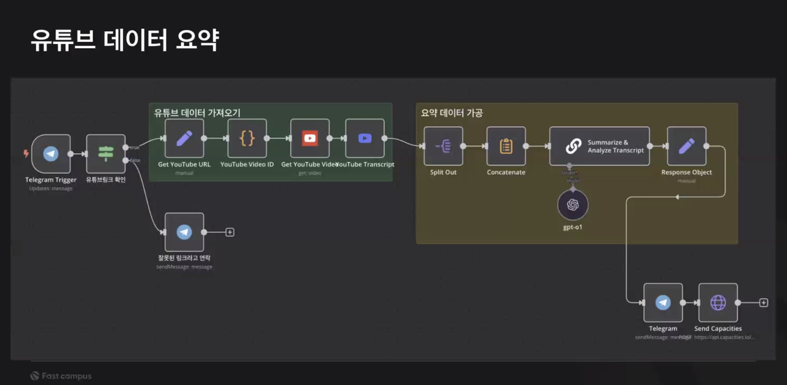
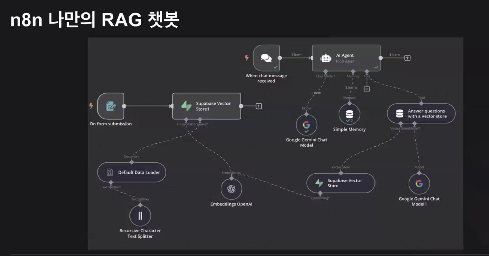

- 일시: `10/29 (수)`


예시
- 유튜브 영상 요약
- n8n 나만의 RAG 챗봇



발표자료
https://docs.google.com/spreadsheets/d/18viaTDW-gUsR8cPXKPHceewPNzuCgARtdVg5XMllPE8/edit?gid=1308281762#gid=1308281762


구글 시트 연동까지 동일 
- + limit 추가
	- 3개로 제한
- + gemini
	- message a model
		- google ai studio에서 api키 발급해서 설정 추가 해줘야 한다 (`save`)
		- `model/gemini-2.5 flash` 설정
		- 아래 프롬프트를 복사 붙여넣기
		- 실행 (오래걸림)
			- 우측에 pin 아이콘 누르면 결과 저장됨
- + 시트에 메일 내용에 넣어줘야 한다
	- Edit Fields (Set) 추가
	- 왼쪽 `Text` 필드를 드래그해서 넣는다 
	- 변수이름을 `email_content`로 설정
	- 그리고 추가로 Day, Date, Email Subject를 드래그 한다
- + google sheet 추가
	- append or update 액션 선택 
		- Column to match on (업데이트할 기준)
			- Date(KST)를 선택 
		- Value to Send에 
			- Data (KST) 필드를 왼쪽에서 드래그
			- 그리고 메일 내용에 email_content 드래그
		- 그리고 실행
			- 구글 시트에 `메일 내용`에 email_content가 추가되어 있다
- 새벽 6시에 메일을 보내야 한다. (상황)
	- limit를 잠깐 지우고 if 노드 추가 
		- Date (KST)를 추가해서 오늘 날짜를 넣는다 
			- 1 item 확인
		- 그리고 gemini에서 pin을 박은것을 푼다
			- pin 박으면 이전에 돌렸던 데이터 결과를 기록해 사용

> n8n은 트리거 노드를 여러개 사용가능


빈공간에 스케쥴 트리거를 추가
- 그리고 Trigger at Hour를 6am 설정 (매일 1번)
- 이때 시간 트리거를 연결안해도 실행이 된다함 

- Get row sheet로 이름만 다 가져온다 
- if 추가
	- 태그에 월급쟁이4기인 경우만 가져온다
- Date & Time 
	- setting 탭에 execute once를 선택
	- get current date
- get row sheet 
	- 21개 다시 가져옴 
- if 추가
	- ``{{ $('Date & Time').item.json.currentDate.slice(0, 10) }}
	- current date time을 드래그해서 넣고 slice처리 
- gmail
	- send a message
		- subject
		- email content 드래그해서 설정
		- 나한테 보내기


```
"너는 ‘월급쟁이햄찌들 21일 챌린지’의 기획자이자 카피라이터야.  
참여자들에게 매일 보내는 이메일을 작성해야 해.  
이메일은 친근하고 동기부여가 되며, 재테크 입문자도 쉽게 이해할 수 있어야 한다.  
불필요한 전문용어는 피하고, 하루 3분 안에 읽을 분량으로 써줘.

입력값(시트에서 불러옴):
- Day: {{ $json.Day }}
- Date: {{ $json["Date (KST)"] }}
- Term: {{ $json.Term }}
- Core Point: {{ $json["Core Point"] }}
- Quote: {{ $json.Quote }}
- Author: {{ $json.Author }}
- Email Subject: {{ $json["Email Subject"] }}
- Preheader: {{ $json.Preheader }}

출력 형식:
제목: {{ $json["Email Subject"] }}
본문:
1. 인사말 (햄찌 기획자 톤, 예: “안녕 햄찌들 🐹 오늘도 작은 한 걸음!”)
2. 오늘의 용어 소개 ({{ $json.Term }}) — {{ $json["Core Point"] }} 를 간단히 설명
3. 명언 인용 ({{ $json.Author }}의 “{{ $json.Quote }}”)  
   → 한 문장 해석과 오늘 배울 점 연결
4. 오늘의 생각거리 (참여자가 스스로 써볼 질문 한 줄)
5. 마무리 (격려 또는 다음 날 예고 문장)

스타일 가이드:
- 문체: 따뜻하고 대화체 (“우리 햄찌들”, “오늘도 같이 배워요”)
- 길이: 150~200단어 정도
- 문단: 3~5개
- 이모지: 적당히 사용 🐹💡💸✨

반드시 제목 없이 본문만 작성해주세요

> 출력 예시

안녕 햄찌들 🐹 드디어 우리 '월급쟁이햄찌들 21일 챌린지'의 첫걸음을 떼는 날이에요! 설레는 마음으로 함께 시작해볼까요? ✨

오늘 우리 햄찌들이 함께 알아볼 첫 번째 용어는 바로 ‘복리’예요. 💡 복리는 쉽게 말해 ‘돈이 돈을 버는 구조’를 말해요. 내가 투자한 원금뿐만 아니라, 원금이 벌어들인 이자에도 또 이자가 붙어서 돈이 불어나는 마법 같은 효과죠! 마치 눈덩이가 굴러갈수록 점점 커지는 것처럼요. 💸 티끌 모아 태산이라는 말이 복리의 힘을 보여주는 최고의 예시랍니다.

오늘 워런 버핏의 명언 한 문장을 가슴에 새겨봐요. ""당신이 지불하는 것은 가격이고, 당신이 얻는 것은 가치입니다."" 우리가 오늘 배운 ‘복리’는 당장은 작은 돈처럼 보여도, 시간이 지날수록 어마어마한 ‘가치’를 만들어줄 거예요. 오늘부터 시작하는 작은 재테크 습관이 미래의 큰 자산이 될 거라는 믿음을 가져봐요!

💡 오늘의 생각거리:
오늘 내가 돈에게 일을 시키기 위해 할 수 있는 아주 작은 행동은 무엇일까요?

첫걸음 힘차게 내디딘 우리 햄찌들, 정말 대단해요! 내일 더 유익한 이야기로 다시 만나요! 🐹💕"
```


> 11월 일할맛(패캠, 무료) 신청하기

> json 파일을 새 워크플로우 만들어서 import 가능

> n8n21se