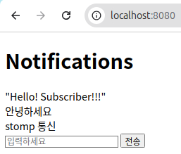

참고. 
- [AWS - RabbitMQ vs Kafka](https://aws.amazon.com/ko/compare/the-difference-between-rabbitmq-and-kafka/)
- [ZDNET korea - 아마존 CTO "이벤트 드리븐 아키텍처로 가라"](https://zdnet.co.kr/view/?no=20221202183934)
- [F-lab. 메시지 브로커와 이벤트 브로커: ..] (https://f-lab.kr/insight/message-broker-event-broker?gad_source=1&gbraid=0AAAAACGgUFeKgrz8-WR_U0x7Zupa8cKrf&gclid=Cj0KCQjw5azABhD1ARIsAA0WFUG1yOOiSHGGC-RXdc5Ua3iev4MphDgtYZGaK4CM969s4oJvMnP0tycaAn9DEALw_wcB)
- [RabbitMQ Tutorials](https://www.rabbitmq.com/tutorials)


Todo.
- RabbitMQ vs Kafka 비교 정리하기
- 주요 용어


## 섹션1. 쉽게 이해하는 RabbitMQ 개요과 비동기 아키텍처

slack에 notification 날린다는데 없네? ㅋㅋㅋ

### 3. RabbitMQ 설치


**도커로 설치** 
```shell
$ docker run -it --rm --name rabbitmq -p 5672:5672 -p 15672:15672 rabbitmq:4.0-management
```
- `--rm` : ctrl + c 로 종료할 경우 컨테이너 삭제 됨
- default 로그인 정보 : `guest` / `guest`
	- 최초 계정은 guest이기 때문에 admin 권한을 갖는 다른 계정을 추가해주고 default user 는 삭제 해주는게 보안상 권고
- [도커 허브 - RabbitMQ](https://hub.docker.com/_/rabbitmq)

> RabbitMQ 콘솔 주소
> localhost:15672 

> [!info] F-lab 참조 게시글
> RabbitMQ : 메시지 브로커, 비유하자면 택배 서비스
> Kafka: 이벤트 브로커, 비유하자면 도서관


**Mac 설치**
```text
// brew install 
[https://brew.sh/](https://brew.sh/)

// 설치 전에 brew 업데이트 
brew update 

// rabbitmq 설치 
brew install rabbitmq

// starts a local RabbitMQ node 
brew services start rabbitmq 

// stops the locally running RabbitMQ node 
brew services stop rabbitmq

// 삭제
brew uninstall rabbitmq

// 삭제 후 관련 디렉터리도 삭제 해줘야 함
rm -r /opt/homebrew/etc/rabbitmq 
rm -r /opt/homebrew/var/lib/rabbitmq 
rm -r /opt/homebrew/var/log/rabbitmq
```


**다른 운영체제**
```markdown
// 바이너리나 인스톨러 등을 활용해서 설치 [https://www.rabbitmq.com/docs/download(https://www.rabbitmq.com/docs/download)

// 윈도우의 경우 환경 변수에서 RabbitMQ 실행 bin 폴더를 지정해주면 됨
C:\Program Files\RabbitMQ Server\rabbitmq_server-4.0.3\sbin
```


### 4. AMQP의 이해

> Advanced Message Queing Protocal의 약자
> MQ의 오픈소스에 기반한 표준 프로토콜을 의미


**메세지큐를 사용하는 이유**
- 비동기 처리가 가능한 분야에서는 메세지 큐를 통해 느슨한 결합을 가지고 처리하도록 한다
	- 비동기 메시지를 사용하여 다른 응용프로그램 사이에 데이터를 송수신
- 복잡한 프로세스를 동기로 처리시 병목 현상, 장애전파, 확장성 제한 등의 문제 발생가능
	- 클라이언트에 대한 동기 처리는 병목의 요인으로 비동기로 처리해도 될 영역에 대해서는 큐를 통해 분리해서 처리한다
- 결국 분산환경에서 응용프로그램들을 분리하고 독립적으로 확장하기 위해서 사용, 기능별로 모듈 구성이 용이하다 (**Scalability**)
- 요청에 대한 응답을 기다릴 필요 ❌
	- 각 영역의 역할만 신경쓰면 된다
	- 어플리케이션 레벨에서 분리 할 수 있다
- 데이터를 메모리 대신에 디스크에 저장하여 데이터 유실을 방지(**Reliability**)
	- 즉시 처리하지 않아도 나중에 다시 처리가 가능하다 
	- 메시지 영구 저장, 메시지 확인, 장애 복구 메커니즘을 통해 메시지의 신뢰성을 보장
- **확장성**
	- 여러 노드에 걸쳐 쉽게 확장할 수 있어 높은 가용성 제공
	- 필요에 따라 메시지를 클러스터링하거나 페더레이션(federation) 방식으로 확장할 수 있다
- **유연성**
	- 다양한 exchange 유형과 라우팅 규칙을 지원하여 메시지를 효과적으로 라우팅하고 관리할 수 있다.
	- **광범위한 프로토콜 지원**: 기본적으로 AMQP 사용, STOMP, MQTT, HTTP 등을 포함한 다양한 프로토콜을 지원
	- **풍부한 클라이언트 라이브러리**:  Java, Python, Ruby, .NET 등 다양한 언어로 클라이언트 라이브러리를 제공하여 다양한 애플리케이션에서 사용할 수 있다


- 여기서 말하는 exchange의 `one-to-one fanout`의 경우 
	- 여러 큐에 메시지를 브로드 캐스트하지만, 각 큐에 연결된 소비자는 한 명이므로 **메시지는 각각의 큐에서 하나의 소비자에게만 전달**되므로 1:1 방식의 메시지 소비를 뜻한다
	- **여러 소비자에게 동시에 메시지를 전달하되 각 메시지가 단일 소비자에게만 전달되도록 보장하고 싶은 경우를 의미**한다고 보면 된다

**AMQP 특징**
이전에도 상용화된 MQ 제품들이 많았지만, 대부분 플랫폼 종속적이라 서로 다른 이기종간에 메시지를 교환하기 위해 메시지 포맷 컨버전(속도 저하 발생)을 위한 메시지 브릿지를 이용하거나 시스템 자체를 통일시켜야 하는 불편함과 비효율성이 있었다. 즉, **AMQP의 목적**은 서로 다른 시스템 간에 (비용/기술/시간 측면에서)효율적으로 메시지를 교환하기 위한 MQ 프로토콜로 특징은 다음과 같다
- 모든 broker들은 똑같은 방식으로 동작할 것  
- 모든 client들은 똑같은 방식으로 동작할 것 
- 네트워크 상으로 전송되는 명령어 표준화
- 프로그래밍 언어 중립적


**메모.**
exchange 방식은 여러가지 
큐는 버퍼의 역할 (생산자와 소비자 사이)

// 로그를 logback, ELK 활용해서 수집하는 방법도 있고
// 메시지 큐를 활용해서 수집 모듈(소비자)에서 따로 저장하는 방식도 생각할 수 있겠네

### 5. 주요용어와 Exchange의 이해 

**메모.**
가장 눈에 띄는게 consumer가 메세지를 처리한 이후에 ACK를 보내야 한다.
보내지 않는 경우 RabbitMQ에서 메시지를 다시 큐에 넣어 다른 소비자가 처리하도록 할 수 있다
<-> Kafka는 최신 offset 기준으로 조회하고 갱신(?)해주는걸로 알고 있음

Prdocuer -> Exchange로 갈때는 `routing key`가 사용됨
Exchange -> Queue로 갈때는 `binding key`가 사용됨
// 모호하네 ..  키 두 개를 구분 지어라는 건가?

**🤔 그러면 "생산자 모듈에서 두 키를 지정하나요?" 에 대해 (Chat-gpt)**

> ❌ **아니요! 생산자는 `routing key`만 지정합니다.**  
> ✅ **`binding key`는 큐 바인딩 시 서버 또는 인프라 레벨에서 설정합니다.**

- **Producer**:  
    `convertAndSend(exchangeName, routingKey, message)`  
    (👉 routing key만 신경 씀)
    
- **Consumer**:  
    큐와 exchange를 바인딩할 때 **binding key를 지정**


**Routing Model Components**
AMQP의 라우팅 모델은 아래와 같은 3개의 중요한 component로 구성된다
- **Exchange**
	- producer에서 보낸 메시지를 적절한 큐 또는 다른 exchange로 분배하는 라우터의 기능을 함
- **Binding**
	- exchange와 큐와의 관계를 정의한 **일종의 라우팅 테이블**
	- 같은 큐가 여러 개의 exchange에 bind 될 수 도 있고, 하나의 exchange 에 여러 개의 큐가 binding 될 수 있다
- **Queue**
	- 메모리나 디스크에 메시지를 저장하고, consumer에게 전달하는 역할을 함


![[Pasted image 20250426132410.png]]


**RabbitMQ의 주요 용어 정리**
- Producer (생산자)
	- 메시지를 생성하고 RabbitMQ에 전송하는 애플리케이션
	- 특정 Exchange에 메시지를 전송하고 Exchange는 메시지를 라우팅하여 큐에 배치
- Exchange
	- Producer로부터 받은 메시지를 큐에 전달하는 역할 
	- 유형
		- Direct: 특정 라우팅 키와 정확히 일치하는 큐에 메시지를 전송 
		- Fanout: 모든 큐에 메시지를 브로드캐스트 
		- Topic: 라우팅 키 패턴을 기반으로 메시지를 특정 큐에 전달 
		- Headers: 메시지 헤더 속성에 따라 메시지를 라우팅 
	- 메시지가 Exchange로 전송될때, Routing Key가 함께 전달
- Routing Key
	- 메시지를 전송할 때 Producers가 Exchange에 전달하는 키
	- Exchange는 이 Routing Key를 참고하여 어떤 큐에 메시지를 전달할지 결정
- Queue
	- 메시지를 일시적으로 저장하는 버퍼 역할
	- RabbitMQ의 큐는 FIFO 방식으로 동작하며, 메시지가 소비자에게 전달될 때까지 보관
	- 각 큐는 여러 Consumer가 구독(수신)할 수 있으며, 메시지는 큐에 들어온 순서대로 전달
	- 비동기적으로 동작하며, 여러 컨슈머가 동시에 메시지를 소비할 수 있다
		- 단, 하나의 메시지가 여러 소비자에게  중복으로 전달될 수 없음
		- 동일한 메시지를 수신하려면 fanout Exchange 방식으로 동작해야만 함
- Binding
	- exchange와 큐 간의 관계를 정의
	- 바인딩은 메시지를 라우팅할 때 어떤 조건으로 큐에 보낼지 정의하고 이를 위해 binding key가 사용됨 
	- Binding Key와 Routing Key가 일치하면 해당 큐로 메시지가 전달 (패턴 매칭 지원)
- Consumer (소비자)
	- 큐에서 메시지를 가져와 처리하는 애플리케이션
	- RabbitMQ는 여러 소비자에게 메시지를 로드 밸런싱 할 수 있다
	- Consumer는 큐에서 메시지를 받아 처리하면 메시지에 대한 확인(ACK, acknowledgment)을 브로커에 전송함
	- 확인을 보내지 않으면, 브로커는 메시지를 재전송하거나 설정한 다른 Consumer에게 전달할 수 있다
- Message Acknowledgment (메세지 확인)
	- 메시지가 성공적으로 처리되었음을 RabbitMQ에 알리는 과정
	- 만약 소비자가 메시지를 성공적으로 처리하지 못했다면, 메시지를 다시 큐에 넣어 다른 소비자가 처리하도록 할 수 있다


**절차 요약**
```text
1. Producer가 메시지와 Routing Key를 Exchange에 전송
2. Exchange가 Routing Key를 사용해 Binding Key가 일치하는 큐에 메시지를 라우팅
3. Consumer가 큐에서 메시지를 가져와 처리하고, 성공적으로 처리되었음을 acknowledgment로 RabbitMQ에 알림
```


**추가 용어**
- Prefetch Count
	- 소비자가 받을 수 있는 최대 메시지 수 설정
	- 한 번에 많은 양의 메시지를 처리하지 않도록 해 소비자의 성능 최적화
- Virtual Host (가상 호스트)
	- RabbitMQ 서버 내의 논리적인 구획으로, 메시지 큐, 익스체인지, 사용자 권한 등을 구분 
	- 하나의 RabbitMQ 서버 내에 여러 개의 가상 호스트를 설정하여 서로 다른 애플리케이션의 메시지를 격리 할 수 있다
- Dead Letter Queue (DLQ)
	- 메시지가 처리되지 못하거나 유효 기간이 지난 경우 별도의 큐로 이동하는 구조도 설정할 수 있다

**Exchange 유형에 따른 처리**
- 1. Direct Exchange
	- 메시지가 routing key에 따라 특정 큐로 하나씩 전달되는 방식
	- 메시지 발행시 사용하는 라우팅 키와 동일한 키로 익스체인지에 바인딩 된 모든 큐에 메시지를 전달
	- 해당 라우팅 키와 일치하는 큐에만 메시지가 전달되는 방식이기 때문에 Direct Exchange 라고 함
	- 예시. 주문에 따른 상태 지시
		- 활용: 주문 상태별로 **라우팅 키**를 정의, 각 상태에 해당하는 큐가 메시지를 받는다. 매핑이 정확하게 되는 한 개의 키만 있으니깐 1:1로 가능할 거 같은데, **하나의 라우팅 키**에 대해 **여러 큐**가 바인딩 될 수 있기 때문에 **1:N** 매칭이 가능하다.
			- 메시지가 명확하게 특정 큐로 전달되어야 할 때
			- 큐마다 고유한 라우팅 규칙을 적용하여 메시지를 분류해야 할 때
	- **예시 업무**: 주문 상태 처리, 결제 처리, 사용자 알림 시스템 등
- 2. Topic Exchange
	- 라우팅 키를 **패턴 기반**으로 정의하여 여러 큐에 유연하게 전달할 수 있는 방식
	- 라우팅 키에 와일드카드(`*, #`) 매칭을 사용하여 더 복잡한 라우팅이 가능하다
		- 와일드카드 \* 의 경우 하나의 단어를 대체하는 의미로 log.info, log.warn과 같은 패턴의 메시지를 수신할 때 log.\*로 매칭되어 전부 수신가능 
		- \#의 경우 0개 이상의 단어를 대체하므로 app.order.success, app.payment.sucess와 같은 라우팅 키를 \#.success로 다 수신할 수 있다
	- 동적이고 유연한 라우팅이 필요할 때 사용 
	- 예시: 로그 수집 시스템, 이벤트 기반 모니터링 등
- 3. Fanout Exchange
	- 브로드캐스트 방식으로 메시지를 모든 바인딩된 큐에 전달한다
	- 한 번의 메시지 발행으로 모든 큐가 동일한 메시지를 받는다
		- 이벤트가 발생하면 모든 서비스가 동일한 메시지를 받는 서비스에서 유용
	- 예시. 시스템 점검 공지 등 
- 4. Headers Exchange
	- 메시지의 속성(헤더)에 기반한 복잡한 라우팅이 필요할 때 사용 
	- 메시지 헤더에 `language: "ko"`등의 값을 설정하여 헤더 기반 라우팅 수행
		- `language: "ko"`로 설정된 메시지는 한국어 이메일 서비스에서 처리 
		- `language: "en"`로 설정된 메시지는 영어 이메일 서비스에서 처리 


**메시지 전송 단계별 프로세스**
![[메시지단계별flow 1.png]]
1. 메시지 전송 
	1. Producer ➡️ Broker (RabbitMQ)
	2. 이때 메시지는 큐에 저장되며, Exchange와 Binding 설정에 따라 적절한 큐로 라우팅
2. 메시지 전달 
	1. Broker ➡️ Consumer
	2. Consumer는 **큐에서 메시지를 가져가거나(Polling) 메시지를 푸시(Push)** 받는 방식으로 수신
3. 메시지 확인(ACK) 또는 커절(NACK)
	1. **ACK** : 
		1. Consumer가 메시지를 성공적으로 처리 후 Broker에게 ACK 전송
		2. 이 경우 Broker는 해당 메시지를 큐에서 제거하고 Producer에게 **Message Acknowledged** 응답을 전송 (Producer가 Publisher Confirms 사용시 활용)
	2. **NACK** : 
		1. Consumer가 메시지 처리에 실패하거나 메시지를 거절당할 경우 NACK을 전송
		2. NACK에는 메시지를 다시 큐로 보내야 할지(requeue) 또는 폐기해야 할지 (discard) 설정 가능 
			1. Requeue(재전송) : 메시지를 다시 큐로 보내고 재처리할 수 있도록 설정
			2. Discard(폐기) : 메시지를 큐에서 제거하고 폐기
4. Producer에 응답 (Message Acknowledged / Message Rejected)
	1. Producer가 Publisher Confirms를 활성화한 경우 Broker는 ACK또는 NACK 결과를 Producer에게 전송
	2. ACK를 받은 경우 메시지가 성공적으로 소비된 것으로 간주
	3. NACK를 받는 경우 Producer는 메시지 실패를 기록하거나 재전송

---

## 섹션2. RabbitMQ 기본 튜토리얼 

### 6~7. 단순 메시지 전송 (Producer to Consumer)

```shell
docker run -it -d --name rabbitmq -p 5672:5672 -p 15672:15672 rabbitmq:4.0-management
```

계정 추가하면 Can access virtual hosts가 No access 확인됨 (접근 권한 x 상태)


➡️ Name을 누르고 설정 이동하면 Set Permission 버튼을 눌러줌
➡️ 이전 화면으로 돌아가면 No access 사라짐 


인텔리제이 프로젝트 설치
- HelloMessageQueue
	- JDK17
	- 의존성: Spring Boot Dev Tools, Spring Web, Spring for RabbitMQ, Lombok

application.yml 작성
```shell
spring:
  rabbitmq:
    host: localhost
    port: 5672  // 기본 통신 포트, 15672는 주로 관리 및 모니터링(admin) 용도로 사용
    username: guestuser
    password: guestuser
  application:
    name: HelloWorldMessageQueue
server:
  port: 8080

```

`RabbitMQConfig` Bean 생성
- `Queue queue()` 
	- Bean은 Queue 인스턴스를 생성하고, 애플리케이션이 사용할 RabbitMQ를 정의
	- 첫번째 인자 QUEUE_NAME: 메시지가 쌓이고 처리할 큐의 이름을 정의
	- 두번째 인자 durable (boolean) : 큐가 휘발성(volatile)인지 영속성(persistent)인지 여부 지정
- `RabbitTemplate rabbitTemplate(ConnectionFactory connectionFactory)`
	- RabbitMQ 통신을 위한 템플릿 클래스, 메시지를 보내고 받을 때 사용
	- RabbitTemplate은 Spring의 JdbcTemplate과 비슷하게, RabbitMQ와 상호작용하기 위한 간단한 API를 제공합니다. 
	- 주로 메시지 전송을 담당
	- **ConnectionFactory** : RabbitMQ와의 연결을 관리하는 객체로, rabbitTemplate에 주입하여 메시지를 전송할 떄 사용할 커넥션을 제공
	- **사용 용도**: 메시지를 전송하는 Sender가 `rabbitTemplate.convertAndSend()` 메서드를 사용해 큐에 메시지를 넣는데 사용
- `SimpleMessageListenerContainer container(ConnectionFactory connectionFactory, MessageListenerAdapter listenerAdapter)`
	- 이 Bean은 RabbitMQ 메시지를 비동기적으로 수신하기 위해 리스너를 생성함
	- 이 컨테이너는 특정 큐를 지속적으로 모니터링하고, 메시지 수신하며 지정된 리스너(MessageListenerAdapter)를 통해 처리함
	- `ConnectionFactory` : RabbitMQ와 연결을 유지하며, 수신하는 메시지를 이 연결을 통해 가져옴
	- `setQueueName(QUEUE_NAME)`: 특정 큐 이름을 설정, 이 컨테이너는 해당 큐에서 수신되는 메시지를 모니터링
	- `setMessageListener(listenerAdapter)`: listenerAdapter를 설정하여, 메시지가 수신될 때 호출할 리스너를 지정
	- Spring AMQP에서 메시지를 자동으로 수신하려면 SimpleMessageListenerContainer가 필요
		- 메시지 수신과 관련된 스레드 관리, 연결 유지, 큐 모니터링 작업을 자동으로 처리함
		- 만약 없이 구현한다면
			- RabbitTemplate의 `receiveAndConvert()` 메서드를 수동 호출하여 메시지를 가져오는 동기적 방식으로 구현해야 함
			- 이는 비효율적이며, 큐의 상태를 주기적으로 확인(polling)해야 하기 때문에 자원을 낭비할 수 있습니다.
- `MessageListenerAdapter listenerAdapter(Receiver receiver)`
	- `MessageListenerAdapter`: 수신한 메시지를 특정 클래스의 특정 메서드로 전달하는 어댑터 역할을 함
		- receiver 객체는 메시지를 처리하는 역할을 하는 빈 (사용자 정의 컴포넌트 빈)
		- receiveMessage 메서드를 호출합니다 (default 명칭 **"handleMessage"**, 문자열 지정 가능) ➡️ MessageListenerAdapter 생성자 확인
		- MessageListenerAdapter는 RabbitMQ에서 수신된 메시지를 특정 메서드에 전달할 수 있도록 해 줌
			- 이 경우 `receiveMessage()`가 자동 호출되며, 메시지 내용을 인자로 받음
			- Receiver 클래스의 receiveMessage()가 메시지를 수신하여 처리하도록 설정
	- RabbitMQ에서 수신된 메시지가 `receiver.receiveMessage(String message)`로 전달된다

step1 생성 후 http 호출 테스트 
```text
###  
POST http://localhost:8080/api/messages/send  
Content-Type: application/json  
  
"hello world"


-------------------------

POST http://localhost:8080/api/messages/send

HTTP/1.1 200 
Content-Type: text/plain;charset=UTF-8
Content-Length: 44
Date: Sat, 26 Apr 2025 07:24:16 GMT

[#] Message sent successfully! "hello world"
```

```text
// 콘솔 
[#] Sent : "hello world"
[#] Received message: "hello world"
```

**참고.** [기억보단 기록을 - 인텔리제이 http](https://jojoldu.tistory.com/266)

---
### 8 ~ 9. Consumer간 작업 분배

**Competing Consumers Pattern**
> [!info] 
> 메시지를 여러 Consumer(소비자) 간에 분배하여 작업을 분산 처리하는 구조
> 작업 부하를 효율적으로 분산하고, 병렬 처리를 가능하게 만들어 처리 속도를 향상시킴
- `Round-Robin `방식과 `Fair Dispatch` 방식을 사용하여 메시지를 Consumer 간에 분배
- `Fair Dispatch` 방식은 메시지 수동 확인(Manual Acknowledgement) 모드로 개발하고 메시지 처리 비중 (Prefetch Count) 설정 등을 통해 조정 가능 (기본값은 AUTO를 많이 씀)

**주요 특징**
- 1. 경쟁적인 메시지 소비 
	- 여러 Consumer가 동일한 메시지 큐에서 메시지를 가져가 처리 
	- 특정 메시지는 한 번에 하나의 Consumer에 의해 처리되므로 메시지 중복 처리 방지
- 2. 작업 분산
	- 메시지가 여러 Consumer 간에 분배되어 병렬로 처리되므로 작업 부하를 효율적으로 분산
- 3. 확장성
	- Consumer를 추가하거나 제거함으로써 작업 처리 능력을 동적으로 확장하거나 축소
- 4. 내결함성
	- Consumer 중 하나가 실패하더라도 다른 Consumer가 작업을 이어받아 처리할 수 있어 시스템이 중단 없이 작동


> step2 예시

```java
package com.example.hellomessagequeue.step2;  
  
import org.springframework.amqp.core.AcknowledgeMode;  
import org.springframework.amqp.core.Queue;  
import org.springframework.amqp.rabbit.connection.ConnectionFactory;  
import org.springframework.amqp.rabbit.core.RabbitTemplate;  
import org.springframework.amqp.rabbit.listener.SimpleMessageListenerContainer;  
import org.springframework.amqp.rabbit.listener.adapter.MessageListenerAdapter;  
import org.springframework.context.annotation.Bean;  
import org.springframework.context.annotation.Configuration;

@Configuration  
public class RabbitMQConfig {  
  
    public static final String QUEUE_NAME = "work-queue";  
  
    @Bean  
    public Queue queue() {  
        return new Queue(QUEUE_NAME, true);  
    }  
    @Bean  
    public RabbitTemplate rabbitTemplate(ConnectionFactory connectionFactory) {  
        return new RabbitTemplate(connectionFactory);  
    }  
    @Bean  
    public SimpleMessageListenerContainer container(ConnectionFactory connectionFactory, MessageListenerAdapter listenerAdapter) {  
        SimpleMessageListenerContainer container = new SimpleMessageListenerContainer();  
        container.setConnectionFactory(connectionFactory);  
        container.setQueueNames(QUEUE_NAME);  
        container.setMessageListener(listenerAdapter);  
        container.setAcknowledgeMode(AcknowledgeMode.AUTO);  
        return container;  
    }  
    @Bean  
    public MessageListenerAdapter listenerAdapter(WorkQueueConsumer workQueueConsumer) {  
        return new MessageListenerAdapter(workQueueConsumer, "workQueueTask");  
    }}
```
- `Queue` 에서 durable(영속성)을 **true** 설정
- `SimpleMessageListenerContainer`에서 `setAcknowledgeMode(..)` 추가
	- `AcknowledgeMode.AUTO` : consumer에서 메시지 처리 후 RabbitMQ에 ACK 전달
	- RabbitMQ에서 AcknowledgmentMode는 메시지가 처리 완료되었음을 RabbitMQ에 알리는 방식
	- Round-Robin 방식이며 별도 설정을 하지 않아도 기본으로 동작함
	- AcknowledgeMode는 AUTO이외에 MANUAL 과 NONE 이 있음


Queue and Sterems 탭에서 **purge message**버튼 누르면 ready 상태 메시지를 초기화한다(복구 불가)

**에러상황**
- **durable(영속성)** 상태가 **true**로 빈에 설정해 둔 상태
- producer 에서 message 를 넘길 때 공백을 파이프 라인에 붙여주면 아래와 같은 에러가 발생하며 어드민상에 **unacked** 를 확인할 수 있음
- 일부러 컨슈머에서 파싱할 때 공백 추가 `split("| ")`
	- 컨슈머가 파싱 에러가 나서 unacked를 보내게 된다
	- 에러를 고치고 메시지를 소비할 수 있도록 해야 한다

⚠️ 메시지 처리가 안되는 경우, 어드민에서 확인해야 할 사항 
- **ready**
	- 메시지가 큐에 있지만 아직 컨슈머에게 전달되지 않은 상태를 의미
	- 이 상태의 메시지는 대기 중이며, 컨슈머가 연결되면 전달될 준비가 됨
	- 큐의 적재량이 많아지면 ready 메시지 수가 증가
- **unacked**
	- 메시지가 컨슈머에게 전달되었으나 아직 확인되지 않은 상태
	- 컨슈머가 메시지를 처리하고 확인(ACK)을 보내면, RabbitMQ는 해당 메시지를 삭제
	- 컨슈머가 확인을 보내지 못하거나 연결이 끊어지면, 메시지는 다시 ready 상태로 되돌아감 (설정에 따라 다름)
- unacked 상태에서 consumer가 제대로 소비하도록 수정하면 unacked에서도 처리가 되어 삭제된다
- 메시지 삭제
	- **purge**
		- purge 명령은 큐에 있는 ready 메시지를 삭제
		- 삭제된 메시지는 복구되지 않으며, 데이터는 소실됨
		- unacked 메시지는 purge로 삭제되지 않음
		- unacked 메시지를 삭제하려면 컨슈머가 연결을 끊거나 RabbitMQ 큐를 재시작해야 함
		- 컨슈머가 연결을 끊으면 unacked 메시지는 다시 ready 상태로 돌아감
- 일반적인 문제 해결 방법
	- ready가 많을 경우: consumer 수를 늘리거나, 메시지 처리 속도를 최적화 해야 함
	- unacked가 많을 경우
		- consumer 코드 수정 (프로그램 에러 가능성이 높음)
		- consumer 연결 상태를 확인하여 재연결 혹은 재시작 필요

**정상 상황**


> 9에서 build 한 jar 파일을 다른 포트로 해서 2개 어플리케이션 실행시킴
> 라운드 로빈 방식으로 consumer가 메시지를 소비하는 것을 확인함


cURL(컬) 테스트
```shell
curl -X POST "http://localhost:8080/api/workqueue?message=Task1&duration=2000" curl -X POST "http://localhost:8080/api/workqueue?message=Task2&duration=4000" curl -X POST "http://localhost:8080/api/workqueue?message=Task3&duration=5000"
```


빌드 후 서버 실행 ➡️ cURL 호출로 각 소비자가 메시지를 순서대로 처리함을 확인 (라운드 로빈 방식)
```shell
java -jar HelloMessageQueue-0.0.1-SNAPSHOT.jar --server.port=8080 
java -jar HelloMessageQueue-0.0.1-SNAPSHOT.jar --server.port=8081
```


---

### 10 ~ 12 Pub/Sub 모델을 이용한 실시간 알림 

- 10, 11의 경우 step3 브랜치 
	- websocket으로 서버에 연결하면, 메시지가 도착할 경우 사용자 화면에 출력하는 예시를 다룬다
	- stomp로 클라이언트에서 서버로 인풋 메시지 보냄
	- 1. RabbitMQ로 연결되어 있기 때문에 소비자에서 `/topic/notifications` 로 브로드 캐스팅 하는 구나
	- 2. 클라이언트 화면에서 stomp로 직접 서버에 메시지를 보내(`/app/send`) `/topic/notifications`로 브로드 캐스팅
- 12의 경우 step4 브랜치
	- 구독 서비스처럼 콤보 박스 선택해서 메시지 받는 형태로


```java
@Configuration  
public class RabbitMQConfig {  
    public static final String QUEUE_NAME = "notification-queue";  
    public static final String FANOUT_EXCHANGE = "notification-exchange";  
  
    @Bean  
    public Queue notificationQueue() {  
        return new Queue(QUEUE_NAME, false); // 메시지는 volatile로 설정  
    }  
  
    @Bean  
    public FanoutExchange fanoutExchange() {  
        // 메시지를 수신하면 연결된 모든 큐로 브로드캐스트  
        return new FanoutExchange(FANOUT_EXCHANGE);  
    }  
    
    @Bean  
    public Binding bindNotification(Queue notificationQueue, FanoutExchange fanoutExchange) {  
        // BindingBuilder.bind().to() 를 통해 큐와 익스체인지를 연결  
        return BindingBuilder.bind(notificationQueue).to(fanoutExchange);  
    }}
```
- `Binding` : exchange와 queue를 바인딩(연결) 해준다
	- 애플리케이션 시작시 
		- Spring Boot AMQP AutoConfiguration이 동작합니다 
		- RabbitAdmin이라는 컴포넌트가 작동해서 **등록된 Bean(Queue, Exchange, Binding)들을 RabbitMQ 서버에 직접 API 호출해서 생성합니다** 


RabbitMQ로 메시지를 발행하면, `NotificationSubscriber` 에서 메시지를 소비하여 `/topic/notifications`로 메시지를 전달함
```shell
curl -X POST 'http://localhost:8080/notifications' -H 'Content-Type: application/json' -d '"Hello! Subscriber!!!"'
```


```java
@Component  
@RequiredArgsConstructor  
public class NotificationSubscriber {  
    public static final String CLIENT_URL = "/topic/notifications";  
  
    // WebSocket으로 메시지를 전달하기 위한 Spring의 템플릿 클래스.  
    private final SimpMessagingTemplate simpMessagingTemplate;  
	
	// RabbitMQ Queue에서 메시지 수신  
    @RabbitListener(queues = RabbitMQConfig.QUEUE_NAME)  
    public void subscriber(String message) {      
        System.out.println("Received Notification: " + message);  
        
        // convertAndSend 를 통해 특정 경로로 메시지를 전달함  
        simpMessagingTemplate.convertAndSend(CLIENT_URL, message); // 클라이언트에 브로드캐스트  
    }  
}
```
- `@RabbitListener(queues = RabbitMQConfig.QUEUE_NAME)` 사용하지 않는 경우
	- `String message = (String) rabbitTemplate.receiveAndConvert(RabbitMQConfig.QUEUE_NAME);`
	- 직접 rabbitTemplate 호출해서 메시지를 가져와야 한다 (귀찮음)


사용자 화면에서 인풋 박스 통해 `/app/send`발송하게 되면 마찬가지로 `/topic/notifications`로 발행

```java
@Controller  
@RequiredArgsConstructor  
public class StompController {  
    private final SimpMessagingTemplate messagingTemplate;  
  
    @MessageMapping("/send")  
    public void sendMessage(NotificationMessage notificationMessage) {  
        // 수신된 메시지를 브로드 캐스팅  
        String message = notificationMessage.message();  
  
        System.out.println("[#] message = " + message);  
  
        // 클라이언트에 메시지 브로드캐스트  
        messagingTemplate.convertAndSend("/topic/notifications", message);  
    }  
}
```

**사용자 화면**


**notification pub/sub 개발 순서**
- RabbitMQConfig : 3개의 Bean(Queue, Exchange, Binding)을 설정
	- FanoutExchange 설정
	- QueueName 설정
	- BindingBuilder를 통해 생성한 큐와 익스체인지(fanout exchange) 연결
- Publisher
	- RabbitTemplate을 이용해 convertAndSend
	- RabbitMQ에 메시지 발행
- Subscriber
	- `@RabbitListener(queues = RabbitMQConfig.QUEUE_NAME)`
		- 내부적으로 Spring의 MessageListenerContainer를 사용하여 Queue를 지속적으로 모니터링
		- Spring이 메시지 수신을 자동화하고, 비동기적으로 처리. 코드가 간결
		- 메시지 수신, 메서드 호출과 변환, Ack 전송 등의 역할
	- SimpMessageingTemplate을 통해 특정 경로에 메시지 전달
		- WebSocket 메시지 브로커와 통신하며, 클라이언트가 구독하는 특정 경로로 메시지를 전송
		- 특정 클라이언트나, 클라이언트 그룹에게 메시지 전송 가능
		- STOMP의 경로를 지정
- WebSocketConfig
	- WebSocketMessageBroker 활성화
	- WebSocketMessageBrokerConfigurer를 구현
	- Spring에서 WebSocket 메시지 브로커를 구성하기 위한 인터페이스로 웹소켓 연결, 메시지 브로커 설정 및 라우팅 등의 웹 소켓 관련 확장기능을 제공함

```java
@Override
public void registerStompEndpoints(StompEndpointRegistry registry) {
    registry.addEndpoint("/ws") // WebSocket 연결 엔드포인트
            .setAllowedOriginPatterns("*") // CORS 설정
            .withSockJS(); // SockJS 지원
}

@Override
public void configureWebSocketTransport(WebSocketTransportRegistration registry) {
    registry.setMessageSizeLimit(2048); // 메시지 크기 제한 (2 KB)
    registry.setSendTimeLimit(5 * 1000); // 전송 제한 시간 (5초)
    registry.setSendBufferSizeLimit(512 * 1024); // 버퍼 크기 제한 (512KB)
}

```
기타 메시지 변환을 위한 converter나 메시지 전송 브로커 경로 등을 설정할 수 있음 


- 클라이언트 구독 경로 설정
	- `config.enableSimpleBroker("/topic");` // 클라이언트 구독 경로
- 서버의 발행 경로 설정
	- `config.setApplicationDestinationPrefixes("/app");` // 서버 발행 경로
- Websocker endpoint 설정 
	- `registry.addEndpoint("/ws").setAllowedOriginPatterns("*").withSockJS();`
- Controller 생성 
- HTML 작성 
	- sock.js : WebSocket 연결을 지원하지 않는 브라우저에서도 동작하도록 폴백(fallback) 기능을 제공하는 라이브러리로 아래와 같은 전송 타입을 지원
		- WebSocket
		- HTTP Streaming
		- HTTP Long Polling
	- stomp.js
		- STOMP(Simple/Streaming Text Oriented Messaging Protocol) 프로토콜을 지원하는 JavaScript 클라이언트 라이브러리
		- [https://stomp.github.io/stomp-specification-1.2.html](https://stomp.github.io/stomp-specification-1.2.html)
		- 텍스트 기반 프로토콜로, 메시지의 유형, 내용을 정의하여 클라이언트와 서버간 메시지를 주고 받음
		- RabbitMQ와 같은 브로커와 통신하는 데 사용
		- 각 프레임은 명령(Command), 헤더(Header), 바디(Body)로 구성
		- 이기종 시스템 간의 메시징에 유용


**WebSocket**
- WebSocket은 **양방향 통신**을 가능하게 하는 표준 프로토콜(RFC 6455)로 클라이언트와 서버 간에 **실시간 데이터**를 주고받는 데 적합하다.
- 데이터를 프레임 단위로 전송하며, 오버헤드가 낮음.
	- 기존의 HTTP 기반 통신과 달리, 연결이 초기화된 후에는 **상태를 유지**하며 데이터 교환이 가능
	- ws://호스트:포트/경로 형태로 작성 (ws://example.com/chat)

**WebSocket 특징**
**1. 실시간성**
- 클라이언트와 서버 간 실시간으로 데이터를 주고받을 수 있음
- 예: (주식거래, 채팅, 실시간 알림)

**2. 효율성:**
- HTTP 기반 폴링(Polling)보다 네트워크 자원과 대역폭을 절약.
- 연결이 열려 있는 동안 별도의 요청/응답 없이 데이터를 지속적으로 전송 가능.

**3. 양방향 통신 (Full-Duplex)**:
- 클라이언트에서 서버로 요청을 보낼 필요 없이, 서버가 클라이언트로 데이터를 푸시.

**4. 낮은 지연 시간:**
- 한 번 연결이 설정되면 데이터 전송 속도가 매우 빠름

**5. 상태 유지 (Persistent Connection)**:
- 연결이 끊기지 않는 동안 클라이언트의 상태를 서버에서 유지 가능.


**NotificationPublisher 부터의 전체 흐름**

> publisher는 exchange에 메시지를 보냄 ➡️ exchange는 binding으로 인해 queue와 연결되어 있음
> ➡️ subscriber에서 RabbitListener에 의해 QUEUE_NAME을 바라보다가 exchange에 메시지가 도착하면 Queue로 발행되고 메시지를 수신

- `Binding`
	- RabbitMQ에서 Exchange와 Queue 간의 관계를 정의 
	- 메시지가 Exchange에 도착했을때, 어떤 Queue로 전달할지를 결정
- `BindingBuilder.bind(notificationQueue).to(fanoutExchange)`
	- notificationQueue를 fanoutExchange에 연결
	- fanout Exchange의 메시지를 해당 queue로 전달하도록 설정


**pub/sub의 활용 영역 예시**
- 실시간 채팅
- 실시간 알림 (실시간 상태 변경 및 수신)
- IoT 데이터 스트리밍 (중앙 서버에 발행)
- 위치 추적, 이벤트 트래킹, 분산 이벤트 통신 (메시지 전달)
- SNS의 좋아요, 새 게시물, 댓글, 팔로워 등

---

step4의 경우 소켓 통신을 바꿔가면서 메시지를 소비하는 예시를 다룬다 
- 개발 뉴스 레터 구독시 관심사 체크(Java/Spring/Vue)
- 각각의 관심사별 Exchange 연결에 따른 메시지 발행과 구독 

RabbitMQConfig 에서
- `Queue`가 3개가 되기 때문에 빈 이름을 잘 지어주든가 명시적으로 @Qualifier로 지정해야 충돌이 없음

```java
@Bean
public Binding javaBinding(@Qualifier("javaQueue") Queue queue, FanoutExchange fanoutExchange) {
    return BindingBuilder.bind(queue).to(fanoutExchange);
}
```


```java

@Configuration  
public class RabbitMQConfig {  
    public static final String FANOUT_EXCHANGE_FOR_NEWS = "newsExchange";  
  
    public static final String JAVA_QUEUE = "javaQueue";  
    public static final String SPRING_QUEUE = "springQueue";  
    public static final String VUE_QUEUE = "vueQueue";  
  
    @Bean  
    public Queue javaQueue() {  
        return new Queue(JAVA_QUEUE, false);  
    }  
    @Bean  
    public Queue springQueue() {  
        return new Queue(SPRING_QUEUE, false);  
    }  
    @Bean  
    public Queue vueQueue() {  
        return new Queue(VUE_QUEUE, false);  
    }  
    @Bean  
    public FanoutExchange fanoutExchange() {  
        // 메시지를 수신하면 연결된 모든 큐로 브로드캐스트  
        return new FanoutExchange(FANOUT_EXCHANGE_FOR_NEWS);  
    }  
  
    @Bean  
    public Binding javaBinding(Queue javaQueue, FanoutExchange fanoutExchange) {  
        return BindingBuilder.bind(javaQueue).to(fanoutExchange);  
    }  
    @Bean  
    public Binding springBinding(Queue springQueue, FanoutExchange fanoutExchange) {  
        return BindingBuilder.bind(springQueue).to(fanoutExchange);  
    }  
    @Bean  
    public Binding vueBinding(Queue vueQueue, FanoutExchange fanoutExchange) {  
        return BindingBuilder.bind(vueQueue).to(fanoutExchange);  
    }}
```

개발 프로세스
- RabbitMQConfig 정의 
- 구독자(Subscriber, 컨슈머) 생성 
- 공급자(Publisher, 생산자) 생성 
- HTML 화면에서 WebSocket 통한 호출 테스트 
- REST API 작성 및 테스트

> 사용자 화면에서 connection을 누르면 기본적으로 하나의 신규 메시지가 발행됨 
> cURL로 rest api 로 요청할 경우 브로드 캐스팅 발행됨 


```shell
curl -X POST "http://localhost:8080/news/api/publish?newsType=java" -H "Content-Type: application/json"
curl -X POST "http://localhost:8080/news/api/publish?newsType=spring" -H "Content-Type: application/json"
curl -X POST "http://localhost:8080/news/api/publish?newsType=vue" -H "Content-Type: application/json"
```


----

### 13~14. Routing 모델을 이용한 로그 수집

로그 모니터링 할 때 log4j + ELK 활용해서 직접 서버에서 수집할 수 있다
라우팅 모델 통해 **로그**를 메시지로 RabbitMQ 통해 컨슈머에서 처리하는 방법으로 분리 가능하다


- CustomExceptionHandler 컴포넌트에서 `routingKey`를 조건문으로 분배
	- routingKey에 대한 책임이 CustomeExceptionHandler에 있다보니 관리가 힘드네☠️
- LogController에서는 에러 핸들러를 호출해서 메시지를 발행한다
- LogPublisher 
	- 13에서는 DirectExchange 사용해서 큐와 1:1 매칭
	- 14에서는 TopicExchange 사용해서 큐와 1:n 매칭
- LogConsumer에서는 메시지를 소비한다


**라우팅 모델**
- Routing Key에 따라 특정 큐에 전달하는 기능으로 Fanout Exchange와 함께 가장 일반적인 모델
- Direct Exchange와 Topic Exchange 모두에서 사용 가능

| 특징          | DirectExchange | TopicExchange    |
| ----------- | -------------- | ---------------- |
| 라우팅 키 매칭 방식 | 정확히 일치         | 패턴 기반 (* 와 # 지원) |
| 특징          | 매칭에 제한이 있음     | 매우 유연(다양한 패턴 매칭) |
| 사용 사례       | 단순 명확한 목적의 라우팅 | 복잡하고 동적인 라우팅     |
- Topic 의 경우 패턴 매칭 기반 라우팅으로 binding key와 매칭되는 메시지만 수신
	- `*` : 한 단어에 해당하는 모든 단어 수신
	- `#` : 0개 이상의 단어 (와일드 카드, 모든 메시지 수신 가능)

**주요 특징**
- 1. 고성능
	- 메시지를 필요한 곳에만 전달하기 때문에 네트워크 부하 감소 효과가 있고 브로드캐스트보다 자원을 효율적으로 사용
- 2. 라우팅 키 기반의 메시지 분배 
	- 각 큐는 **하나 이상의 라우팅 키**와 매칭(Direct Exchange의 경우 라우팅 키가 정확히 일치해야 1:1 로 동작한다고 알고 있는데, 1:N으로 동작함 - 동일한 라우팅 키로 여러 큐에 바인딩 할 수 있음)
	- Fanout 방식과 달리, 메시지가 **특정 큐로만 전달**됨
- 3. 바인딩 설정
	- Direct Exchange는 정확한 매칭 기반으로 메시지를 라우팅.
	- Topic Exchange는 패턴 기반 매칭으로 다양한 방식으로 유연하게 연결
	- Exchange와 큐 사이의 관계를 바인딩 키(binding key)를 통해 메시지가 전달

그러나 라우팅 키와 바인딩 키가 일치 하지 않을 경우 메시지가 전달이 안되고. 다수의 큐와 라우팅을 관리할 경우 복잡성이 늘어난다.


**메시지 흐름**
1. Producer가 메시지와 함께 **라우팅 키**를 설정해 메시지를 Exchange로 전송
2. Exchange는 **바인딩 키**를 확인하고, 해당 키와 매칭되는 큐로 메시지를 전달
3. Consumer는 해당 큐에서 메시지를 소비


**라우팅 모델의 활용 사례**
- 로그 수집
- 주문 상태 전이 (주문 완료시 order.completed 를 키로 배송 지시, 재고 차감 지시, 이메일 마케팅 전송 큐 등에 분배)
- 채팅의 방 개설 단위로 분류하여 메시지 전달


**예시 학습**

cURL 테스트 
```shell
curl -X GET "http://localhost:8080/api/logs/error" 
curl -X GET "http://localhost:8080/api/logs/warn"  
curl -X POST "http://localhost:8080/api/logs/info" -H "Content-Type: application/json" -d "\"System initialized successfully.\""
```

13의 경우 DirectExchange를 사용했기 때문에 지정한 큐에 바인딩 되고 소비된다


14의 경우 표현식을 사용하기 위해 TopicExchange를 사용했고, all_log_queue를 통해 모든 로그를 수집하고 소비한다
```java
@Configuration  
public class RabbitMQConfig {  
    public static final String TOPIC_EXCHANGE = "topic_exchange";  
  
    public static final String ERROR_QUEUE = "error_queue";  
    public static final String WARN_QUEUE = "warn_queue";  
    public static final String INFO_QUEUE = "info_queue";  
    public static final String ALL_LOG_QUEUE = "all_log_queue";  
  
    @Bean  
    public TopicExchange topicExchange() {  
        return new TopicExchange(TOPIC_EXCHANGE);  
    }  
    @Bean  
    public Queue errorQueue() {  
        return new Queue(ERROR_QUEUE, false);  
    }  
    @Bean  
    public Queue warnQueue() {  
        return new Queue(WARN_QUEUE, false);  
    }  
    @Bean  
    public Queue infoQueue() {  
        return new Queue(INFO_QUEUE, false);  
    }  
    @Bean  
    public Queue allLogQueue() {  // ✨
        return new Queue(ALL_LOG_QUEUE, false);  
    }  
    @Bean  
    public Binding errorBinding() {  
        return BindingBuilder.bind(errorQueue())  
                .to(topicExchange())  
                .with("log.error");  
    }  
    @Bean  
    public Binding warnBinding() {  
        return BindingBuilder.bind(warnQueue())  
                .to(topicExchange())  
                .with("log.warn");  
    }  
    @Bean  
    public Binding infoBinding() {  
        return BindingBuilder.bind(infoQueue())  
                .to(topicExchange())  
                .with("log.info");  
    }  
    @Bean  
    public Binding allLogBinding() {  //✨
        return BindingBuilder.bind(allLogQueue())  
                .to(topicExchange())  
                .with("log.*");  
    }}
```


----

## 섹션3. DeadLetterQueue와 Transaction의 적용

> [!tip] 
> 결국 트랜잭션 / Publisher Confirms / TCC 방식 등은 도메인과 비즈니스 로직에 따라 적절히 선택해서 사용해야 한다
### 15 ~ 16. DeadLetterQueue와 DeadLetterExchange의 이해 
- `step7` : ACK를 수동으로 관리하는 방법을 다룸
	- `channel.basicNack(..)` 통해 직접 호출하는 방법 
	- RetryTemplate로 자동화 (빈 설정)
	- application.yml 설정 통해 자동화
- `step8` : RetryTemplate 사용해서 자동화 방법을 다룸

### step7

> exchange와 queue를 따로 설정을 해주는거구나.
> 특정 큐에서 메시지 처리가 되지 않는 경우 DLQ, DLX 설정에 따라 메시지 이동하게 됨


`RabbitMQManualConfig.java`
```java
@EnableRabbit  
@Configuration  
public class RabbitMQManualConfig {  
  
    @Bean  
    public SimpleRabbitListenerContainerFactory rabbitListenerContainerFactory(ConnectionFactory connectionFactory) {  
        SimpleRabbitListenerContainerFactory factory = new SimpleRabbitListenerContainerFactory();  
        factory.setConnectionFactory(connectionFactory);  
        factory.setAcknowledgeMode(AcknowledgeMode.MANUAL); // 수동 모드 설정  
        return factory;  
    }
}
```
- 그 외에 생산자, 소비자, 컨트롤러는 거의 비슷함 

`RabbitMQConfig.java`
```java
@Configuration  
public class RabbitMQConfig {  
    public static final String ORDER_COMPLETED_QUEUE = "order_completed_queue";  
    public static final String ORDER_EXCHANGE = "order_completed_exchange";  
    public static final String DLQ = "deadLetterQueue";  
    public static final String DLX = "deadLetterExchange";  
  
    @Bean  
    public TopicExchange orderCompletedExchange() {  
        return new TopicExchange(ORDER_EXCHANGE);  
    }  
    
    @Bean  
    public TopicExchange deadLetterExchange() {  
        return new TopicExchange(DLX);  
    }  
    
    @Bean  
    public Queue orderQueue() {  
        return QueueBuilder.durable(ORDER_COMPLETED_QUEUE)  
                .withArgument("x-dead-letter-exchange", DLX)  
                .withArgument("x-dead-letter-routing-key", DLQ)  
                .build();  
    }  
    
    @Bean  
    public Queue deadLetterQueue() {  
        return new Queue(DLQ);  
    }  
    
    @Bean  
    public Binding orderCompletedBinding() {  
        return BindingBuilder.bind(orderQueue())  
                .to(orderCompletedExchange())  
                .with("order.completed.#");  
    }  
    
    @Bean  
    public Binding deadLetterBinding() {  
        return BindingBuilder.bind(deadLetterQueue())  
                .to(deadLetterExchange())  
                .with(DLQ);  
    }
    
}
```


OrderConsumer.java 생성
- 에러 발생시 재시도 로직을 직접 작성해본다
- 에러가 3번째까지 처리 안되면 DLQ로 메시지를 보낸다
	- `channel.basicNack(..)`

retryCount가 맘에 들지 않는데 Map을 사용해 카운팅을 관리하거나 RabbitMQ의 header에 카운팅 정보를 보내는 방법을 고려할 수 있는 것으로 보임(chat-gpt)
```java
@Component
public class OrderConsumer {
    private static final int MAX_RETRIES = 3; // 총 시도 제한 수
    private int retryCount = 0; // 재시도 횟수

    @RabbitListener(queues = RabbitMQConfig.ORDER_COMPLETED_QUEUE, containerFactory = "rabbitListenerContainerFactory")
    public void processOrder(String message, Channel channel, @Header("amqp_deliveryTag") long tag) {
        try {
            // 실패 유발
            if ("fail".equalsIgnoreCase(message)) {
                if (retryCount < MAX_RETRIES) {
                    System.err.println("#### Fail  & Retry = " + retryCount);
                    retryCount++;
                    throw new RuntimeException(message);
                } else {
                    System.err.println("#### 최대 횟수 초과, DLQ 이동 시킴 ");
                    retryCount = 0;
                    channel.basicNack(tag, false, false);
                    return;
                }
            }
            // 성공 처리
            System.out.println("# 성공 : " + message);
            channel.basicAck(tag, false);
            retryCount = 0;
        } catch (Exception e) {
            System.err.println("# error 발생 : " + e.getMessage());
            try {
                // 실패 시 basicReject 재처리 전송
                channel.basicReject(tag, true);
            } catch (IOException e1) {
                System.err.println("# fail & reject message : " + e1.getMessage());
            }
        }
    }
}
```

`OrderDLQConsumer.java` 생성
```java
@Component  
@RequiredArgsConstructor  
public class OrderDLQConsumer {  
    private final RabbitTemplate rabbitTemplate;  
  
    @RabbitListener(queues = RabbitMQConfig.DLQ)  
    public void process(String message, Channel channel, @Header("amqp_deliveryTag") long tag) {  
        System.out.println("DLQ Message Received: " + message);  
  
        try {  
            String fixMessage = "success";  
  
            rabbitTemplate.convertAndSend(  
                    RabbitMQConfig.ORDER_EXCHANGE,  
                    "order.completed.shipping",  
                    fixMessage  
            );  
            System.out.println("DLQ Message Sent: " + fixMessage);  
            channel.basicAck(tag, false);  
        } catch (Exception e) {  
            System.err.println("### [DLQ Consumer Error] " + e.getMessage());  
            try {  
                channel.basicReject(tag, true);  
            } catch (IOException e1) {  
                System.err.println("# fail & reject message : " + e1.getMessage());  
            }        
		}    
	}
}
```
- ack 처리를 해주지 않으면 RabbitMQ 콘솔에서 확인시 DLQ에 unacked 상태가 1건이 그대로 남아 있었음 


### 17 ~ 18. RetryTemplate를 통한 간편한 재처리 설정

**step8-1**
- channel에 ack, nack를 수동 관리하는 것보다 재처리가 간편함
- 세부적인 설정이 필요하다면 RetryTemplate이 필요하지 않나 싶은데(?)


`RabbitMQConfig.java`
```java

```

`RetryConfig.java`
```java

```

`OrderConsumer.java`
```java
@Component  
@RequiredArgsConstructor  
public class OrderConsumer {  
    private final RabbitTemplate rabbitTemplate;  
    private final RetryTemplate retryTemplate;  
  
    @RabbitListener(queues = RabbitMQConfig.ORDER_COMPLETED_QUEUE)  
    public void consume(String message) {  
        retryTemplate.execute(context -> {  
            try {  
                System.out.println("# 리시브 메시지 : " + message + " # retry : " + context.getRetryCount());  
                // 실패 조건  
                if ("fail".equalsIgnoreCase(message)) {  
                    throw new RuntimeException(message);  
                }                System.out.println("# 메시지 처리 성공 " + message);  
            } catch (Exception e) {  
                if (context.getRetryCount() >= 2) {  
                    rabbitTemplate.convertAndSend(RabbitMQConfig.ORDER_TOPIC_DLX,  
                            RabbitMQConfig.DEAD_LETTER_ROUTING_KEY, message);  
                } else {  
                    throw e;  
                }            }            return null;  
        });    
	}
}
```
- `RetryTemplate` 가 "요청(또는 실행) 단위"로 새로 생성되서 관리된다
	- 그러므로 카운터는 개별적으로 관리된다
	- RetryContext가 요청(메시지) 단위로 새로 생성된다

```java
// RetryTemplate를 보니 Map 자료구조로 Context를 캐싱한다
private void registerContext(RetryContext context, RetryState state) {  
    if (state != null) {  
        Object key = state.getKey();  
        if (key != null) {  
            if (context.getRetryCount() > 1 && !this.retryContextCache.containsKey(key)) {  
                throw new RetryException("Inconsistent state for failed item key: cache key has changed. Consider whether equals() or hashCode() for the key might be inconsistent, or if you need to supply a better key");  
            }  
            this.retryContextCache.put(key, context);  
        }    
	}  
}
```
- RetryState가 고유키를 가지고 있는데, 프레임워크가 자동 지정하거나 사용자가 직접 지정한다
- RetryState.getKey() : **RetryContext를 구분하기 위한 식별자**
- RetryTemplate.execute() 살펴보면 finally에서 context를 closed 처리해 줌

http 요청 결과 콘솔
```text
[주문 완료. 배송 지시 메시지 생성 : fail]
# 리시브 메시지 : fail # retry : 0 // OrderConsumer.java
# 리시브 메시지 : fail # retry : 1
# 리시브 메시지 : fail # retry : 2
[DLQ Received]: fail   // OrderDeadLetterRetry.java
[DLQ] Message fixed: success
[DLQ] Message requeued to original queue: success
# 리시브 메시지 : success # retry : 0 // OrderConsumer.java
# 메시지 처리 성공 success
```


**step8-2**
- @Bean 설정을 application.yml으로 뺀다 ➡️ RetryConfig 삭제

`application.yml`
```text
spring:  
  rabbitmq:  
    host: localhost  
    port: 5672  
    username: guest  
    password: guest  
    listener:  
      simple:  
        retry:  
          enabled: true # 재시도 활성화  
          initial-interval: 1000 # 첫 재시도 대기 시간 1초  
          max-attempts: 3 # 최대 재시도 횟수  
          max-interval: 1000 #최 시도간 최대 대기시간  
        default-requeue-rejected: false  
  application:  
    name: HelloMessageQueue  
server:  
  port: 8080
```


`OrderConsumer.java`
```java
@Component  
@RequiredArgsConstructor  
public class OrderConsumer {  
    private int retryCount;  // 💩
  
    @RabbitListener(queues = RabbitMQConfig.ORDER_COMPLETED_QUEUE)  
    public void processMessage(String message) {  
        System.out.println("Received message: "+ message + "count : " + retryCount++);  
        if ("fail".equals(message)) {  
            throw new RuntimeException("- Processing failed. Retry" );  
        }        System.out.println("Message processed successfully: " + message);  
        retryCount = 0;  
    }
}
```
- RetryTemplate이 사라져서 간소화됨
	- `SimpleMessageListenerContainer` 내부에서 자동으로 적용됨
	- @RabbitListener를 사용하면 내부적으로 **SimpleMessageListenerContainer**가 자동으로 생성되기 때문에 retry 설정을 읽어서 exception 이 발생할 경우 RetryTemplate을 사용해서 자동으로 설정된 속성에 해당하는 작업을 수행하게 됩니다.
	- [관련 인프런 질문](https://www.inflearn.com/community/questions/1515831)


```text
[주문 완료. 배송 지시 메시지 생성 : fail]
Received message: fail count : 0
Received message: fail count : 1
Received message: fail count : 2
2025-04-27T15:52:15.689+09:00  WARN 51978 --- [HelloMessageQueue] [ntContainer#0-1] o.s.a.r.r.RejectAndDontRequeueRecoverer  : Retries exhausted for message (Body:'fail' MessageProperties [headers={}, contentType=text/plain, contentEncoding=UTF-8, contentLength=0, receivedDeliveryMode=PERSISTENT, priority=0, redelivered=false, receivedExchange=orderExchange, receivedRoutingKey=order.completed.shipping, deliveryTag=1, consumerTag=amq.ctag-oGr1ePAu39jJ4wMsXrSkRg, consumerQueue=orderCompletedQueue])

org.springframework.amqp.rabbit.support.ListenerExecutionFailedException: Listener method 'public void com.example.hellomessagequeue.step8.OrderConsumer.processMessage(java.lang.String)' threw exception
	at 
// 에러 메시지 생략

[DLQ Received]: fail        // OrderDeadLetterRetry
[#DLQ] Message successfully reprocessed : success
Received message: success count : 3    // OrderConsumer
Message processed successfully: success
```

참고. [기술블로그](https://hvho.github.io/2021-12-05/spring-retry)

---

> RabbitMQ 와 트랜잭션에 대한 내용
> 업무 도메인, 비즈니스 로직에 따라 선택해야 함

### 19. DB 연동 메시지 큐의 트랜잭션 개요
- 트랜잭션 스크립트 마냥 서버단에서 트랜잭션을 시작/종료 관리
- 비동기가 아니라 `동기 방식`에 해당함
	- 비효율적 
	- 성능 오버헤드 발생 가능
		- `Publisher-confirms` 방식이나 `TCC` 권장

RabbitMQ는 **트랜잭션 메시징**을 지원하여 메시지 전송, 큐 수신 및 Ack를 처리 가능
- 메시지 전송 중 **데이터 일관성**을 보장하고, 실패시 메시지를 재전송하거나 복구할 수 있다

**트랜잭션 메시징 개념**
- RabbitMQ에서의 트랜잭션 메시징은 메시지를 큐에 보내는 동안 문제가 발생하면 메시지 상태를 롤백하거나 커미샇여 메시지가 성공적으로 처리되었음을 보장 

**트랜잭션 종류**
- 1. Producer 트랜잭션
	- 메시지를 MQ에 전송하기 전 트랜잭션 시작 (**수작업**)
	- 메시지를 큐에 게시한 후 트랜잭션 커밋 or 롤백 (**수작업**)
		- 실패시 메시지가 큐로 producing 되지 않음
	- (단점) 속도 문제가 있으며 비동기라는 특징에 부합하지 않음 (거의 동기)
- 2. Consumer 트랜잭션
	- 메시지를 수신한 후 트랜잭션 시작 - RabbitMQ 브로커에 도달했음을 알림 
	- 메시지를 처리한 뒤 커밋 
	- 실패시 메시지를 다시 처리하거나 DLQ로 이동


**amqp-client 의존성 가짐(starter-amqp에 포함)**
- `channel.txSelect()`
	- 트랜잭션 시작, 이후 모든 메시지 전송 ㅈ가업은 이 트랜잭션 내에서 실행
- `channel.txCommit()`
	- 트랜잭션 커밋, 모든 작업이 성공적으로 수행되었음을 RabbitMQ에 알림
- `channel.txRollback()`
	- 트랜잭션 롤백, 트랜잭션 내 작업을 무효화하고 변경사항을 되돌림
-  channel 트랜잭션은 RabbitMQ의 트랜잭션
- `setChannelTransacted(true)`와 @Transactional 로 처리 가능
	- `setChannelTransacted(true)` 로 RabbitMQ 트랜잭션 처리 가능하다는 의미 
	- `@Transactional`로 스프링에서 DB에 대한 트랜잭션 처리 가능하다는 의미


### 20. DB 연동 메시지큐의 트랜잭션 처리 실습

build.gradle 의존성 추가 
```text
implementation 'org.springframework.boot:spring-boot-starter-data-jpa' // JPA 의존성 runtimeOnly 'com.h2database:h2' // H2 데이터베이스 의존성
```

> StockEntity를 RabbitMQ 메시지로 보내기 위해 Jackson2JsonMessageConverter 빈 생성해서 RabbitTemplate setter로 주입해줘야 한다

**1. 실패하는 테스트 케이스의 경우**
```text
POST http://localhost:8080/api/message?  
    testCase=failContent-Type: application/json  
  
{  
  "userId": "1",  
  "stock": 100  
}
```


```text
Send message : StockEntity(id=null, userId=1, stock=100, processed=false, createdAt=null, updatedAt=null)
Hibernate: 
    insert 
    into
        stock_entity
        (created_at, processed, stock, updated_at, user_id, id) 
    values
        (?, ?, ?, ?, ?, default)
Stock Saved: StockEntity(id=1, userId=1, stock=100, processed=false, createdAt=2025-04-28T19:20:20.105578665, updatedAt=null)
트랜잭션 실패 : 트랜잭션 작업 중에 에러 발생
```

**2. 성공하는 케이스**
```text
Send message : StockEntity(id=null, userId=1, stock=100, processed=false, createdAt=null, updatedAt=null)
Hibernate: 
    insert 
    into
        stock_entity
        (created_at, processed, stock, updated_at, user_id, id) 
    values
        (?, ?, ?, ?, ?, default)
Stock Saved: StockEntity(id=1, userId=1, stock=100, processed=false, createdAt=2025-04-28T19:23:42.879762261, updatedAt=null)
트랜잭션이 정상적으로 처리 되었음!~
# received message  = StockEntity(id=1, userId=1, stock=100, processed=false, createdAt=2025-04-28T19:23:42.879762261, updatedAt=null)
Hibernate: 
    select
        se1_0.id,
        se1_0.created_at,
        se1_0.processed,
        se1_0.stock,
        se1_0.updated_at,
        se1_0.user_id 
    from
        stock_entity se1_0 
    where
        se1_0.id=?
Hibernate: 
    select
        se1_0.id,
        se1_0.created_at,
        se1_0.processed,
        se1_0.stock,
        se1_0.updated_at,
        se1_0.user_id 
    from
        stock_entity se1_0 
    where
        se1_0.id=?
Hibernate: 
    update
        stock_entity 
    set
        created_at=?,
        processed=?,
        stock=?,
        updated_at=?,
        user_id=? 
    where
        id=?
# StockEntity 저장 완료
```


```java
@Component  
@RequiredArgsConstructor  
public class MessageProducer {  
    private final StockRepository stockRepository;  
    private final RabbitTemplate rabbitTemplate;  
  
    @Transactional  
    public void sendMessage(StockEntity stockEntity, String testCase) {  
        rabbitTemplate.execute(channel -> {  
            try {  
                channel.txSelect();  
                stockEntity.prepareProcessed(LocalDateTime.now());  
  
                StockEntity saved = stockRepository.save(stockEntity);  
  
                System.out.println("Stock Saved: " + saved);  
  
                // 메시지 발행  
                rabbitTemplate.convertAndSend(RabbitMQConfig.QUEUE_NAME, saved);  
  
                if("fail".equalsIgnoreCase(testCase)) {  
                    throw new RuntimeException("트랜잭션 작업 중에 에러 발생");  
                }  
                channel.txCommit();  
                System.out.println("트랜잭션이 정상적으로 처리 되었음!~");  
            } catch (Exception e) {  
                System.out.println("트랜잭션 실패 : " + e.getMessage());  
                channel.txRollback();  
                throw new RuntimeException("트랜잭션 롤백 완료 ", e);  
            } finally {  
                if(channel != null) {  
                    try {  
                        channel.close();  
                    } catch (Exception e) {  
                        e.printStackTrace();  
                    }                
				}            
			}            
			
			return null;  
        });    
	}}
```


```java
@Component  
@RequiredArgsConstructor  
public class MessageConsumer {  
    private final StockRepository stockRepository;  
  
    @RabbitListener(queues = RabbitMQConfig.QUEUE_NAME)  
    public void receiveTransaction(StockEntity stockEntity) {  
        System.out.println("# received message  = " + stockEntity);  
  
        try {  
            StockEntity stock = stockRepository.findById(stockEntity.getId())  
                            .orElseThrow(() -> new RuntimeException("Stock id not found"));  
  
            stock.updatedProcessed(LocalDateTime.now());  
            stockRepository.save(stock);  
            System.out.println("# StockEntity 저장 완료");  
        } catch (Exception e) {  
            System.out.println("# Entity 수정 에러 " + e.getMessage());  
            throw e; // todo 메시지를 데드레터 큐에 집어넣는다..  
        }  
    }}
```
- JPA에서 `save(..)` 호출시
	- 비영속인 경우 (id == null) `insert` 발생
	- 영속 또는 준영속 상태인 경우 `select + update` 발생

**트랜잭션 메시징의 한계**
- 1. 성능 오버 헤드 
	- 트랜잭션은 추가 작업(예. 디스크 동기화)를 요구하므로 성능이 떨어질 수 있다
	- **대량 메시지 처리가 필요한 경우 부적합**
- 2. 복잡성
	- 트랜잭션 처리를 잘못 구성하면 메시지가 중복 처리되거나 손실될 가능성 증가
- 3. 분산 트랜잭션을 완벽하게 보장하지 않는다
	- DB작업과 메시지 전송 사이의 완벽한 원자성을 위해서는 추가적인 매커니즘이 필요함
	- 추가 메커니즘 예: 2 Phase Commit 또는 보상 트랜잭션 (TCC 에서 다룸)

> [!info] AMQP Confirm Select 추천
> RabbitMQ에서는 트랜잭션 대신 Publisher Confirms(AMQP Confirm Select) 방식이 더 효율적


### 21. Publisher-confirms을 이용한 트랜잭션 처리 
- `CorrelationData` : RabbitMQ에서 상태 관리하기 위한 객체, 고유 키값을 넣어 보냄(ex. `id`)
	- Future 기반 비동기 확인용 객체
	- **발송한 메시지를 식별하고, 그 메시지의 전송 결과(ack/nack)를 비동기적으로 추적**하기 위한 데이터
- CorrelationData가 중요한 이유 
	- 여러 메시지를 동시에 보낼 때, 어떤 메시지에 대한 결과인지 추적할 수 있다
	- 대규모 트래픽 상황에서도 메시지별 성공/실패를 개별적으로 관리할 수 있다
	- 추후 실패한 메시지만 재발송하거나, DB에 따로 저장해 복구할 수도 있다
- Producer 에서 사용

**Publisher-confirms**
- 메시지가 브로커의 Exchange에 도달했는지 확인하는 메커니즘
- 메시지가 RabbitMQ 브로커에 성공적으로 도달했는지 확인하기 위해 사용되는 경량화된 메커니즘으로 서로 다른 이기종간의 신뢰성 보정, 대사 기법인 TCC와 비슷한 방법
- 이는 앞서 살펴본 트랜잭션 방식보다 성능이 뛰어남
- 메시지가 브로커에 안전하게 저장되었는지 확인하는데 적합하고 가볍다는 특징이 있다
- 고로 시스템 부담이 적고 빠르다.

**Publisher-confirms 특징**
- 1. 가볍고 빠름
	- 개별 메시지 단위로 전송 후 브로커로부터 확인(acknowledgment)을 받는다
	- 트랜잭션처럼 모든 메시지 작업을 롤백하지 않고, 실패한 메시지만 다시 처리
- 2. 응답 처리 방식
	- Ack : 브로커가 메시지를 성공적으로 처리함
	- Nack : 브로커가 메시지 처리에 실패함
- 3. 활용 사례
	- 대규모 메시지 전송
	- 메시지 손실 방지가 중요한 시스템(예. 결제 시스템, 알림 시스템)


**application.yml**
```text
rabbitmq:  
  host: localhost  
  port: 5672  
  username: guest  
  password: guest  
  publisher-confirm-type: correlated
```


**1. 성공하는 케이스**
```shell
curl -X POST "http://localhost:8080/api/message?testCase=false" \ -H "Content-Type: application/json" \ -d '{"userId":"USER1","stock":10}'
```

```text
Publisher Confirms Send message : StockEntity(id=null, userId=1, stock=100, processed=false, createdAt=null, updatedAt=null)
Hibernate: 
    insert 
    into
        stock_entity
        (created_at, processed, stock, updated_at, user_id, id) 
    values
        (?, ?, ?, ?, ?, default)
[producer entity] : StockEntity(id=1, userId=1, stock=100, processed=false, createdAt=2025-04-28T20:33:37.894004494, updatedAt=null)

// confirm callback - RabbitTemplate 빈
#### [Message confirmed]: 1

[producer entity] ack : StockEntity(id=1, userId=1, stock=100, processed=false, createdAt=2025-04-28T20:33:37.894004494, updatedAt=null)

[Consumer] StockEntity(id=1, userId=1, stock=100, processed=false, createdAt=2025-04-28T20:33:37.894004494, updatedAt=null)
Hibernate: 
    select
        se1_0.id,
        se1_0.created_at,
        se1_0.processed,
        se1_0.stock,
        se1_0.updated_at,
        se1_0.user_id 
    from
        stock_entity se1_0 
    where
        se1_0.id=?
Hibernate: 
    select
        se1_0.id,
        se1_0.created_at,
        se1_0.processed,
        se1_0.stock,
        se1_0.updated_at,
        se1_0.user_id 
    from
        stock_entity se1_0 
    where
        se1_0.id=?
Hibernate: 
    update
        stock_entity 
    set
        created_at=?,
        processed=?,
        stock=?,
        updated_at=?,
        user_id=? 
    where
        id=?
[Save Entity Consumer] StockEntity(id=1, userId=1, stock=100, processed=true, createdAt=2025-04-28T20:33:37.894004, updatedAt=2025-04-28T20:33:39.966406654)

```

```java
@Component  
@RequiredArgsConstructor  
public class MessageProducer {  
    private final StockRepository stockRepository;  
    private final RabbitTemplate rabbitTemplate;  
  
    @Transactional  
    public void sendMessage(StockEntity stockEntity, boolean testCase) {  
        if(stockEntity.getUserId() == null || stockEntity.getUserId().isEmpty()) {  
            throw new RuntimeException("user id is null");  
        }  
        stockEntity.prepareProcessed(LocalDateTime.now());  
        StockEntity saved = stockRepository.save(stockEntity);  
  
        System.out.println("[producer entity] : " + saved);  
  
        try {  
            // 메시지를 rabbitmq에 전송  
            CorrelationData correlationData = new CorrelationData(saved.getId().toString());  
            rabbitTemplate.convertAndSend(  
                    testCase ? "nonExistentExchange" : RabbitMQConfig.EXCHANGE_NAME,  
                    testCase ? "invalidRoutingKey" : RabbitMQConfig.ROUTING_KEY,  
                    saved,  
                    correlationData  
            );  
  
            if(correlationData.getFuture().get(5, TimeUnit.SECONDS).isAck()) {  
                System.out.println("[producer entity] ack : " + saved);  
            } else {  
                throw new RuntimeException("# confirm 실패 - 롤백");  
            }  
        } catch (Exception e) {  
            System.out.println("[producer exception fail] : " + e);  
            throw new RuntimeException(e);  
        }    
	}
}
```


```java
@Component  
@RequiredArgsConstructor  
public class MessageConsumer {  
    private final StockRepository stockRepository;  
  
    @RabbitListener(queues = RabbitMQConfig.QUEUE_NAME, containerFactory = "rabbitListenerContainerFactory")  
    public void receiveTransaction(StockEntity stock, @Header(AmqpHeaders.DELIVERY_TAG) long deliveryTag, Channel channel) {  
       try {  
           System.out.println("[Consumer] " + stock);  
           Thread.sleep(2000);  
  
           StockEntity stockEntity = stockRepository.findById(stock.getId())  
                   .orElseThrow(() -> new RuntimeException("Stock not found"));  
  
           stockEntity.updatedProcessed(LocalDateTime.now());  
           stockRepository.save(stockEntity);  
  
           System.out.println("[Save Entity Consumer] " + stockEntity);  
           channel.basicAck(deliveryTag, false);  
       } catch (Exception e) {  
           System.out.println("[Consumer Error] " + e.getMessage());  
           try {  
               channel.basicNack(deliveryTag, false, false);  
           } catch (IOException ex) {  
               System.out.println("[Consumer send nack] " + ex.getMessage());  
               //throw new RuntimeException(ex);  
           }  
       }    }}
```

```java
@Configuration  
public class RabbitMQConfig {  
    public static final String QUEUE_NAME = "transactionQueue";  
    public static final String EXCHANGE_NAME = "transactionExchange";  
    public static final String ROUTING_KEY = "transactionRoutingKey";  
  
    public static final String DLX = "deadLetterExchange";  
    public static final String DLQ = "deadLetterQueue";  
  
    @Bean  
    public Queue transactionQueue() {  
        return QueueBuilder.durable(QUEUE_NAME)  
                .withArgument("x-dead-letter-exchange", DLX)  
                .withArgument("x-dead-letter-routing-key", DLQ)  
                .build();  
    }  
    @Bean  
    public Queue deadLetterQueue() {  
        return new Queue(DLQ);  
    }  
    @Bean  
    public DirectExchange transactionExchange() {  
        return new DirectExchange(EXCHANGE_NAME);  
    }  
    @Bean  
    public Binding transactionBinding(Queue transactionQueue, DirectExchange transactionExchange) {  
        return BindingBuilder.bind(transactionQueue)  
                .to(transactionExchange)  
                .with(ROUTING_KEY);  
    }  
    @Bean  
    public MessageConverter messageConverter() {  
        return new Jackson2JsonMessageConverter();  
    }  
    @Bean  
    public RabbitTemplate rabbitTemplate(ConnectionFactory connectionFactory, MessageConverter messageConverter) {  
        RabbitTemplate rabbitTemplate = new RabbitTemplate(connectionFactory);  
        rabbitTemplate.setMessageConverter(messageConverter); // JSON 변환기 등록  
        rabbitTemplate.setMandatory(true); // ReturnCallback 활성화  
  
        // confirmCallBack 설정  
        rabbitTemplate.setConfirmCallback((correlationData, ack, cause) -> {  
            if (ack) {  
                System.out.println("#### [Message confirmed]: " +  
                        (correlationData != null ? correlationData.getId() : "null"));  
            } else {  
                System.out.println("#### [Message not confirmed]: " +  
                        (correlationData != null ? correlationData.getId() : "null") + ", Reason: " + cause);  
  
                // 실패 메시지에 대한 추가 처리 로직 (예: 로그 기록, DB 적재, 관리자 알림 등)  
            }  
        });  
        // ReturnCallback 설정  
        rabbitTemplate.setReturnsCallback(returned -> {  
            System.out.println("Return Message: " + returned.getMessage().getBody());  
            System.out.println("Exchange : " + returned.getExchange());  
            System.out.println("RoutingKey : " + returned.getRoutingKey());  
  
            // 데드레터 설정 추가  
        });  
  
        return rabbitTemplate;  
    }  
    // TODO RabbitListener 설정, 수동 Ack 모드 설정  
    @Bean  
    public SimpleRabbitListenerContainerFactory rabbitListenerContainerFactory(ConnectionFactory connectionFactory) {  
        SimpleRabbitListenerContainerFactory factory = new SimpleRabbitListenerContainerFactory();  
        factory.setConnectionFactory(connectionFactory);  
        factory.setMessageConverter(messageConverter());  
        factory.setAcknowledgeMode(AcknowledgeMode.MANUAL); // 수동 Ack 모드  
        return factory;  
    }
}
```


**RabbitMQ 전송 실패 케이스**
```shell
curl -X POST "http://localhost:8080/api/message?testCase=true" \
     -H "Content-Type: application/json" \
     -d '{"userId":"USER1","stock":10}'
```

**트랜잭션 DB 저장 실패 케이스 (userId is empty)**
```shell
curl -X POST "http://localhost:8080/api/message?testCase=false" \
     -H "Content-Type: application/json" \
     -d '{"userId":"","stock":10}'
```


단, 메시지 중복 가능성이 있고 지속성에 대한 비용이 존재할 수 있다.
- Nack 발생 시 재전송 과정에서 메시지가 중복될 수 있음.
- 중복 메시지 처리를 별도로 구현
- PERSISTENT 설정시 약간 성능이 저하될 수 있음
- txSelect 로 트랜잭션을 시작하는 RabbitMQ Transactions 방식 보다 (이 경우는 메시지 원자성을 명시적으로 보장) 메시지를 비동기적으로 전송하며 RabbitMQ 서버에서 메시지가 정상적으로 저장되었는지 ack/nack로 확인하고 응답 역시 비동기로 수신하기 때문에 처리량이 높다.
- 실제 서버 환경 마다 차이는 있으나 RabbitMQ Transactions 방식보다 **두배 이상 전송 성능이 높다.**
	- RabbitMQ Transactions 방식:  트랜잭션 시작/커밋/롤백을 명시적 스크립트 작성하는거(`step9`)

어떤 상황에서 쓰는가?
- 높은 처리량이 필요한 경우
- 개별 메시지의 신뢰성이 중요한 경우
- 성능이 중요한 대규모 시스템

### 22. 트랜잭션 처리의 확장 - TCC(Try Confirm/Cancel) 패턴의 이해와 마무리
메시지 큐를 가공하여 다른 시스템에 전달 하였을 때, 이는 비동기이기 때문에 트랜잭션으로 묶을수가 없다. 일반적인 케이스에서 물리적으로 코드도 다른 서버에 있고 트랜잭션 처리를 한다는게 큐의 비동기 사상과 맞지 않기 때문에 보통 이 경우에는 양쪽(전송자와 수신자) 서버쪽에서 데이터가 맞는지 대사 (recognition, data integrity and consistency) 작업을 통해 양쪽의 데이터가 일치하는지 여부를 확인하는 단계를 둔다.

시간 배치작업이나 일별 배치등으로 양측의 데이터를 재확인하는 대사 작업을 한 뒤 틀어지는 데이터가 있다면 재보정을 해주는 후처리를 해주는 방식이다.

이 방식과 비슷하게 분산 서버간의 트랜잭션 처리를 TCC(Try-Confirm/Cancel) 로 만들어서 취소/확인과 확정의 단계를 두는 방식으로 처리하면 상당부분의 트랜잭션은 비교적 어렵지 않게 처리할 수 있다. 취소와 확인, 보정이라는 안정장치와 절차들을 통해 데이터를 확정짓는 패턴인것이다.

TCC 를 이용한 구현 (Try-Confirm/Cancel) 패턴은 서로 다른 두개의 도메인에 각각 요청한 결과에 대해서, 정상적으로 처리 된 경우의 응답이 오면 둘다 확정 하는 단계를 거치도록 하고 중간에 에러가 발생한 경우 다른 하나에 대해서 취소 처리 프로세스를 호출하는게 패턴의 핵심이다.


> 주문 도메인에 대한 RabbitMQ를 활용하는 방법이 사실 잘 이해가 안됨 (250428)
> - 재고 / 결제 도메인은 그래도 강의가 있는데, 배송과 주문은 모호하다 
> - 환불은 cancel에 해당하는 걸까?

- **참고 자료**
	- [강의자료](https://2dell.notion.site/DB-RabbitMQ-Transaction-1792d6475f8580b0b73ff25c9d10d79c)
	- [기술면접에서 알아두면 좋을 개념](https://2dell.notion.site/1882d6475f85801ea723c4e51e399c39)
		- 클러스터와 페더레이션 구분 방법 (특정 상황에 대한)


**내 생각**
주문 도메인에 대한 TCC 예시가 심플한데, try로 예약을 잡아두고, 모두가 성공하면 confirm / 하나라도 실패하면 cancel 처리를 함. 근데 현실은 주문/결제/재고차감/배송이 생성되고 갱신되는 시점이 모두 다름

```text
[주문 생성] (Order: PENDING)
    ↓
[결제 성공] (Order: PAYMENT_CONFIRMED)
    ↓
[재고 확보 성공] (Order: STOCK_CONFIRMED)
    ↓
[배송 준비 완료] (Order: DELIVERY_READY)
    ↓
[주문 최종 완료] (Order: COMPLETED)

```
- **RabbitMQ로 이벤트 드리븐 아키텍처**로 구성하면 훨씬 자연스럽게 이런 "단계별 처리"를 가능하다
- **상태 변경 이벤트 (OrderEvent, PaymentEvent, StockEvent, DeliveryEvent)** 를 발행해서 각 도메인이 반응하게 만들 수 있다.
- 참고. [기술블로그](https://www.popit.kr/rest-%EA%B8%B0%EB%B0%98%EC%9D%98-%EA%B0%84%EB%8B%A8%ED%95%9C-%EB%B6%84%EC%82%B0-%ED%8A%B8%EB%9E%9C%EC%9E%AD%EC%85%98-%EA%B5%AC%ED%98%84-3%ED%8E%B8-tcc-confirmeventual-consistency/)
	- 주문 도메인에 대한 TCC 기본 예시 코드 제공됨 
	- RestTemplate 기반으로 처리한다. 


MSA 게시판도 그렇고 이커머스 서비스가 도메인이 엄청 어려운거였구나라는걸 느낌..
- 상품 관리 
- 회원 관리
- 주문 / 재고 / 결제 / 배송 / 알림